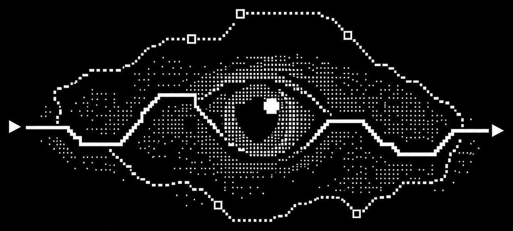
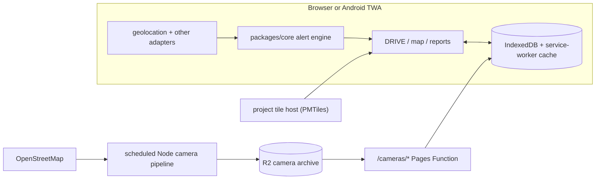
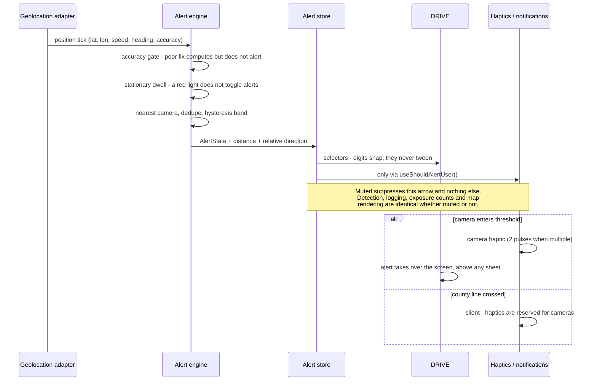

<p align="center">
  
</p>

<h1 align="center">DarkRoute</h1>

<p align="center"><strong>they watching. we watching back.</strong></p>

<p align="center">
  <a href="LICENSE"></a>
  <a href="https://github.com/darkcodelabs/darkroute/actions/workflows/ci.yml"></a>
  <a href="https://github.com/darkcodelabs/darkroute/actions/workflows/security.yml"></a>
</p>

---

## Table of contents

- [What this is](#what-this-is)
- [Repository layout](#repository-layout)
- [Architecture](#architecture)
- [Runtime workflow](#runtime-workflow)
- [Prerequisites](#prerequisites)
- [Installation](#installation)
- [Environment variables](#environment-variables)
- [Development commands](#development-commands)
- [Test commands](#test-commands)
- [Security and privacy model](#security-and-privacy-model)
- [Design sources and the token rule](#design-sources-and-the-token-rule)
- [Platform limits](#platform-limits)
- [Contributing](#contributing)
- [Security policy](#security-policy)
- [License](#license)

## What this is

An Android-first counter-surveillance PWA that tells a driver where the automated license plate
readers are, before they drive past them.

It provides real-time proximity alerts against an offline-capable camera archive, local exposure
history, an on-device queue of signed and hash-chained camera reports,
and source-backed public-record context about the agencies operating cameras around you.

The deployed app has no report-upload endpoint. Reports stay in IndexedDB today. A submission
gateway exists as operator code and is not a deployed route; that distinction is intentional
throughout this README.

It deliberately does not do a sixth thing: it queries no vendor's system, and license plate values
never leave the device.

## Repository layout

```text
darkroute/
├── apps/
│   ├── pwa/                    React 19 + TypeScript + Vite PWA
│   └── android/                buildable Android Trusted Web Activity shell
├── packages/
│   ├── core/                   pure geometry and alert engine; no DOM or I/O
│   └── api-client/             empty placeholder; no OpenAPI contract exists yet
├── functions/
│   └── cameras/                same-origin camera tiles from the CAMERA_TILES R2 binding
├── scripts/                    camera pipeline, deploy, asset and policy checks
├── docs/                       implementation, operations and public documentation
├── DESIGN-GAPS.md              unresolved design decisions and stand-ins
└── installer.sh
```

The LoRa stack is Meshtastic's own, unmodified: this project builds no firmware and pairs with a
stock node. `packages/api-client` remains a placeholder; the production PWA does not use it.

## Architecture

The deployed product is a static PWA plus Cloudflare Pages Functions. It has no FastAPI
process, Postgres database, presence API or deployed report endpoint.



Camera tiles are requested from same-origin `/cameras/*`, served from the `CAMERA_TILES` R2 binding,
and cached for offline use. Basemap and speed archives are cross-origin range requests to the
project-operated public tile host. `darkroute.ai` is the public app. The
administrative Functions live outside this distribution entirely.

The curation tooling and the submission gateway are operator code, kept out of this
distribution. Neither is a deployed runtime server, and nothing in this repository
depends on either: the app builds, runs, tests and audits without them.

Geospatial calculation lives in `packages/core`; screens consume stores and adapters. Plate matching,
trip history and the report evidence chain remain on the device.

## Runtime workflow



## Prerequisites

- **Node.js 22.12 or newer**
- **pnpm 9.15 or newer** — the repository's package manager. Do not create a competing lockfile.
- **Android work only:** JDK 17 and Android SDK platform 36/build-tools 36.0.0.
- **Curation work only:** credentials for a separately operated curation service. Not needed to
  build, run or test the app.

Python, FastAPI, Postgres and PostGIS are not prerequisites for this repository. Local PWA
development needs no account, database or backend credentials.

## Installation

```bash
git clone https://github.com/darkcodelabs/darkroute.git
cd darkroute
corepack enable
corepack prepare pnpm@9.15.9 --activate
./installer.sh
```

`installer.sh` verifies the supported Node version and runs `pnpm install --frozen-lockfile`. It is
idempotent and does not create a virtual environment, copy an `.env` file or alter configuration.

## Environment variables

No environment file is required to run the PWA locally. These are the active configuration groups:

| Variable or binding      | Used by   | Notes                                                                |
| ------------------------ | --------- | -------------------------------------------------------------------- |
| `VITE_FWM_BASEMAP_URL`   | PWA build | Optional PMTiles archive override; the source carries a default.     |
| `CAMERA_TILES`           | Pages     | R2 binding used by `functions/cameras/[[path]].ts`.                  |

Operator-only configuration — the administrative Functions, the publishing
credentials and the curation tooling — is not documented here. Those names
describe a deployment you cannot reach and are of no use in building or
auditing this repository; each script states what it needs when you run it.

Secrets never go in source control or a `VITE_` variable, because Vite variables are bundled into
the client.

## Development commands

```bash
pnpm dev            # PWA development server; alias for dev:pwa
pnpm dev:pwa        # PWA development server, no backend credentials needed
pnpm build          # production PWA bundle; alias for build:pwa
pnpm build:pwa      # typecheck and build apps/pwa
pnpm lint           # eslint + the design-value checker
pnpm typecheck      # workspace packages plus deployed Pages Functions
pnpm format         # prettier
pnpm check:design   # design-system enforcement on its own
pnpm preflight      # release preflight checks
pnpm ship:verify    # verify the deployed site without publishing
```

The PWA ships a drive simulator, so the whole foreground alert loop is exercisable without driving
and without connecting to anything. Named scenarios each cross a real state boundary:
`clear-to-approaching`, `approaching-to-in-range`, `multiple-cameras`, `threshold-flap`,
`stationary-at-light`, `gps-lost`, `muted-drive`.

There is no `dev:backend` command: no backend server is part of this repository. Curation
migration and export are operator tooling, not a service required by `pnpm dev`.

## Test commands

```bash
pnpm test           # workspace, script, Pages Function and gateway unit suites
pnpm test:unit      # same command, explicitly
pnpm test:e2e       # playwright - critical browser flows including a simulated alert
pnpm test:functions # deployed Pages Functions only
pnpm test:scripts   # Node script tests only
```

## Security and privacy model

These override convenience. They are not preferences.

**Location.** Distance, bearing and alert state are computed on-device. Trip and alert history stays
in IndexedDB. The deployed app has no presence service or report-upload endpoint. Network privacy is
not absolute: a camera-tile request reveals a roughly 15 km square, and PMTiles range requests to
the tile host reveal the viewport or speed-tile area. A sequence of requests can reveal more
than one request. The full accounting is in [`docs/public/THREAT-MODEL.md`](docs/public/THREAT-MODEL.md).

**Plates.** Plate and watchlist values are local-only secrets, encrypted at rest with a per-install,
non-exportable AES-GCM key held as a `CryptoKey` in IndexedDB. They are decrypted into memory only,
for matching against your own trip log and the community camera map. They are never placed in
zustand persistence, service-worker logs, URLs, notifications, analytics, crash reports or any
backend request body - and a runtime guard in the persist middleware throws if one tries to reach a
serializer. Exporting them requires a separate, explicit action with a warning. No camera vendor's
system is ever queried.

**Evidence.** Reports are signed at filing with a per-install non-exportable ECDSA P-256 key and
hash-chained so queue order is provable. Camera photos are re-encoded to strip metadata before local
storage. The queue is local: the gateway code can validate, redact and propose a report to the
curation service, but it is not routed or deployed.

**Identity and administration.** There is no end-user account system. The Access-gated dev host
checks a Cloudflare Access assertion for its two admin endpoints; `darkroute.ai` has no public admin
surface, and those endpoints refuse requests without a valid assertion. Admin credentials stay in
Pages secrets.

**RECORD.** Names agencies, never individuals. Shows nothing without a citable published source with
a publisher, title, publication date where available and retrieval date. Contested entries are
labelled, never deleted.

**No third-party analytics, advertising, session replay or tracking SDKs. Ever.**

## Design sources and the token rule

The design is finished; this repository implements it rather than redesigning it. The historical
sources are four unpublished HTML exports with inline styles; their literal hex, px and ms values
informed the implementation but are not included in the public repository. The checked-in token
set, tests, `DESIGN-GAPS.md` and `docs/gaps-inbox/` records are the public, reviewable authority for
what ships.

| Source        | What it governs                                                                                       |
| ------------- | ----------------------------------------------------------------------------------------------------- |
| Design system | colour, type, space, radius, motion, components, six modes, PWA shell, watch rules, §08 token exports |
| App screens   | the five dock screens at 375px, the RADAR state matrix, the dock spec                                 |
| Screens II    | onboarding, offline, node, intel card, mesh, board, and ten feature screens                           |
| Watch         | fifteen round 384×384 faces and the watch navigation model                                            |

**The hard rule: no design value is ever invented.** Every colour, size, spacing step, radius,
duration and easing curve in the application traces to a token in §08.
`apps/pwa/src/styles/tokens.css` holds that token set verbatim and is the only file under
`apps/pwa/src` allowed to contain a raw hex, length, duration or curve.
`scripts/check-design-values.mjs` fails CI on any violation - raw hex, `rgba()`, hardcoded lengths,
Tailwind arbitrary values, `hover:` utilities, a third font family, or a brand image that is not
derived from the supplied logo. Its allowlist requires a written reason per entry.

When the system does not cover something: use the nearest existing token, mark the line
`/* GAP: see DESIGN-GAPS.md#slug */`, and file the entry. Never guess, never extrapolate, never
borrow a value from another project.

- **[DESIGN-GAPS.md](DESIGN-GAPS.md)** - every genuine missing design decision, what stands in for
  it, and the options worth considering.
- **[docs/gaps-inbox/](docs/gaps-inbox/README.md)** - detailed implementation
  records behind the cross-cutting gap index.

## Platform limits

The detailed capability matrix and implementation references are in
[`docs/platform-capabilities.md`](docs/platform-capabilities.md). The limits that materially change
the product are:

- **A browser PWA cannot guarantee background GPS.** `watchPosition()` works while the document is
  visible; Page Visibility and a service worker cannot keep it alive after the screen locks or the
  browser suspends the tab.
- **The Android shell exists and is buildable, but is not on Google Play.** Its TWA location
  delegation lets ordinary web geolocation continue with the screen off while the app remains
  running. It deliberately has no `ACCESS_BACKGROUND_LOCATION` permission and no notification
  delegation, so it does not promise alerts after the app is fully backgrounded or killed.
- **iOS has no Web Bluetooth or vibration support for this app.** A Meshtastic node cannot be paired
  from the MESH screen and haptics are unavailable. iOS also does not emit Chromium's
  `beforeinstallprompt`; installation is a browser-menu action, and compass/motion permission must
  follow a user gesture.
- **Voice recognition is not private or always-on.** Chromium's speech recognition is
  network-backed, and wake-word listening stops when the page is hidden. Push-to-talk is the
  dependable interaction.
- **Battery and Ambient Light APIs are optional.** They are absent on most target browsers, and
  alerting never depends on them.

## Contributing

See [docs/public/CONTRIBUTING.md](docs/public/CONTRIBUTING.md). Conventional commits, tests alongside source, PRs focused and
under ~400 lines where practical, no direct commits to `main`, and dependencies checked for CVEs and
maintenance before they are added.

## Security policy

See [.github/SECURITY.md](.github/SECURITY.md).

## License

[GPL-3.0-only](LICENSE)

## Author

**Corian Kennedy** - [@NoDataFound](https://github.com/NoDataFound)

---

<p align="center"><em>they watching. we watching back.</em></p>
