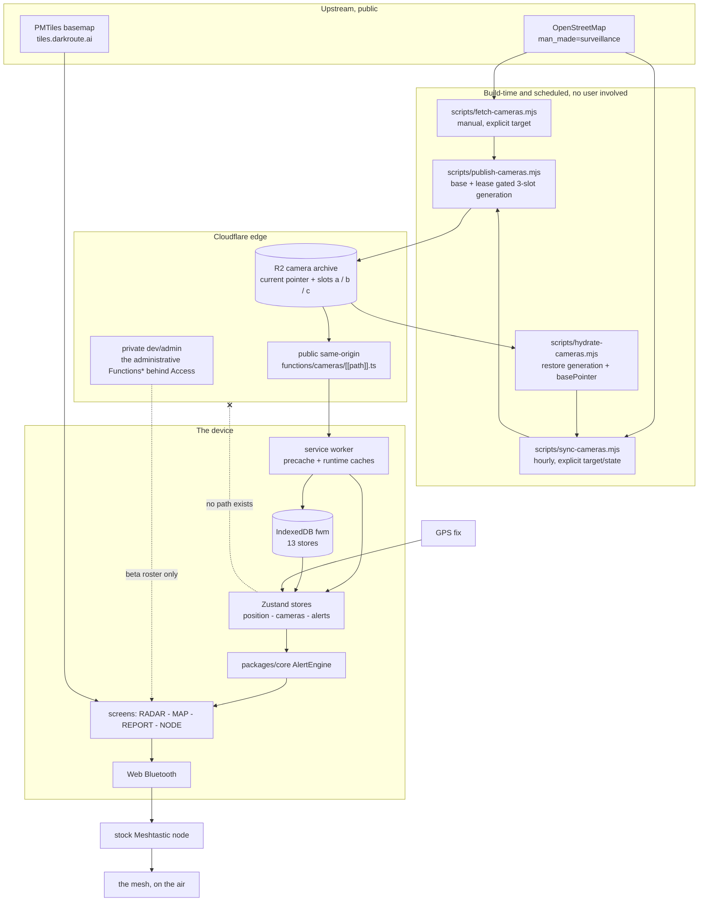
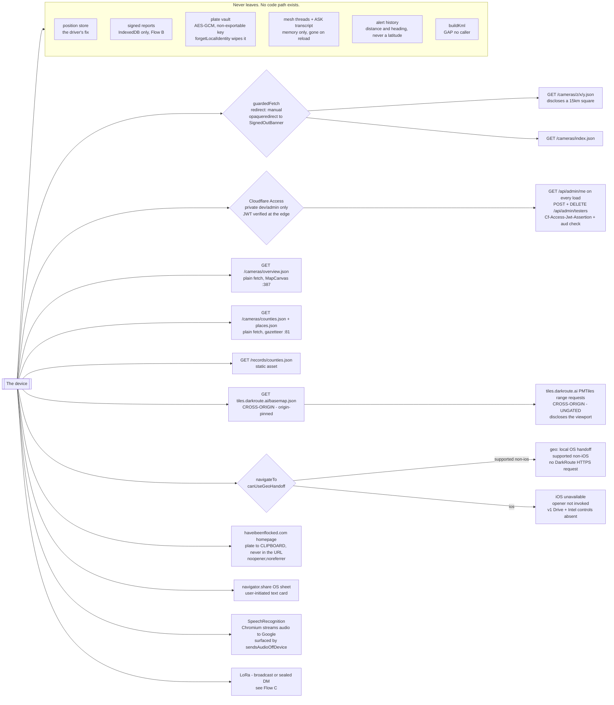
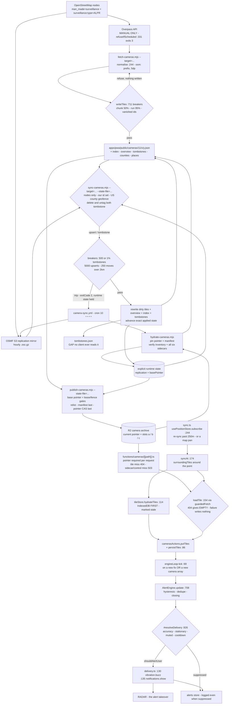
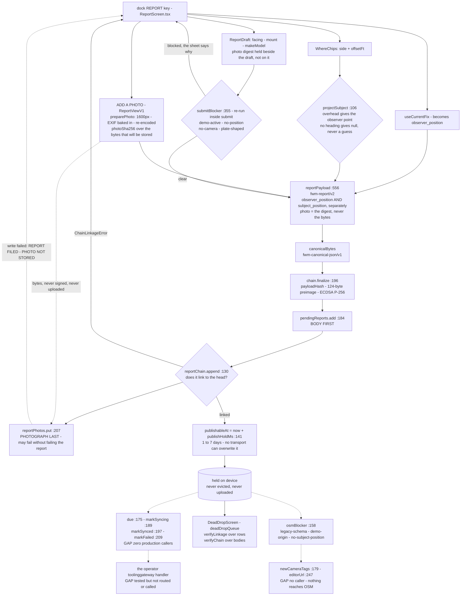
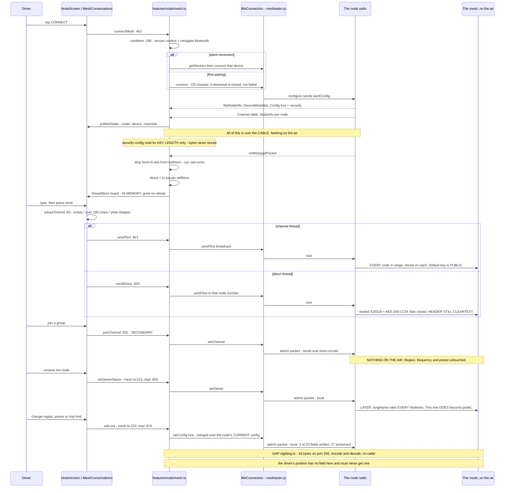
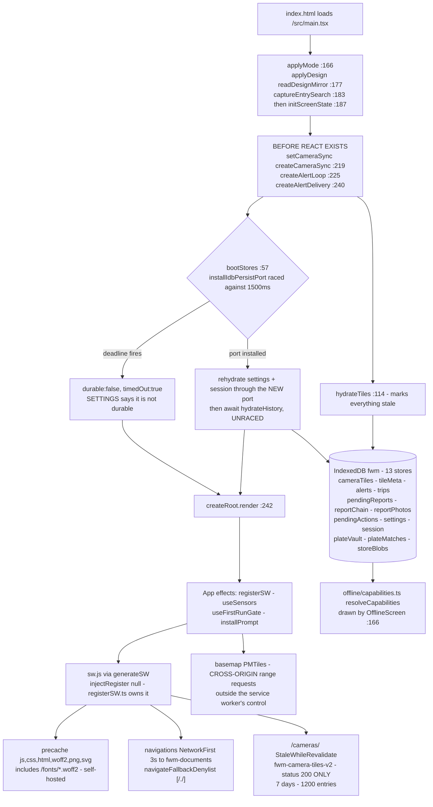

# How DarkRoute works

This is the document to read before auditing the system. It describes what the
pieces are, how they relate, and — in the most detail — **what leaves the
device**, because that is the only claim in this product that a user cannot
check from inside the app.

Every arrow in every diagram here has a call site. Every `file:line` was read
against the tree that published this document, not written from memory. Where a
path is built, tested and connected to nothing, the diagram says **`GAP`** and
the prose says so in words. Those gaps are not omissions from this document;
they are the most useful thing in it, because they are the parts a reader would
otherwise assume were finished.

If you find a diagram that disagrees with the code, that is a bug in this file
and it is worth reporting — see [`SECURITY.md`](SECURITY.md).

**Related documents:** [`API.md`](API.md) — every endpoint and every request.
[`DATA-CONTRACTS.md`](DATA-CONTRACTS.md) — the signed record, the canonical
bytes, the Meshtastic protobufs. [`TRANSPARENCY.md`](TRANSPARENCY.md) and
[`notices/`](notices/) — what gets published if a legal demand arrives.

---

## Contents

1. [The pieces, on one page](#1-the-pieces-on-one-page)
2. [What leaves the device](#2-what-leaves-the-device) ← the sceptic's section
3. [Flow A — from OpenStreetMap to a warning in a moving car](#3-flow-a--from-openstreetmap-to-a-warning-in-a-moving-car)
4. [Flow B — a report's life](#4-flow-b--a-reports-life)
5. [Flow C — the mesh](#5-flow-c--the-mesh)
6. [Flow D — startup, and what survives with no network](#6-flow-d--startup-and-what-survives-with-no-network)
7. [What is deliberately NOT built](#7-what-is-deliberately-not-built)
8. [Index of dead ends](#8-index-of-dead-ends)

---

## 1. The pieces, on one page

DarkRoute is **a static PWA plus three narrowly scoped Pages Functions.** There
is no end-user account, session, profile row or deployed report-upload route,
and none of the live Functions accepts a driver's position. The pieces are:

| Piece                           | Path                                          | What it is                                                                                                                                                                                                                                                       |
| ------------------------------- | --------------------------------------------- | ---------------------------------------------------------------------------------------------------------------------------------------------------------------------------------------------------------------------------------------------------------------- |
| **The app**                     | `apps/pwa`                                    | React 19 + TypeScript (strict) + Vite. Zustand stores, IndexedDB for durability, MapLibre + PMTiles for the map. Ships as a PWA with a Workbox service worker.                                                                                                   |
| **The engine**                  | `packages/core`                               | Pure, dependency-free alerting and geometry: `alert.ts`, `geo.ts`, `tiles.ts`. No DOM, no I/O, no clock of its own. This is where the "is a camera about to matter" decision lives.                                                                              |
| **The edge**                    | `functions/`                                  | Three Cloudflare Pages Functions: `cameras/[[path]].ts` reads tiles from an R2 binding; `api/admin/me.ts` and `api/admin/testers.ts` are the beta-tester roster, behind Cloudflare Access. That is the entire server.                                            |
| **The data pipeline**           | `scripts/*.mjs`                               | Node scripts, run by a human or by GitHub Actions. `fetch-cameras.mjs` bootstraps; `hydrate-cameras.mjs` restores one R2 generation and its state; `sync-cameras.mjs` applies replication diffs; `publish-cameras.mjs` atomically activates the next generation. |
| **The Android shell**           | `apps/android`                                | A Trusted Web Activity. It exists for exactly one reason: Android's own location permission, so alerting survives the screen locking. No web code changes; `locationdelegation` routes ordinary `navigator.geolocation` calls through the native provider.       |
| **The radio link**              | `apps/pwa/src/features/node`, `features/mesh` | Web Bluetooth to a **stock** Meshtastic node. No custom firmware.                                                                                                                                                                                                |
| **The notices archive**         | `transparency/`                               | Every legal demand received, published in full, modelled on `github/dmca`. Count is currently 0, and the count is a statement rather than an absence.                                                                                                            |
| **Curation and intake tooling** | the operator tooling                                    | Node tools and declarations for an external curation platform, plus a tested TypeScript submission gateway. The gateway is not exposed under `functions/` and the PWA has no caller for it.                                                                      |
| **The API-client placeholder**  | `packages/api-client`                         | Exports one placeholder boolean. No OpenAPI contract is generated and the production PWA does not import it.                                                                                                                                                     |

Two things travel through the system, and they travel in opposite directions
and never mix:

- **Camera positions** come _down_. They are public facts about public hardware,
  sourced from OpenStreetMap, and they are the payload of every tile, every
  map marker and every alert.
- **The driver's position** stays _put_. It is read from the GPS into a Zustand
  store, consumed by the alert engine and (only on a deliberate report) written
  into IndexedDB. It has no path to any network.

---

## 2. What leaves the device

**Read this section adversarially. It is meant to survive that.**

The largest category is the empty one: **the driver's coordinates have no
egress path at all.** Not "encrypted before sending", not "anonymised", not
"aggregated" — there is no send. The position store feeds the alert engine and
a deliberately-filed report; the report goes into IndexedDB and stops there
(Flow B); the alert history records distance, heading, speed, camera id and
state, and never a latitude (`services/db/schema.ts:213`, and the file's own
header at `:21`).

Camera tiles are fetched **by address**. The tile id is computed on the device
from the fix (`packages/core/src/tiles.ts`) and a z11 tile is roughly 15 km
across, so a tile request discloses "somebody wanted this square", never a
coordinate. The tile and index requests go through `guardedFetch`
(`services/access/session.ts:89`) with `redirect: 'manual'`, so an unexpected
redirect is a failed request rather than an empty square. The production camera
route itself is public; same-origin routing avoids disclosing each requested
square to a separate tile operator. The distinction between "no cameras here"
and "we could not ask" remains load-bearing in a car.

### Every outbound path, and its gate

| #   | Destination                                          | What discloses                                                                                       | Gate                                                                                                                                                                 | Site                                                                                                                  |
| --- | ---------------------------------------------------- | ---------------------------------------------------------------------------------------------------- | -------------------------------------------------------------------------------------------------------------------------------------------------------------------- | --------------------------------------------------------------------------------------------------------------------- |
| 1   | `GET /cameras/{z}/{x}/{y}.json`                      | one ~15 km square, per square entered                                                                | public same-origin Function, `guardedFetch`                                                                                                                          | `services/cameras/sync.ts:156`                                                                                        |
| 2   | `GET /cameras/index.json`                            | that the app started                                                                                 | public same-origin Function, `guardedFetch`                                                                                                                          | `services/cameras/catalogue.ts:59`                                                                                    |
| 3   | `GET /cameras/overview.json`                         | that the national map was opened                                                                     | public same-origin Function — **plain `fetch`, not guarded**                                                                                                         | `features/map/MapCanvas.tsx:387`                                                                                      |
| 4   | `GET /cameras/counties.json`, `/cameras/places.json` | that a place name was needed                                                                         | public same-origin Function — plain `fetch`, failure returns an empty map                                                                                            | `services/cameras/gazetteer.ts:81`                                                                                    |
| 5   | `GET /records/counties.json`                         | that the misuse record index was opened                                                              | same-origin static asset, plain `fetch`                                                                                                                              | `services/records/countyRecords.ts:165`                                                                               |
| 6   | `GET /api/admin/me`                                  | your Access identity, to your own edge, on every load                                                | Access JWT verified server-side against the team JWKS with an `aud` check                                                                                            | `features/admin/useAdmin.ts:66`, `functions/_shared/access.ts:97`                                                     |
| 7   | `GET/POST/DELETE /api/admin/testers`                 | beta-roster administration                                                                           | admin-only, same verification                                                                                                                                        | `features/admin/AdminScreen.tsx:84`                                                                                   |
| 8   | `GET https://tiles.darkroute.ai/basemap.json`        | that the map loaded                                                                                  | **cross-origin.** The pointer is refused unless it names its own origin (`isPermittedArchive`); on failure the app falls back to the archive compiled into the build | `features/map/manifest.ts:110`, `:187`                                                                                |
| 9   | **PMTiles range requests to `tiles.darkroute.ai`**   | **the viewport being looked at**                                                                     | **none.** Our host, but cross-origin and unauthenticated                                                                                                             | `features/map/basemap.ts:58`, `:72`                                                                                   |
| 10  | `geo:` local OS handoff (supported non-iOS only)     | the destination is passed to the OS-registered map handler; DarkRoute makes no HTTPS request         | `canUseGeoHandoff`; on iOS `navigateTo` returns `unavailable` before invoking the opener and shipped v1 Drive and Intel omit the controls                            | `services/adapters/navigateTo.ts:82-127`, `features/drive/DriveScreen.tsx:1023`, `features/intel/IntelScreen.tsx:386` |
| 11  | `https://haveibeenflocked.com/` **homepage**         | that you opened their site                                                                           | plate goes to the **clipboard**, never into a URL; opened `noopener,noreferrer` so they cannot see which screen sent you                                             | `features/lookup/handoff.ts:39`, `:94`                                                                                |
| 12  | `navigator.share` OS sheet                           | whatever the user chooses to send                                                                    | user-initiated, text card only                                                                                                                                       | `services/adapters/share.ts:139`                                                                                      |
| 13  | Speech recognition                                   | **audio, to a Google service, on Chromium**                                                          | not hidden: `sendsAudioOffDevice()` surfaces the fact and the screen warns                                                                                           | `services/adapters/speechRecognition.ts:331`, `features/ask/AskScreen.tsx:179`                                        |
| 14  | LoRa radio                                           | see [Flow C](#5-flow-c--the-mesh) — a broadcast is not private, a DM is sealed but its header is not | one call site per transmit, each behind a button                                                                                                                     | `features/node/mesh.ts:821`, `:825`                                                                                   |

**The map handoff fails closed on iOS.** `navigateTo` constructs only a `geo:`
URI and returns `unavailable` before invoking its opener when the platform is
iOS. The shipped v1 Drive and Intel screens also query `canUseGeoHandoff()` and
do not render their route/map controls there. On supported non-iOS platforms,
the destination is handed locally to the OS-registered map handler; that handler
may use its own network afterward, but DarkRoute makes no Google HTTPS fallback.

**Two corrections to things you may have read elsewhere about this app:**

- **Bundled fonts are self-hosted.** Chakra Petch and JetBrains Mono are served
  from `/fonts/*.woff2` (`src/styles/tokens.css:11`) and precached by
  `workbox.globPatterns` in `vite.config.ts`; the default system face needs no
  fetch. Nothing is requested from `fonts.googleapis.com` or
  `fonts.gstatic.com`, and the obsolete Workbox routes for those origins have
  been removed. A cold, offline install now has its UI typefaces. Map labels use
  the separately self-hosted Noto Sans glyph PBFs; the service worker caches
  those ranges on demand.
- **There is no analytics of any kind.** No beacon, no crash reporter, no tag
  manager, no error sink. `rg -i 'analytics|telemetry|sentry|gtag|posthog'`
  over `apps/pwa/src` returns only comments saying there is none.

---

## 3. Flow A — from OpenStreetMap to a warning in a moving car

A camera starts life as an OSM node tagged `man_made=surveillance` plus a
case-insensitive `surveillance:type=ALPR` or `ANPR`.

**Bootstrap.** `scripts/fetch-cameras.mjs` accepts only the versioned,
receipt-bound Overpass-shaped handoff from `fetch-cameras-deflock.mjs`; direct
national Overpass fetching is disabled because a rectangle is not a territorial
policy. Each node
goes through `normalise()` (`:244`), which prefixes ids with `osm:` so a camera
id can never be mistaken for a plate or a report id, and rounds coordinates to
five decimals (~1.1 m) because more would be false precision on a node a
volunteer traced from aerial imagery. Three circuit breakers stand between the
fetch and the disk, all reachable from `writeTiles` (`:711`): a per-chunk
credibility check against the archive already held (`chunkLooksTruncated`,
`:654`, `CHUNK_LOSS_RATIO = 0.5`), a whole-run floor (`TOTAL_LOSS_RATIO = 0.95`)
that catches a slow bleed spread across many chunks, and an identity check on
vanished ids. It **refuses** rather than warns, because the next thing
`writeTiles` does is `rmSync` the output directory.

Fetch and sync accept an explicit guarded `--target`; the workflow always names
the camera staging tree. The release baseline comes only from one reviewed v3
receipt over DarkRoute's retained first-party Overpass capture, made with a
pinned DeFlock-derived query implementation. The receipt binds capture-plan and
response-body evidence, exact code and artifact hashes, territorial and
predecessor inputs, transformation digest, minimum constituent OSM watermark,
and conservative official replication floor. `baseUpstream` records that
minimum parsed OSM watermark, not a runner or build time. Legacy local carry and
remote-PMTiles receipts fail closed.

**Staying current is a different program.** `scripts/sync-cameras.mjs` runs
hourly from the private operational camera-sync workflow against OSM replication diffs
on the OSMF S3 mirror — first-party infrastructure published for exactly this,
~2.52 MB an hour. `decide()` (`:185`) drives everything from **our own id set**
rather than from tags, and the reasons are enumerated in the code: an OsmChange
`<delete>` carries no tags, so a tag filter cannot see it; a _retag_ (a camera
that stops qualifying) is invisible to a tag filter too; and OSM ids are unique
only within an element type, so 210 camera ids fall inside the live _way_ id
range and a deleted building could otherwise tombstone a camera in another
state. A foreign unknown id is ignored; a known qualifying id moved outside the
strict US/DC/PR polygons is version-ordered into an `osm_out_of_scope`
tombstone. Four more
breakers guard the write: 500 absolute tombstones or 1% of live, 5,000 upserts,
250 cameras moving more than 2 km. Tripping sets `process.exitCode = 2` and
**leaves the explicit runtime state where it was**, so the next run reconsiders
the same diffs rather than skipping past them.

Normal runs apply at most 24 diffs and may publish a complete intermediate
generation before converging later. The reviewed bootstrap runs with
`--max 1000 --require-caught-up` and fails if it cannot reach its observed head.

**Hydration and publication.** R2 holds three complete-generation slots and the
small pointer `__camera/current.json`. Before sync,
`scripts/hydrate-cameras.mjs` pins that pointer and its manifest, verifies the
manifest hash plus the exact per-file inventory and hashes, and restores both
the archive and an explicit runtime state file containing the manifest's exact
replication fields plus the full hydrated pointer as `basePointer`. Sync
preserves that pointer while advancing replication. After sync,
`scripts/publish-cameras.mjs` refuses below the reviewed 120,000-camera floor,
requires the remote pointer to equal that exact base before candidate mutation;
bootstrap has no base pointer and requires the remote pointer to be absent. It
then reconciles only the inactive candidate slot, exact-relists it, writes its
manifest after all data, and conditionally replaces the pointer last. A
180-minute lease, a 110-minute write fence, and exact lease checks before
reconcile, manifest, and pointer writes bound the transaction. The current and
previous slots stay immutable; the third is recyclable. The pointer-selected
manifest, not a Git commit, is the canonical replication watermark.

`functions/cameras/[[path]].ts` reads that pointer on every request and maps an
allowed logical path into the selected slot. The public route remains
same-origin, `TILE_BASE` is unchanged, and the service-worker route still
matches. A missing binding calls `context.next()` for compatibility with old
deployments, although current builds omit `dist/cameras` and therefore require
the binding. Once bound, the route is generation-only: an absent, malformed, or
unreadable pointer fails closed with `503`, never a legacy-root read. A selected
hit or tile miss includes `x-darkroute-camera-generation`; a missing tile
returns a **cached 404**, while any of the six required sidecars missing
returns `503`. Only the documented JSON, cache, ETag, and generation headers are
emitted.

**On the device.** `createCameraSync()` (`services/cameras/sync.ts:143`)
subscribes to the position store and re-syncs after `RESYNC_DISTANCE_M` (250 m);
map pans call `syncCamerasAt` through the `syncInstance.ts` seam. `syncAt`
(`:174`) computes the surrounding tile ring and **hydrates from IndexedDB before
touching the network** — awaited on purpose, because with no signal every fetch
rejects and without this the driver gets a blank map over a city they have
driven fifty times. `loadTile` (`:154`) treats 404 as `EMPTY` and any failure as
_write nothing_: a failed tile must never be cached as an empty square.
`hydrateTiles` (`services/cameras/tileStore.ts:114`) marks everything **`stale`,
never `fresh`** — letting an old "CLEAR" look current is the one lie this cache
is in a position to tell.

**The warning.** `createAlertLoop()` (`services/alerts/engineLoop.ts:58`) ticks
on a new fix _and_ on a new camera array — ticking only on a fix meant the first
tick ran against an empty camera set, and a stationary car gets no second fix.
`AlertEngine.update()` (`packages/core/src/alert.ts:708`) does the hysteresis,
dedupe and closing logic; `#resolveDelivery` (`:926`) spends four gates —
accuracy, stationary, muted, cooldown — and a suppressed alert is **still
logged**. `createAlertDelivery()` (`services/alerts/delivery.ts:71`) turns the
survivors into `vibration.buzz()` (`:130`) and `notifications.show()` (`:135`).
It never calls `request()`: a permission dialog raised by a camera coming into
range is a dialog raised while driving.

**One thing stops here.**

- **`tombstones.json` has no app reader.** The sync writes it, rebuilds preserve
  it, the publisher inventories it, and the Function permits it as a sidecar;
  `rg -n tombstone apps/pwa/src packages` returns **nothing**. A deleted camera
  disappears only because its tile was rewritten, so a client holding a cached
  tile keeps the camera until that tile is refetched.

---

## 4. Flow B — a report's life

Pressing the dock's REPORT key opens `ReportScreen`. It reads the phone's fix
and names it **`observer_position`** — never the camera's. Where the camera is
comes from two thumb taps (`WhereChips`: which side, how far over) resolved by
`projectSubject()` (`features/report/subjectPosition.ts:106`), which returns
**`null` rather than guessing** when the heading is unknown and the side is not
`overhead`: "left" is meaningless without knowing which way the car was
pointing, and the tempting fallbacks — assume north, or reuse the observer fix —
reintroduce exactly the defect that module exists to remove.

`submitBlocker()` (`reportDraft.ts:355`) is re-evaluated **inside** `submit`
rather than trusted from the last render, and refuses on: a live demo drive
(checked _before_ the position check, because during a demo there _is_ a
position and it is the problem), a missing fix, a `confirm` with no camera id,
and plate-shaped free text. `reportPayload()` (`:556`) emits `fwm-report/v2`
carrying both positions **separately**, plus a `synthetic` flag that the
signature covers. `photo` (`:581`) carries the SHA-256 of an attached
photograph, or `null` — **the digest, never the bytes**; the picture itself
lives in `reportPhotos`, and a photograph is never a submit blocker.

`createReportQueue().submit` (`features/report/reportQueue.ts:173`) reads the
chain head, calls `chain.finalize()` (`services/crypto/chain.ts:196`) —
canonical bytes under `fwm-canonical-json/v1`, SHA-256 payload hash, a 124-byte
chain-hash preimage, ECDSA P-256 over the raw hash — then writes the **body
first** (`:184`) and the chain row second (`:185`), because a body with no row
is recoverable and a row pointing at nothing is not. The photograph's bytes are
written **last** (`:207`), for the same argument one step further out: bytes
written before the record exists are an orphan nothing points at, and no screen
could ever show them. Written last, the worst case is a record naming a digest
whose bytes are absent, which is detectable by anything that can read the
payload. That write is also the one step allowed to fail without failing the
submit — the report is already filed by then, and reporting it as failed would
be a lie the driver might act on by refiling. The sheet says `REPORT FILED ·
PHOTO NOT STORED` instead. Before any of it, `submit` refuses outright if the
payload's `photo` does not equal the digest of the bytes it was handed
(`PhotoDigestMismatchError`).
`reportChain.append()` (`services/db/repositories/reportChain.ts:130`) refuses
any row that does not link to the current head, throwing `ChainLinkageError`,
and stamps `publishableAt = now + publishHoldMs()` (`:141`) — a 1-to-7-day
jitter deliberately kept out of `nextAttemptAt`, which a transport would
overwrite on every backoff.

**Then it stops. There is no upload.** `due()` (`:175`), `markSyncing` (`:189`),
`markSynced` (`:197`) and `markFailed` (`:209`) have **zero production
callers** — the interface declares them, the repository implements them, and
nothing calls them. `createReportQueue` contains no `fetch`, and neither does
anything behind it. The only reader of the queue is `DeadDropScreen`, which
opens the database, reads both halves back and asks `verifyLinkage()` over the
rows and `verifyChain()` over the bodies (`deadDropQueue.ts:216-231`, `:354`).

**The OSM publication gate is complete, tested, and equally unwired.**
`osmBlocker()` (`features/report/osmTags.ts:158`) and `osmNodePosition()`
(`:131`) are referenced outside their own tests only by a comment in
`WhereChips.tsx:8` and a `checkIn` citation in `features/help/answers.ts:170`.
Nothing calls `newCameraTags()` (`:179`), `changesetTags`, `editorUrl` (`:247`)
or `nearbyExisting` (`:277`). **No report has ever reached OpenStreetMap by any
path**, and the map data flows strictly one way.

---

## 5. Flow C — the mesh

The app talks to a **stock Meshtastic node** over Web Bluetooth. There is no
custom firmware and no custom radio protocol; `features/node/sighting.ts`
explains at length why not.

`connectMesh()` (`features/node/mesh.ts:463`) checks `canMesh()` (`:296`) for a
secure context and `navigator.bluetooth`, then either opens the OS chooser or
silently reattaches to an already-granted device via `getDevices()`. That is why
`reconnectSupport()` (`:418`) exists and reports whether _this browser_ will
hand a node back at all: "the link keeps dropping" and "this browser refuses to
remember" look identical from outside, and only one of them is worth the
driver's time. `BleConnection.connect` calls `configure()` unconditionally,
which sends **`wantConfig`**, and the node replies with its identity, device
metadata, LoRa and security config, its channel table and every NodeInfo it
holds — all of it over the Bluetooth cable, **none of it on the air**. The
security config is read for key _length_ only; the bytes are never stored. The
session lives at module scope rather than in a component, so walking to RADAR
does not cost you your radio; screens read it through `subscribeMesh()`
(`:269`).

**The asymmetry is the design.** Receiving is unconditional — the radio hears
what it hears, and `onMessagePacket` drops `from=0` and our own echo before
`threadStore.heard`. Transmission is five explicit methods on `MeshSession`
(`:173`), and each has exactly one call site, verified by a test that reads
every file in `features/node` **and** `features/mesh`:

| Method                 | What actually happens                                                                                                                                                                                                                                                                           |
| ---------------------- | ----------------------------------------------------------------------------------------------------------------------------------------------------------------------------------------------------------------------------------------------------------------------------------------------- |
| `sendText` (`:821`)    | Broadcast to **every node in range**, stored on each of them. On the default channel the key is published in Meshtastic's own source, so **this is not private.**                                                                                                                               |
| `sendDirect` (`:825`)  | Addressed to one node number, which is what makes firmware 2.5+ take its PKI path: X25519 to a shared secret, then AES-256-CCM, and it **fails closed** rather than downgrading. What it does _not_ hide is that you transmitted, when, and to which node — **the packet header is cleartext.** |
| `joinChannel` (`:831`) | Writes a SECONDARY channel. **Nothing goes on the air**: the admin packet is addressed to the local node and `Router::sendLocal` short-circuits before the radio. A secondary channel uses only its PSK, so region, frequency and modem preset are untouched.                                   |
| `setOwnerName`         | Renames the node. `longName` rides every NodeInfo, so this one _does_ become public — over the air, later, by the firmware's own doing.                                                                                                                                                         |
| `setLora`              | Region, preset, hop limit, merged over the node's **current** config so unshown fields are not reset to defaults.                                                                                                                                                                               |

`refuseToSend()` (`features/node/chat.ts:65`) gates every outbound text on a
deliberately narrow plate check, with `MAX_MESSAGE_CHARS = 180`. Threads are
memory-only (`mesh/threadStore.ts`, `TRANSCRIPT_CAP = 100`): a durable
transcript would be a written record of who somebody talks to.

**The camera-sighting frame is specified and unwired.** `sighting.ts` defines a
16-byte frame (`SIGHTING_BYTES = 16`, `:74`) on Meshtastic's `PRIVATE_APP` port
256 (`:76`), carrying magic, kind, lat, lon, bearing and a truncated OSM id —
**the camera's position, never the driver's.** `encodeSighting` (`:109`) and
`decodeSighting` (`:141`) are complete and tested, the decoder treats everything
from the radio as hostile (magic, length, kind, coordinate range, and null
island as a rejected value), and **nothing calls either one.** The privacy test
exempts the file explicitly, on the grounds that encoding bytes is not
transmitting them — and notes that the day something calls it, the **caller** is
what the test will catch.

---

## 6. Flow D — startup, and what survives with no network

`main.tsx` does the pre-paint work synchronously and in a deliberate order:
`applyMode` (`:166`), then `applyDesign(readDesignMirror())` (`:177`) because
the settings store lives in IndexedDB and cannot answer fast enough to avoid a
flash, then `captureEntrySearch()` (`:183`) **before** `initScreenState()`
(`:187`) rewrites the URL.

It then starts the three long-lived subscriptions **before React exists** —
`setCameraSync(createCameraSync())` (`:219`), `createAlertLoop()` (`:225`),
`createAlertDelivery()` (`:240`), in that order — because a camera coming into
range does not arrive through a component tree, and delivery must outlive
whatever screen happens to be mounted.

Only then does `bootStores()` (`stores/boot.ts:57`) run. It installs the
IndexedDB persist port and **races it against a 1,500 ms deadline**
(`BOOT_DEADLINE_MS`, `:35`) so a blocked upgrade in another tab cannot mean a
blank app; on timeout it returns `{ durable: false, timedOut: true }` and
SETTINGS **says so** rather than the UI assuming durability. On success it
re-hydrates the settings and session slices _through the new port_ — they cannot
be skipped as "already hydrated", because they hydrated from the wrong port and
returned defaults — and then awaits `hydrateHistory()` **unraced**, because a
boot that gives up on the alert log reports zero as though the drive never
happened. The first `createRoot().render()` happens inside that `.then`
(`:242`).

**Offline is three layers doing three different jobs.**

1. **The service worker** (`vite.config.ts`, `generateSW`; `injectRegister` is
   `null`, so `registerSW.ts` owns registration). It precaches
   `js,css,html,woff2,png,svg` — which is why the self-hosted fonts are
   available on a cold offline start. Camera tiles are `.json` and are **not**
   precached; they get a `StaleWhileRevalidate` runtime route backed by
   `fwm-camera-tiles-v2`, restricted to **status 200 only**, 7 days and 1,200
   entries. The cached response is immediate and the background refresh picks
   up each successfully activated R2 generation. The status restriction is the
   point: a cached 404 would say "no cameras here" over a real road, and a
   cached redirect or error document could do the same. Navigations are
   `NetworkFirst` with a 3-second timeout into `fwm-documents`, and the SPA fallback is
   disabled by `navigateFallbackDenylist: [/./]` — deleting the
   `navigateFallback` key does nothing, because the plugin injects a default,
   and route order put it ahead of `runtimeCaching`. The generated worker sets
   `skipWaiting: true` and `clientsClaim: true`, so it activates and claims open
   clients automatically. Claiming does not reload their loaded documents;
   `registerSW.ts` reloads only after its explicit, alert-gated update path.
2. **IndexedDB** — database `fwm`, thirteen stores (`services/db/schema.ts:58`),
   each created by a numbered migration; a name in `STORE_NAMES` that no
   migration creates makes `openFwmDb()` refuse at startup rather than fail at
   the first read.
3. **The memory store** — `hydrateTiles` seeds it from disk and marks everything
   `stale`, so RADAR and the OFFLINE screen can keep saying where the data came
   from and how old it is.

**One honest gap remains.**

- **The basemap is cross-origin.** PMTiles archives at `tiles.darkroute.ai`
  (`features/map/basemap.ts:58`, `:72`) are fetched by HTTP range request, so
  offline map coverage depends on the browser's own HTTP cache rather than on
  anything this app controls — and the requests are ungated. See
  [§2](#2-what-leaves-the-device), row 9.

---

## 7. What is deliberately NOT built

Several capabilities are absent on purpose, and the absences are load-bearing
rather than incidental. Where the refusal is enforced by a test rather than by a
comment, the test is named, because a comment is not a guarantee and this
project's credibility rests on the difference.

### On the radio — enforced by `features/node/mesh.privacy.test.ts`

That test reads **every source file** in `features/node` _and_ `features/mesh`
(the transmit surface moved once already, and a check scoped to one directory
had a live transmit path sitting outside it) and fails the build on any of:

| Refused                                                           | Why                                                                                                                                                                               |
| ----------------------------------------------------------------- | --------------------------------------------------------------------------------------------------------------------------------------------------------------------------------- |
| `sendPacket`                                                      | The raw escape hatch. Anything reachable through it is reachable without any of the gates below.                                                                                  |
| `sendWaypoint`                                                    | Puts a **coordinate** on the air. Never.                                                                                                                                          |
| `requestPosition`                                                 | Asks another node for its coordinates. Also never: **the one thing this project must not do is collect positions.**                                                               |
| `traceRoute`                                                      | Makes every node on the path log that we asked.                                                                                                                                   |
| `deleteMyNode`, `factoryReset`                                    | Wipes somebody else's radio; `factoryReset` takes their keypair with it, unrecoverably.                                                                                           |
| `setModuleConfig`                                                 | Sixteen module panels, none of which a driving app needs — and several of them (MQTT, Serial, External Notification) can start **publishing mesh traffic off the mesh entirely**. |
| `latitudeI`, `longitudeI`, `onPositionPacket`, `onWaypointPacket` | Location fields, banned by name. The node knows where the phone is only if we ever tell it, and a position packet is the thing this project must never emit.                      |

Four calls are _allowed_, each under a one-call-site rule: `sendText`,
`setChannel`, `setOwner`, `setConfig`. The rule is not "these are safe", it is
"these have exactly one call site and that call site is a person pressing a
button" — a second caller is what turns a deliberate write into something a
timer or a retry can do on its own.

`setChannel` was itself banned until joining a group became a real feature.
Group membership in Meshtastic **is** a channel, and there is no other
mechanism, so refusing the call meant refusing the feature. The promise did not
get weaker, it got more precise: the screen still joins nothing on its own.

### On the device

- **No position packet, no position field, anywhere outbound.** The mesh
  sighting frame carries the _camera's_ coordinates only, and has no field for
  the driver's. It must never get one.
- **No plate ever stored in the clear, and no plate in any URL.**
  `services/crypto/plate.ts` is the only place a plate string may exist, in
  memory, for the moment a local match runs. At rest: AES-GCM-256 under a
  per-install key generated `extractable: false`, fresh 12-byte IV per
  encryption, AAD binding the ciphertext to its record id. Matching is done on a
  **keyed** blind index (HMAC-SHA-256, first 16 bytes) so equality works without
  decrypting and the index is useless off the device — an unkeyed hash of a
  plate's short alphabet would be trivially brute-forced.
- **No passphrase, no account, no recovery, no cloud backup, no sync** for the
  vault. Each of those would be inventing a place the plate could travel to.
  Clearing site data destroys the vault, and that is documented behaviour, not a
  bug.
- **No history of what you searched.** LOOKUP resolves entirely against the
  archive already on the phone. `LookupV1Screen.source.test.ts` reads the screen
  file and fails on `fetch(`, `XMLHttpRequest`, `axios`, `EventSource(` or
  `WebSocket(` — a search screen that quietly gained a network call would break
  the only promise that makes it worth having.
- **No coordinate in the alert log.** A trip's exposure is a count and a
  distance. `alerts` keeps distance, heading, speed and camera id; the only
  coordinate stored anywhere is inside a report the user deliberately filed,
  because a camera report without a position is not a report.
- **Muting suppresses delivery, never the record.** A muted alert still writes
  its row, still counts toward exposure and still draws on SWEEP. Muting removes
  the alert, not the evidence that it happened.
- **No permission prompt raised by an alert.** `delivery.ts` never calls
  `request()` — ONBOARDING and SETTINGS ask, in the calm.
- **No analytics, no telemetry, no crash reporting, no end-user account.** No
  shipped endpoint accepts any of it, and no client code tries to send it.
- **No photograph leaves the phone, and none is kept once you clear.** One
  photo may be attached to a report; it is re-encoded to strip every tag, stored
  in `reportPhotos` on the device, never uploaded, never exported, and deleted
  by `clearLocalData()` even though the report itself is retained.
- **No automatic Overpass polling.** `refuseIfScheduled()` exits 3 in CI. The
  supported automated path is the OSMF replication mirror, and the script would
  rather fail than get the project blocked.

### Refused by omission, and worth saying out loud

There is **no deployed upload endpoint for reports and no PWA caller for one**.
the submission gateway (operator code) contains a tested Pages-compatible handler for a future
anonymous intake route, while the curation scripts and templates operate an
external platform using operator credentials. Neither is on the driving path.
Reports in the shipped app are signed, chained and held in IndexedDB. Exposing
the gateway would require a new file under `functions/`, a client transport and
the documented privacy review for both.

---

## 8. Index of dead ends

Everything below is code that exists, is typed, is usually tested, and is called
by nothing in production. Each is drawn in the diagram for its flow. They are
listed together so a reader can check them in one pass.

| #   | What                                   | Where                                                                                                     | How to confirm                                                                                                                                                         |
| --- | -------------------------------------- | --------------------------------------------------------------------------------------------------------- | ---------------------------------------------------------------------------------------------------------------------------------------------------------------------- |
| 1   | `tombstones.json` has no client reader | generated by sync, preserved by rebuild, inventoried by publication, and permitted by the camera Function | `rg -n tombstone apps/pwa/src packages` returns nothing                                                                                                                |
| 2   | The report queue is never drained      | `reportChain.ts:175`, `:189`, `:197`, `:209`                                                              | no caller outside the interface and its implementation; `createReportQueue` contains no `fetch`                                                                        |
| 3   | The OSM publication gate is unwired    | `features/report/osmTags.ts`                                                                              | `osmBlocker`, `osmNodePosition`, `newCameraTags`, `changesetTags`, `editorUrl`, `nearbyExisting` — referenced only by tests, one comment, and one help-screen citation |
| 4   | The mesh sighting codec is unwired     | `features/node/sighting.ts:109`, `:141`                                                                   | no caller; the privacy test exempts the file and says the caller is what it will catch                                                                                 |
| 5   | `buildKml` has no caller               | `services/export/googleMaps.ts:76`                                                                        | nothing exports the "add to my Google Maps" file                                                                                                                       |

---

_Camera data is © OpenStreetMap contributors, ODbL 1.0. Basemap © OpenStreetMap
contributors · Protomaps._
