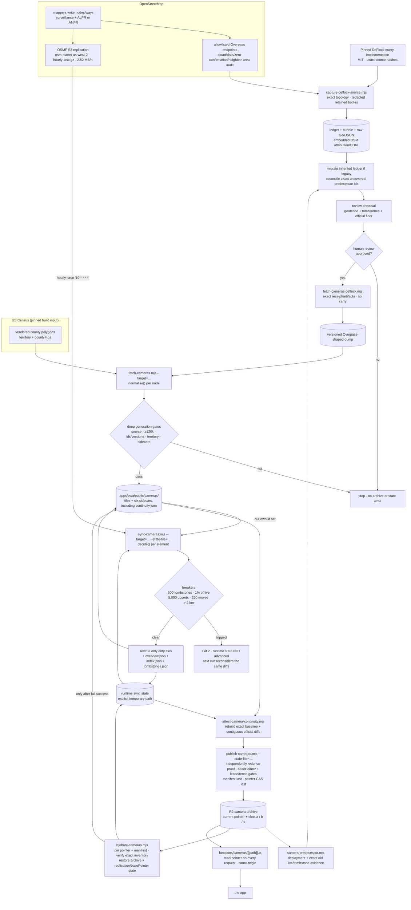
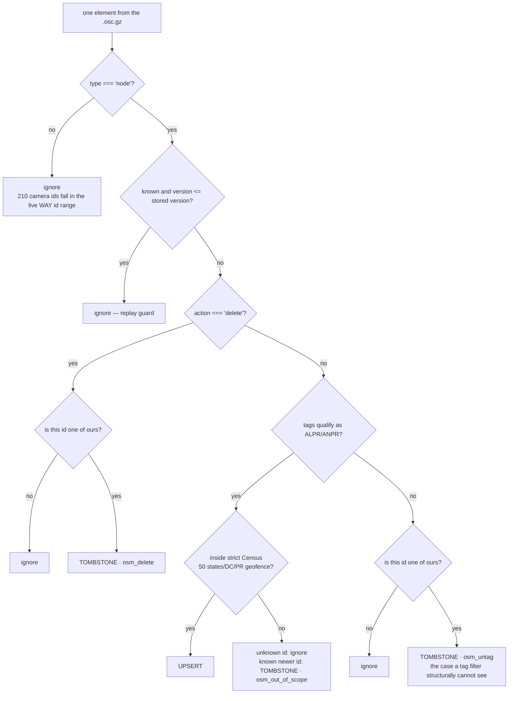

# Data provenance

Where every camera in this app comes from, what happens to it on the way, what
is deliberately not in it, and the exact commands to rebuild the whole dataset
from scratch and check that you got the same thing we did.

This document exists because the answer "we got it from OpenStreetMap" is not
verifiable. The verifiable version is the query, the script, the thresholds, the
failures those thresholds were written after, and the numbers you should get
when you run it yourself.

Numeric distributions labelled **historical audit snapshot** below were measured
over the complete 2026-08-26 archive, not a sample. They describe that snapshot,
not the pending reviewed baseline or the live object store. The release gate
requires a coherent approved capture, archive, tombstone ledger, geofence, and
replication state before any new count may be called current. Read the served
`index.json` for operational counts and timestamps, and use §8 to remeasure
rather than carrying an old number forward.

---

## 0. The whole thing in one table

|                       |                                                                                                                                                                                         |
| --------------------- | --------------------------------------------------------------------------------------------------------------------------------------------------------------------------------------- |
| **Upstream**          | OpenStreetMap, contributed by its mappers                                                                                                                                               |
| **Query**             | `man_made=surveillance` **+** case-insensitive `surveillance:type=ALPR` or `ANPR`; nodes and ways captured, nodes only published                                                        |
| **Access paths**      | First-party, receipt-bound Overpass capture using pinned DeFlock-derived query code · OSMF hourly replication diffs                                                                     |
| **Licence**           | **ODbL-1.0**, and it attaches to us                                                                                                                                                     |
| **Attribution**       | `Map data © OpenStreetMap contributors`, `ODbL-1.0`, and its URI — required in every tile and all six sidecars; deficient historical copies cannot enter an approved R2 generation      |
| **Footprint**         | Strict containment in the vendored Census county/county-equivalent polygons — 50 states + DC + Puerto Rico; the coarse latitude prefilter spans both sides of the Aleutian antimeridian |
| **Records**           | Read the current `index.json`; capture and final territorial output each have a conservative **120,000** release floor                                                                  |
| **Shape**             | slippy tiles, zoom 11, `/cameras/11/{x}/{y}.json`                                                                                                                                       |
| **Bootstrap**         | `capture-deflock-source.mjs` → human-reviewed receipt → `fetch-cameras-deflock.mjs` → `fetch-cameras.mjs`                                                                               |
| **Freshness**         | `scripts/sync-cameras.mjs`, scheduled hourly from replication diffs; cadence, not an SLA                                                                                                |
| **Publication**       | `scripts/publish-cameras.mjs` → R2 → `functions/cameras/[[path]].ts`                                                                                                                    |
| **Deletions**         | explicit sync removals in `tombstones.json`; manual rebuild limitation in [AGGREGATION-POLICY.md](./AGGREGATION-POLICY.md#removals-and-tombstones)                                      |
| **What is not in it** | no plates, no plate reads, no driver positions, no OSM contributor identities, no photographs                                                                                           |

Contract-level field definitions are in
[DATA-CONTRACTS.md](./DATA-CONTRACTS.md) §3. Mapping this data into somebody
else's schema is [TAXONOMY.md](./TAXONOMY.md). This document is the chain of
custody between them.

---

## 1. The upstream source

### 1.1 OpenStreetMap is the factual source

OpenStreetMap contributors assert the camera identities, positions and tags in
this layer. DarkRoute establishes a release baseline by running a first-party
Overpass capture whose adaptive tiling and element conversion derive from one
pinned DeFlock commit. DeFlock code is therefore credited implementation input,
not a second factual source, transport host, or independent corroborator.

The capture retains a complete topology ledger and a canonical body for every
accepted count, data, zero-confirmation, and Canada/Mexico neighboring-area
audit response.
It hashes the original response transport, immediately projects away `user`,
`uid`, and `changeset`, and discards the unredacted bytes. The retained bundle
and raw GeoJSON embed OSM attribution and the ODbL identity. Their exact bytes,
the capture code bytes, the strict Census US/DC/PR geofence, the tombstone floor,
and the minimum actual `osm3s.timestamp_osm_base` are bound into a human-reviewed
receipt. A runner start or build time is never treated as an OSM watermark.

The adapter then emits an Overpass-shaped local handoff. Driver devices request
only DarkRoute's same-origin published tiles; they never contact Overpass or
DeFlock. Obsolete local-carry flags remain rejected because an unversioned local
archive cannot distinguish a source gap from a deletion or retag.

What DeFlock _did_ contribute is more important than a data feed, and it is
credited in [`../credits.md`](../credits.md): they established the tagging
convention that makes this data queryable at all. DarkRoute reads that
convention unchanged. A write-back tag builder exists and is tested, but no
production path currently submits edits to OpenStreetMap.

The public admission, licence-separation, and source-versus-transport rules are
in [AGGREGATION-POLICY.md](./AGGREGATION-POLICY.md#source-and-transport-roles).

### 1.2 The exact query and retained proof

Each count/data leaf uses the same selector (shown here in data form):

```
[out:json][timeout:60];
(
  node["man_made"="surveillance"]["surveillance:type"~"^(ALPR|ANPR)$",i](SOUTH,WEST,NORTH,EAST);
  way["man_made"="surveillance"]["surveillance:type"~"^(ALPR|ANPR)$",i](SOUTH,WEST,NORTH,EAST);
);
out meta;>;out skel qt;
```

Two details in that are load-bearing:

**`out meta`, not `out body`.** `meta` supplies the element version, edit time,
and the response's `osm3s.timestamp_osm_base`. Versions order the baseline
against later diffs; the minimum response watermark determines the conservative
hourly replay floor.

**Capture ways; publish nodes.** Capturing ways keeps the pinned query semantics
auditable and proves what was excluded. The adapter deliberately drops them
before publication because OSM ids are unique only within an element type while
DarkRoute's canonical `osm:<id>` namespace is node-only. Replication likewise
ignores unknown ways.

Counts and data must match exactly. A count over 5,000 splits into four exact
quadrants; every nonzero leaf has one retained data body from a different
allowlisted endpoint than its count response, and every zero is confirmed by
the corresponding data query against a different endpoint. Every selected node
must lie inside its requested leaf. The complete seed-root union and the
post-geofence/tombstone release set must each contain at least 120,000 records;
these are circuit breakers, not advertised counts.

The two Canada/Mexico administrative-area responses remain hash-bound audit
measurements inherited from the pinned implementation, but they do **not**
subtract ids from the seed-root union. Border geometries can overlap or disagree;
only strict point containment in the pinned Census county polygons decides
release territory. The ledger records how many seed candidates also appeared in
those neighboring-area responses so that overlap stays visible without becoming
an unreviewed deletion rule.

### 1.3 The tag filter, and what it excludes

```
man_made          = surveillance     ← it is a surveillance device
surveillance:type = ALPR             ← it reads licence plates
```

Both the baseline capture and `sync-cameras.mjs` accept `ANPR`, the British
spelling, case-insensitively (`qualifies()`). The mapper-written spelling and
case are preserved through the capture handoff; the pipeline does not rewrite
an `anpr` assertion into `ALPR`.

Nothing else qualifies. A dome camera on a shop, a speed camera, a red-light
camera, a doorbell, a gunshot detector — none of them enter this dataset, even
though OSM holds all of them under `man_made=surveillance`. The app warns about
plate readers, so the data is plate readers.

The two query tags are then **stripped from the stored record**
(`REDUNDANT_TAGS` in `fetch-cameras.mjs`). Every node has them by construction.
The first-party capture deliberately transports a selected tag surface rather
than every mapper tag; §3.6 lists it exactly. Values that are transported remain
source values, except the documented `brand`/`manufacturer` correspondence.

### 1.4 The footprint, and the two bugs that shaped it

```js
export const US_BBOX = { south: 17.5, west: -180, north: 72, east: 180 };
```

This constant is the patrol's coarse prefilter, not its country boundary. New
ids and updates must also land in the vendored US Census
county/county-equivalent polygons at `scripts/data/us-counties.geojson`. The
longitude span is global because the Aleutians cross the antimeridian; the
polygon, not the rectangle or an existing identity, is the admission authority.
Vancouver, Mexico, USVI, and simplified-coastline misses are rejected.

**Too narrow.** The original box ran `24.4/-125.0` to `49.4/-66.9` under a
comment claiming "enough margin for Alaska and Hawaii", and excluded both, along
with Puerto Rico. 315 cameras already in the dataset sat outside it. The patrol
would have refused to update any of them, and an earlier draft of the deletion
rule would have **deleted each one on its first upstream edit**.

**Sized to its own contents.** A first attempt at widening used the northern
extreme of the cameras already committed — 53.6 N — which fits everything in the
dataset and silently excludes Anchorage at 61.2 N. A footprint derived from its
own contents can only ever ratify what it already has. The polygon asset is now
the **territory**, including Adak and Attu on opposite sides of the antimeridian.

The capture plan has separate negative- and positive-longitude Alaska roots,
and a regression proves that every vertex in the admitted Census geometry is
covered by at least one seed, including Adak, Attu, Mayagüez, Mona, and Monito.
The Puerto Rico root extends west to -68; the former -67.5 edge did not cover
the declared policy.

Historical audit-snapshot extent (not a current release count):

```
south 17.69755   north 61.57895   west -159.57868   east -64.63244
```

Those measurements explain why a data-derived rectangle was unsafe. Admission
now comes only from the polygon; USVI and foreign-border points inside a seed
rectangle do not qualify.

**Using only the box in the patrol was itself a measured bug.** The replication
stream is global. Before the filter existed the patrol ingested every ALPR
camera on earth into a US dataset: **288 upserts in six hours** against a
national churn of ~158 edits a day. The first record inspected was in Vancouver,
which the Alaska-sized rectangle also contains. The county polygon admission
gate is what now excludes it.

Deletions are deliberately **not** filtered by either geographic check, because
an OSM `<delete>` carries no position. They are matched by id instead — see
§2.5.

### 1.5 What a node gives us

```json
{
  "type": "node",
  "id": 13398047427,
  "lat": 41.32554,
  "lon": -73.47414,
  "version": 3,
  "timestamp": "2026-08-14T09:12:44Z",
  "tags": {
    "man_made": "surveillance",
    "surveillance:type": "ALPR",
    "surveillance": "public",
    "surveillance:zone": "traffic",
    "camera:type": "fixed",
    "camera:mount": "street_lamp",
    "direction": "175",
    "manufacturer": "Flock Safety",
    "operator": "Ridgefield Police Department",
    "check_date": "2025-08-26",
    "mapillary": "2518291208548633"
  }
}
```

That is a real node, `osm:13398047427`, in tile `11/606/765`. It is unusually
complete; §3.6 has the coverage numbers for what most nodes actually carry.

`out meta` also returns `user`, `uid` and `changeset` — the OSM account that
made the edit. **None of the three is stored.** See §5.3.

---

## 2. The pipeline, in order

### 2.1 The programs

| Script                                | Runs                        | Reads                                                                                          | Writes                                                                                  | May run on a schedule? |
| ------------------------------------- | --------------------------- | ---------------------------------------------------------------------------------------------- | --------------------------------------------------------------------------------------- | ---------------------- |
| `capture-deflock-source.mjs`          | reviewed baseline capture   | allowlisted Overpass endpoints using pinned DeFlock-derived query code                         | response ledger, redacted retained-body bundle, attributed raw GeoJSON, capture summary | No                     |
| `camera-predecessor.mjs`              | before a baseline cutover   | exact pointer generation, frozen legacy flat R2 inventory, or proven-empty R2                  | deployment-bound predecessor identity, live-id evidence, exact source tombstone bytes   | No                     |
| `migrate-camera-tombstone-ledger.mjs` | legacy-flat cutover only    | predecessor-bound legacy tombstones and their exact numbered hourly diffs                      | canonical attributed versioned inherited ledger                                         | No                     |
| `reconcile-camera-cutover.mjs`        | before review proposal      | retained capture, predecessor live ids, inherited ledger, pinned geofence, official nodes/head | exact-current one-time reconciliation tombstones in a fresh stage                       | No                     |
| `propose-deflock-source-review.mjs`   | after capture               | those artifacts, exact local code, strict Census geofence, staged tombstones, official states  | an explicitly **unapproved** review proposal; never tiles or sync state                 | No                     |
| `fetch-cameras-deflock.mjs`           | after human approval        | exact checked-in approved receipt and bound local artifacts; two official state files          | a receipt-bound, versioned Overpass-shaped dump                                         | No                     |
| `fetch-cameras.mjs`                   | release rebuilds            | that local dump; direct national Overpass and unpinned place enrichment are disabled           | tile tree and five data sidecars at an explicit guarded `--target`                      | No network             |
| `enrich-cameras.mjs`                  | by hand, rarely             | a dump on disk                                                                                 | tags on existing records only                                                           | n/a                    |
| `hydrate-cameras.mjs`                 | before every scheduled sync | the pointer-selected R2 generation                                                             | an exact, validated local tile tree and explicit runtime state file                     | **Yes**                |
| `sync-cameras.mjs`                    | hourly, in CI               | OSMF hourly replication diffs plus explicit target and state paths                             | changed tiles, five data sidecars, and that runtime state                               | **Yes**                |
| `attest-camera-continuity.mjs`        | after every sync            | approved capture, immutable parent proof, exact official numbered states/diffs, target + state | `continuity.json`, only when an independent replay exactly equals the candidate         | **Yes**                |
| `publish-cameras.mjs`                 | after attestation           | all six sidecars, tiles, state, approved artifacts, and independent official replay            | an atomic R2 generation                                                                 | Yes                    |



### 2.2 Bootstrap — captured US/DC/PR source into `scripts/fetch-cameras.mjs`

There is one supported capture/review/build path and three supported cutover
starting states. Determine the state before choosing a tombstone source:

1. **Pointer present with `versionsKnown:false`.** Hydrate the pointer-selected
   legacy generation. It is the source of both the deletion ledger and the
   compare-and-swap base pointer. This is the one permitted false-to-true trust
   transition. It is a credentialed, operator-reviewed cutover using the
   commands in this section; the routine `camera-sync.yml` workflow cannot
   perform this transition. An already approved `versionsKnown:true`
   generation follows the normal hydrate/sync/publish path; changing its
   baseline source or `baseUpstream` is deliberately not a supported normal
   publication.
2. **Pointer absent, legacy flat-root archive present.** Freeze the legacy
   writer and capture its complete R2 inventory. The predecessor tool requires
   the pointer to stay absent, conditionally reads and deeply validates every
   archive object, relists unchanged, and exports both its live-id evidence and
   exact tombstone bytes. Publication uses `--bootstrap` because no generation
   pointer exists, but the bucket is not empty. Never substitute the older
   tracked ledger.
3. **Pointer absent, object store truly empty, and no dataset was ever served.**
   This greenfield case starts with a canonical empty tombstone ledger and uses
   `--bootstrap`. An empty bucket is not enough if an older static camera tree,
   another bucket, or client-visible deployment ever existed; capture that
   served dataset as a predecessor instead. Historical tracked tombstones are
   never imported into an empty predecessor without their own bound source and
   exact-diff proof.

The hydrate command below is the first pointer check: success selects case 1;
only the exact `camera generation pointer is absent` result permits considering
case 2 or 3. Any other error stops. The R2 predecessor modes then distinguish 2
from 3 from the actual bucket inventory, not from a reconstructed log or an
assumption.

The production credentials are intentionally unavailable on an ordinary local
host. For the expected legacy-flat-root case, first freeze every old camera
writer, merge the reviewed code-only change to protected `main`, and dispatch
the read-only preparation workflow from the private operational repository.
That workflow is deliberately excluded from the curated public seed. It lists
and conditionally reads the live bucket but has no R2 write operation. Its
protected `R2_READ_ONLY_ACCESS_KEY_ID` and
The read-only R2 secrets must be the generated S3 credential
pair for a dedicated R2 **Object Read only** token whose resource is the one
named camera bucket (the bucket-item read permission, not account-wide R2
access). It may list/get that bucket and must be unable to write, delete,
administer, or read another bucket. Object-level R2 tokens are S3-only and fail
Cloudflare's REST token-verification endpoint, so neither a raw read-only token
nor the generic writer bearer token is a substitute. The workflow maps the
pair directly to `R2_ACCESS_KEY_ID`/`R2_SECRET_ACCESS_KEY`. Code review and that
external least-privilege scope are separate boundaries:

```bash
repo="${PRIVATE_REPO:?set this to the protected private operational repository}"
gh workflow run camera-baseline-prepare.yml --repo="$repo" --ref=main

# Select the exact workflow run shown by GitHub, then verify its immutable
# source revision and successful conclusion before downloading its evidence.
PREP_RUN_ID=…
gh run view "$PREP_RUN_ID" --repo="$repo" \
  --json event,headBranch,headSha,conclusion,url
gh run download "$PREP_RUN_ID" --repo="$repo" \
  --name="camera-predecessor-$PREP_RUN_ID" \
  --dir=./camera-predecessor-prepared
(cd ./camera-predecessor-prepared && sha256sum --check SHA256SUMS)
```

Require `event=workflow_dispatch`, `headBranch=main`, the reviewed code commit,
and `conclusion=success`. Use those downloaded bytes as `$predecessor_stage` in
case 2. Do not rerun the old writer after capture. Cases 1 and 3 still require
their exact mode-specific evidence; never relabel the legacy-flat artifact.

```bash
# Pointer-present case: hydrate and deeply validate the generation currently named
# by __camera/current.json. If that pointer changes later, publication refuses
# and this sequence must restart from hydration.
export R2_ACCOUNT_ID=… R2_CAMERA_BUCKET=…
export R2_ACCESS_KEY_ID=… R2_SECRET_ACCESS_KEY=…   # or CLOUDFLARE_API_TOKEN
old_stage="$(mktemp -d /tmp/darkroute-camera-current-XXXXXX)"
old_target="$old_stage/cameras"
old_state="$old_stage/state.json"
node scripts/hydrate-cameras.mjs \
  --target="$old_target" \
  --state-file="$old_state"

# Select the exact predecessor evidence. Run exactly one branch.
# Case 1, after successful hydration:
predecessor_stage="$(mktemp -d /tmp/darkroute-predecessor-parent-XXXXXX)/evidence"
node scripts/camera-predecessor.mjs \
  --mode=generation \
  --target="$old_target" \
  --state-file="$old_state" \
  --out="$predecessor_stage"
# Case 2 instead, after the protected preparation workflow above succeeds:
# predecessor_stage="$(realpath ./camera-predecessor-prepared)"
# Do not rerun camera-predecessor locally or substitute reconstructed bytes.
# Case 3 instead, only when the whole R2 bucket is expected to be empty; first
# replace the case-1 predecessor_stage value with a new destination:
# predecessor_stage="$(mktemp -d /tmp/darkroute-predecessor-parent-XXXXXX)/evidence"
# node scripts/camera-predecessor.mjs \
#   --mode=empty-r2 \
#   --out="$predecessor_stage"

# Capture into a fresh temporary directory. This performs network reads but no
# camera-tree or replication-state write. Count and data for every leaf use
# different allowlisted Overpass endpoints.
capture_dir="$(mktemp -d /tmp/darkroute-deflock-capture-XXXXXX)"
node scripts/capture-deflock-source.mjs --out="$capture_dir"

# Build the inherited deletion floor in its own fresh tombstone-only directory.
# Never carry a predecessor live tile, sidecar, street, or cross field.
base_stage="$(mktemp -d /tmp/darkroute-camera-ledger-XXXXXX)"
base_target="$base_stage/cameras"
mkdir -p "$base_target"
captured_tombstones="$predecessor_stage/camera-predecessor-tombstones.json"
predecessor_mode="$(jq -r '.source.mode' \
  "$predecessor_stage/camera-predecessor.json")"
predecessor_versions="$(jq -r '.source.versionsKnown' \
  "$predecessor_stage/camera-predecessor.json")"

case "$predecessor_mode:$predecessor_versions" in
  generation:false|legacy-flat-root:null)
    # The helper binds the exact captured source bytes, verifies every existing
    # or added osmVersion against its numbered hourly diff, validates
    # osm_out_of_scope against the pinned geometry, adds the exact OSM/ODbL URI
    # notice, and never mutates its input.
    node scripts/migrate-camera-tombstone-ledger.mjs \
      --dry \
      --predecessor="$predecessor_stage/camera-predecessor.json" \
      --input="$captured_tombstones" \
      --out="$base_stage/tombstones.dry-run.json"
    node scripts/migrate-camera-tombstone-ledger.mjs \
      --predecessor="$predecessor_stage/camera-predecessor.json" \
      --input="$captured_tombstones" \
      --out="$base_target/tombstones.json"
    ;;
  empty-r2:null)
    # Only after separate review proves no camera dataset was ever served.
    # Do not import the historical tracked deletion set into a greenfield case.
    capture_completed="$(jq -r '.capture.completedAt' \
      "$capture_dir/deflock-us-overpass-response-ledger.json")"
    capture_upstream="$(jq -r '.minimumOsmBase' \
      "$capture_dir/deflock-us-overpass-response-ledger.json")"
    jq -nc --arg generated "$capture_completed" --arg upstream "$capture_upstream" '{
      attribution:"Map data © OpenStreetMap contributors",
      licence:"ODbL-1.0",
      licenceUrl:"https://opendatacommons.org/licenses/odbl/1-0/",
      generatedAt:$generated,
      upstream:$upstream,
      tombstones:[]
    }' > "$base_target/tombstones.json"
    ;;
  *)
    printf >&2 'unsupported camera cutover predecessor: %s:%s\n' \
      "$predecessor_mode" "$predecessor_versions"
    exit 1
    ;;
esac

# Reconcile the complete predecessor-live set into a separate fresh stage.
# Every predecessor-live id absent after applying the inherited ledger is
# fetched, including ids that also have an old tombstone. A still qualifying
# in-territory node is a capture hole and stops; otherwise the output replaces
# any inherited entry with its exact current version and an official hourly
# observation fence.
stage="$(mktemp -d /tmp/darkroute-camera-release-XXXXXX)"
target="$stage/cameras"
dump="$stage/source-overpass.json"
staged_state="$stage/state.json"
mkdir -p "$target"
node scripts/reconcile-camera-cutover.mjs \
  --capture-dir="$capture_dir" \
  --camera-target="$base_target" \
  --predecessor="$predecessor_stage/camera-predecessor.json" \
  --out="$target/tombstones.json"

# The transform input is a release artifact in its own right. Put one exact
# byte-for-byte copy at its canonical path before proposal; the proposal and
# adapter both reject a stage whose tombstones differ from this retained copy.
# Do not commit or publish this evidence while the receipt is unapproved.
baseline_tombstones="scripts/data/deflock-us-baseline-tombstones.json"
test ! -e "$baseline_tombstones"
cp "$target/tombstones.json" "$baseline_tombstones"

# Validate the retained evidence, geofence, exact predecessor ancestry, and
# reconciliation set; discover the exact
# official hourly overlap; compute counts and output digest. Output status is
# unapproved and cannot be consumed by the release adapter.
node scripts/propose-deflock-source-review.mjs \
  --capture-dir="$capture_dir" \
  --camera-target="$target" \
  --predecessor="$predecessor_stage/camera-predecessor.json" \
  --out="$capture_dir/deflock-us-source-review.proposed.json"

# STOP HERE. Review the topology, retained bodies, code hashes, raw and final
# counts, exclusions, digest, territorial policy, and numbered floor/next state.
# Approval is a reviewed human change. Only after approval, mechanically copy
# the three exact capture artifacts, `camera-predecessor.json`, its exact
# `camera-predecessor-tombstones.json` source when nonempty, and the approved
# receipt to their fixed paths under scripts/data/. The canonical
# `deflock-us-baseline-tombstones.json` created above is the fourth retained
# transformation input. Initial and routine continuity verification always
# re-read those receipt-bound bytes, never the mutable post-replay ledger.
# The exact fixed-path copy set is:
#   deflock-us-overpass-response-ledger.json
#   deflock-us-overpass-responses.bundle.gz
#   deflock-us-source.geojson.gz
#   camera-predecessor.json
#   camera-predecessor-tombstones.json (non-empty predecessor modes only)
#   deflock-us-baseline-tombstones.json
#   deflock-us-source-review.json (the reviewed proposal, with only
#                                  sourceWatermark.status promoted to approved)
# If review is rejected, remove the newly created, uncommitted canonical
# baseline-tombstone copy before restarting. Never leave rejected evidence at a
# path whose name denotes an approved release input.

# The adapter now verifies those checked-in bytes and the two official states,
# then emits a local versioned handoff.
node scripts/fetch-cameras-deflock.mjs \
  --source-review=scripts/data/deflock-us-source-review.json \
  --out="$target" \
  --overpass="$dump"

# Build the five data sidecars in the staging tree. The checked-in county
# geometry is both the territorial authority and exact county join. Approved v3
# releases deliberately emit a canonical empty places.json: the network-fetched
# place archive is not a pinned release input, and --places is rejected.
node scripts/fetch-cameras.mjs \
  --target="$target" \
  --input="$dump" \
  --counties=scripts/data/us-counties.geojson

# Start replay at the approved floor. Case 1 retains the exact hydrated pointer
# as its normal-publication CAS token; cases 2 and 3 have no basePointer.
case "$predecessor_mode" in
  generation)
    jq -n \
      --slurpfile review scripts/data/deflock-us-source-review.json \
      --slurpfile old "$old_state" \
      '{
        stream: "hour",
        lastAppliedSeq: $review[0].replicationFloor.sequence,
        lastAppliedTimestamp: $review[0].replicationFloor.timestamp,
        versionsKnown: true,
        basePointer: $old[0].basePointer
      }' > "$staged_state"
    ;;
  legacy-flat-root|empty-r2)
    jq -n \
      --slurpfile review scripts/data/deflock-us-source-review.json \
      '{
        stream: "hour",
        lastAppliedSeq: $review[0].replicationFloor.sequence,
        lastAppliedTimestamp: $review[0].replicationFloor.timestamp,
        versionsKnown: true
      }' > "$staged_state"
    ;;
  *) exit 1 ;;
esac

# Sync proves the overlap, applies every later numbered diff, and refuses unless
# one bounded run catches up to the head observed at its start.
node scripts/sync-cameras.mjs \
  --target="$target" \
  --state-file="$staged_state" \
  --max 1000 \
  --require-caught-up

# This is the initial semantic proof. It reconstructs the exact approved
# baseline from the receipt-bound capture and the separately preserved input
# ledger, then independently downloads and applies every official numbered diff.
# It writes continuity.json only when that result exactly equals every published
# OSM-derived field, live/tombstone membership, and final state in the target.
node scripts/attest-camera-continuity.mjs \
  --target="$target" \
  --state-file="$staged_state" \
  --baseline-tombstones="$baseline_tombstones"

# This dry run checks the complete local schema and manifest construction. It
# does not contact R2 or replay independently. After the separate go decision,
# the non-dry publisher performs that reconstruction before its first candidate
# write. The dry run is mandatory, but it is not approval to publish.
node scripts/publish-cameras.mjs \
  --target="$target" \
  --state-file="$staged_state" \
  --dry
```

After a separate explicit go decision, case 1 publishes normally; cases 2 and 3
use the one-shot bootstrap lane:

```bash
case "$predecessor_mode" in
  generation)
    node scripts/publish-cameras.mjs \
      --target="$target" --state-file="$staged_state"
    ;;
  legacy-flat-root|empty-r2)
    node scripts/publish-cameras.mjs --bootstrap \
      --target="$target" --state-file="$staged_state"
    ;;
  *) exit 1 ;;
esac

# Read the pointer-selected result back into a new directory; never verify the
# upload from the local candidate that produced it. In cases 2 and 3 the old
# flat-root Function continues serving the unchanged legacy keys at this point;
# the new pointer-aware Function cannot safely be deployed until this pointer
# exists.
post_stage="$(mktemp -d /tmp/darkroute-camera-post-publish-XXXXXX)"
node scripts/hydrate-cameras.mjs \
  --target="$post_stage/cameras" \
  --state-file="$post_stage/state.json"

# Dispatch the protected reviewed-main deployment. Its preflight requires both
# Pages CAMERA_TILES bindings to equal R2_CAMERA_BUCKET, hydrates the new
# pointer before Direct Upload, and repeats hydration after deployment.
# Cloudflare Access must already have a service token admitted to the dev
# policy, and the protected environment must contain its paired client-id and
# client-secret values. Creating that token through the API requires an API
# token with Access: Service Tokens Edit; HTTP 403 is a failed prerequisite,
# never a reason to weaken Access or skip the post-deploy check.
repo="${PRIVATE_REPO:?set this to the protected private operational repository}"
gh workflow run deploy-dev.yml --repo="$repo" --ref=main
DEPLOY_RUN_ID=…
gh run watch "$DEPLOY_RUN_ID" --repo="$repo" --exit-status

# Supply the paired Access service-token variables when dev is Access-protected.
# This independent local check must observe the pointer generation header and
# exact index/continuity bytes hydrated above.
node scripts/verify-camera-deployment.mjs \
  --target="$post_stage/cameras" \
  --state-file="$post_stage/state.json" \
  --origin=https://dev.darkroute.ai
```

Do not enable the hourly schedule until pointer hydration, the protected dev
deployment, and exact origin verification all pass. For cases 2 and 3 this
ordering is mandatory: bootstrap while the old flat-root Function remains
live, then deploy the pointer-aware Function. Deploying that Function before a
pointer exists would return 503; verifying the old Function immediately after
bootstrap would only re-read flat keys and cannot prove the generation header.
Case 1 may already run a pointer-aware Function, but redeploying the reviewed
main commit through the same protected lane keeps the cutover proof uniform.
Case 2/3 publication rechecks that the pointer is absent. The publisher binds
the Cloudflare account and bucket named by the predecessor evidence. For a
legacy flat-root deployment it requires the exact captured LIST fingerprint
before candidate writes and again before pointer activation; for an empty
predecessor it proves that no flat logical object exists at both fences. Never
use bootstrap to replace an existing generation pointer.

The predecessor check is a cutover invariant, not archive carry:
`old live ids ⊆ new live ids ∪ staged tombstone ids`. The proposal and adapter
both fail if even one old live id would disappear without a tombstone. They do
not copy the old record into the new baseline. The reconciliation command above
must account for **every predecessor-live id absent from the post-ledger
baseline**, including an id that also has an inherited historical tombstone.
Such an overlap is re-fetched and its old tombstone is replaced by a proved
exact-current reconciliation entry; an inherited deletion can never hide a
later restoration. The command independently proves each exact current node
version is deleted, unqualified, or out of scope at its official hourly
observation fence. A still-qualified in-territory node is a capture hole and
stops approval; a count floor cannot waive it. The stopped
legacy run cannot be reconstructed exactly from its checkout:
the measured base/final union contains 8,806 logical objects while the R2 LIST
recorded 8,820, leaving 14 stale historical keys. Actual conditional R2
GET/LIST evidence is therefore required for the flat-root branch.

The capture validator reconstructs the raw GeoJSON from retained bodies and
rejects missing plan nodes, unbound responses, false zeroes, count/data skew,
split parents whose distinct terminal-descendant element union loses any
candidate, same-mirror count/data leaves, out-of-leaf nodes, redirects,
disallowed endpoints, contributor identity in retained artifacts, and
insufficient national coverage. The proposal applies the strict Census polygons and
versioned tombstone floor, proves predecessor and exact-current reconciliation
continuity, and binds the exact transformation. The adapter accepts only the
human-approved exact receipt and artifacts, and rechecks the predecessor,
ledger ancestry, complete reconciliation set, release inputs, and official
numbered overlap before emitting anything.
`fetch-cameras.mjs` then rechecks the marker, digest, qualifying tags, versions,
timestamps, uniqueness, territory, sidecars, and 120,000-camera release floor.

The curated-seed validator is deliberately offline. It rebinds the exact
approved capture, geofence, predecessor, and baseline-tombstone bytes,
recomputes the transformation, and checks structural ancestry and coverage. It
does **not** claim to re-download historical diffs or current-node responses.
Those online version proofs run during proposal, reconciliation, and adapter
validation; the human-approved receipt then makes their exact input and output
bytes the public trust root.

### 2.3 The safety breakers, and the incidents behind them

This is the part of the pipeline that most deserves a stranger's attention,
because the failure mode of a camera dataset is **quiet loss**, and quiet loss in
this product means a driver is not warned.

| #   | Breaker                    | Constant                           | Threshold                                                                                      | Catches                                         |
| --- | -------------------------- | ---------------------------------- | ---------------------------------------------------------------------------------------------- | ----------------------------------------------- |
| 1   | Overpass `remark`          | —                                  | any non-empty `remark`                                                                         | the server admitting it timed out               |
| 2   | Chunk vs archive           | `CHUNK_LOSS_RATIO` / `CHUNK_FLOOR` | a chunk returning **< 50%** of what the archive holds in that box, when the box holds ≥ **50** | a well-formed wrong answer for one region       |
| 3   | Run vs archive             | `TOTAL_LOSS_RATIO`                 | a whole run under **95%** of the archive                                                       | a slow bleed across many chunks                 |
| 4   | Vanished ids               | `MAX_VANISHED_RATIO`               | **> 1%** of held ids absent from the run                                                       | a stale source with a healthy-looking count     |
| 5   | Vanished, patrol-confirmed | `MAX_VANISHED_VERIFIED`            | **> 25** records carrying `osmVersion` absent                                                  | a source predating the patrol's own discoveries |
| 6   | Sidecar rescue             | `PRESERVED_SIDECARS`               | —                                                                                              | `rmSync` taking the deletion ledger with it     |

**Why breaker 1 is not enough, in the project's own words.** A remark check asks
Overpass whether Overpass thinks it failed. That works when the server knows; it
cannot work when the server believes it answered.

**The 19,000.** A full sweep wrote 112,098 cameras over a 131,083-camera archive
and **exited zero**. Chunk 14 of 40 — latitude 28.3 to 39.1, longitude -103.3 to
-90.4, which is Texas, Oklahoma, Kansas, Missouri, Arkansas and Louisiana —
retried twice against 429 and 502 and then received **HTTP 200 with an empty
`elements` array and no `remark`**. The one guard saw a clean successful answer
meaning "there are no ALPR cameras in the south-central United States", and
believed it. Nineteen thousand cameras, including every one in the Kansas City
metro, were deleted by a run whose only symptom was a smaller number in a log
nobody had a reason to read.

Breakers 2 and 3 exist because **the archive on disk is the control group**.
Cameras are hardware bolted to poles; the count in a given box changes by
fractions of a percent between runs.

**The 443.** Counting is not enough either. Measured against the Aug-20 dump: it
holds 130,684 nodes and the archive held 131,083 — comfortably inside the 95%
floor — and **443 of the archive's ids are simply absent from it**. Every one of
those 443 carries `osmVersion`, and only the hourly patrol writes that field:
they are cameras the patrol discovered _after_ the dump was taken. Nothing would
put them back, because the diffs that added them sit behind the patrol's
watermark. So breakers 4 and 5 check **identity**, not just population.

**Every breaker refuses rather than warns.** `writeTiles()` is about to
`rmSync` the whole directory; by the time a warning were read the archive would
be gone. The only safe outcome is to leave the previous archive exactly where it
is and exit non-zero. `--force` exists for the day a removal is real, and it has
to be typed by a person who has looked.

Breaker 6 is a different class of bug: `rmSync(OUT_DIR)` would take
`tombstones.json` and `overview.json` with it, and `fetch-cameras.mjs` writes
neither. They are read into memory _before_ the directory goes and written back
**first**, so an interrupted run cannot leave the tree without its deletion
ledger.

The tests that hold these are in `scripts/fetch-cameras.test.mjs` and are named
after the incidents — `REFUSES THE ZERO THAT COST 19,000 CAMERAS`,
`THE PATROL-CONFIRMED COUNT IS WHAT CATCHES IT`,
`rescues the deletion ledger and the zoomed-out map from its own rmSync`.

### 2.4 Enrichment — `scripts/enrich-cameras.mjs`

```bash
node scripts/enrich-cameras.mjs --input=../meridian-flock/data/alpr_osm.json [--dry]
```

This exists because the archive was written by an earlier `normalise()` that
kept two tags and threw the rest away, and neither available rebuild path is
safe:

- **Against Overpass** it fails. Three full national sweeps, three aborts —
  chunks 14, 23 and 42 each answered HTTP 200 with an empty body and no remark.
  The circuit breaker caught all three and left the archive alone. That is the
  system working; it is still not a rebuild.
- **Against the dump** it is destructive, for the 443-id reason in §2.3.

So enrichment **adds and never replaces**. It walks the tiles already on disk;
for a record whose id the dump also holds, it copies the tags across. A record
the dump has never heard of is left exactly as it was.

> No record is created. No record is removed. No tile file is created or
> deleted. `lat`, `lon`, `street`, `cross`, `countyFips`, `placeGeoid`,
> `confirmations`, `osmVersion` and `updatedAt` are never written.

It also does **not** set `osmVersion` — the dump was not fetched with `out meta`
and carries no version, and writing a version we do not have would arm the
patrol's replay guard with a lie.

It also does not touch `directionDeg` or `ownerType`. That restraint has a
measurable consequence, documented at §6.5.

### 2.5 The freshness patrol — `scripts/sync-cameras.mjs`

```
https://osm-planet-us-west-2.s3.amazonaws.com/planet/replication/hour/
```

OSMF-operated, publicly readable, and intended for replication consumers. This
is the scheduled delta path; a country-scale public Overpass query is not.
Freshness is stated by sequence and timestamps rather than by a fixed lag
promise. See the public
[freshness and publication policy](./AGGREGATION-POLICY.md#freshness-and-publication).

#### The trap this file exists to avoid

Two facts from the OsmChange specification make the obvious design impossible.

1. **Deletions carry no tags.** The spec: "for deletion, an element only needs
   its id, changeset and version fields filled out. The position and tags should
   be omitted." A `<delete>` for a camera is indistinguishable from a `<delete>`
   for a park bench. Any pipeline shaped `filter surveillance:type=ALPR → apply`
   sees **zero camera removals, forever**. `osmium tags-filter`'s own manual says
   flatly: "The command can not be used on change files."
2. **Retagging is equally invisible.** Actions apply at element level, not tag
   level, so a mapper removing `surveillance:type=ALPR` arrives as a `<modify>`
   whose new tags do not match the filter — dropped by a tag filter, and the
   camera lives in our database forever.

The fix is to drive everything from **our own id set** rather than from tags. We
never need the delete record to tell us it was a camera, only to answer "is this
id one of ours".

> **Rule 0: absence is never evidence of deletion.**

#### The rule table

`decide(element, known)` is a pure function, extracted so it can be tested
without a network:



Within one batch, a create-then-delete does not publish the create, and a
retag-then-restore does not publish the tombstone.

#### Replication state and the published watermark

The patrol reads and writes the path passed with `--state-file`. The scheduled
job uses an explicit temporary runtime path restored by hydration; it does not
advance `scripts/camera-sync-state.json` in Git. That tracked file is legacy
audit material unless it is cross-bound to an approved v3 source receipt and a
deeply validated generation; it is never the live service's freshness marker.

```json
{
  "stream": "hour",
  "lastAppliedSeq": 122407,
  "lastAppliedTimestamp": "2026-08-22T14:00:00Z",
  "versionsKnown": false,
  "lastRun": "2026-09-01T14:49:01.273Z"
}
```

Those are the checked legacy audit bytes at this review, not an approved v3
bootstrap watermark. Hydration adds `basePointer`, the complete validated
`darkroute-camera-pointer/v1` object it pinned, to the runtime state.
Sync changes the replication fields but preserves `basePointer` exactly. On
publication, only the four continuity fields (`stream`, `lastAppliedSeq`,
`lastAppliedTimestamp`, and `versionsKnown`) become the `replication` object in
the generation manifest. `basePointer` is a compare-before-write control, not
replication data; `lastRun` is diagnostic. The manifest selected by
`__camera/current.json` is the canonical operational watermark.

Rules that govern it, each one a bug that was fixed:

- **Sequence numbers come from `state.txt`, never from arithmetic.** The OSM
  wiki warns verbatim that you cannot rely on incrementing, because incomplete
  diffs may be present beyond the one the state file identifies.
- **It records what was APPLIED, not the head.** It used to write `head.seq`
  unconditionally, so a run bounded by `--max` applied a handful of diffs and
  then advanced the watermark past every one it had _not_ applied. Those changes
  were gone forever.
- **It advances only after a whole diff parses without throwing.** A diff that
  404s or truncates mid-stream leaves the watermark where it was.
- **A tripped breaker does not advance it.** The next run reconsiders the same
  diffs rather than skipping past them.
- **On a first run it adopts the head and applies nothing.** With no watermark
  there is no proven continuity with the snapshot on disk, and without
  continuity there is no basis for any deletion.
- **A normal bound may publish an intermediate.** The 24-diff default still
  produces one internally coherent generation; the next run resumes from its
  exact applied sequence. Bootstrap instead uses `--max 1000` with
  `--require-caught-up` and fails if it cannot reach the head it observed.

#### The patrol's own breakers

| Breaker       | Threshold                                  | Why that number                                                                                                                                |
| ------------- | ------------------------------------------ | ---------------------------------------------------------------------------------------------------------------------------------------------- |
| Empty table   | `live === 0`                               | a wrong `TILE_ROOT` or a branch without tiles used to evaluate the fraction guard to zero and **pass**                                         |
| Tombstones    | **> 500** absolute or **> 1%** of live     | measured national churn is ~0.83%/week ≈ 0.12%/day, so 1% is ~8× a normal day                                                                  |
| Upserts       | **> 5,000**                                | the breaker used to watch only removals — and the bug it was written after was an _addition_ bug                                               |
| Moves         | **> 250** cameras further than **2,000 m** | a run that relocates cameras in bulk is as harmful as one that deletes them; a driver warned in the wrong place is not warned in the right one |
| Diffs per run | **24**                                     | bounds the work so a run always terminates; a day of catch-up                                                                                  |

All of them exit **2** and leave both the tiles and the explicit runtime state
untouched.

#### What survives an upsert

An upsert rebuilds the record from the OSM node. In a dated
`versionsKnown:false` archive only, the patrol may preserve the explicitly
named legacy `street` and `cross` fields when the camera remains in the same
z11 tile; a blanket merge would resurrect source tags a mapper deleted, and a
moved camera would carry a confidently wrong road name.

Approved `versionsKnown:true` generations do not carry legacy enrichments.
They recompute `countyFips` from the pinned territorial geometry and reject
`street`, `cross`, and `placeGeoid`. This keeps the published record exactly
reproducible by the independent replay instead of treating old annotations as
new evidence.

### 2.6 Hydration — `scripts/hydrate-cameras.mjs`

The archive and the replication state are one generation in R2. Hydration reads
and pins `__camera/current.json`, fetches
`__camera/slots/{slot}/manifest.json`, and requires the manifest bytes to match
the pointer's `manifestSha256` and `generation`. It accepts only the manifest's
sorted inventory of canonical `11/{x}/{y}.json` keys and all six mandatory
sidecars for an approved generation — `index.json`, `overview.json`,
`tombstones.json`, `places.json`, `counties.json`, and `continuity.json` — then
verifies every downloaded object's byte length and
SHA-256 rather than trusting a listing or filename.

Before replacement it parses every tile and sidecar, applies the same 4,000-tile
/ 120,000-camera floors as publication, and checks the actual tile and camera
counts against both `index.json` and `overview.json`. Duplicate live ids, a live
tombstoned id, missing attribution, a generation-hash mismatch, or any extra,
missing, or altered object is fatal. Only full success installs the staged
camera directory and writes the manifest's replication fields plus the full
pinned pointer as runtime `basePointer` to the explicit state path. A hydration
failure changes neither output.

A source checkout may contain a camera archive and
`scripts/camera-sync-state.json` for a reviewed initial seed. Normal scheduled
operation never combines that Git snapshot with a newer sequence: it restores
both archive and state from one pointer-selected R2 manifest.

### 2.7 Publication — `scripts/publish-cameras.mjs`

During pre-public development, archive updates were committed and a push to
`main` rebuilt the Pages project. Hourly, that is ~720 builds a month against a
free-tier ceiling of 500: the schedule that keeps the data current could not run
for a whole month without stopping the deploys that publish it.

So tiles go to R2 and `functions/cameras/[[path]].ts` serves them over a binding.
The app asks the same origin for the same path; nothing about the client changes.

- **One pointer selects one complete generation.** `__camera/current.json` uses
  schema `darkroute-camera-pointer/v1` and names a slot (`a`, `b`, or `c`), a
  generation digest, the SHA-256 of that slot's manifest, a nullable previous
  reference, and `updatedAt`.
- **The manifest binds data and continuity.** Each
  `__camera/slots/{slot}/manifest.json` uses schema
  `darkroute-camera-generation/v1`. It contains the generation id, `createdAt`,
  exact replication fields, archive metadata, and a strictly sorted inventory
  of logical keys with `bytes`, `md5`, and `sha256`. The generation digest is
  derived from replication, archive, and inventory; `createdAt` does not change
  its identity.
- **Only the inactive candidate is reconciled.** Logical archive key `K` lives
  at `__camera/slots/{slot}/data/K`. The publisher chooses the third slot not
  named as current or previous, compares size and MD5, uploads changed or
  missing objects, and deletes stale objects from that recyclable candidate.
  It then requires an exact relist and verifies the completed manifest.
- **Floors:** `MIN_TILES = 4000`, `MIN_CAMERAS = 120000`. Below either, it exits
  non-zero and uploads none of it.
- **Visibility changes once, last.** After all candidate data, the manifest is
  written last within the slot. The publisher then conditionally replaces
  `__camera/current.json` last. A concurrent publisher or changed pointer makes
  that compare-and-swap fail instead of overwriting somebody else's decision.
- **The hydrated base is an admission check.** Before any candidate mutation, a
  normal publisher requires the observed remote pointer to equal the runtime
  state's exact `basePointer`. Bootstrap state has no `basePointer` and is
  accepted only while the remote pointer is absent.
- **The lease is fenced.** Publication acquires a 180-minute lease but hard
  stops writes after 110 minutes. It revalidates the exact lease body and ETag
  before candidate reconciliation, before the manifest write, and before the
  pointer write.
- **Current and previous are immutable.** An interrupted candidate upload is
  unreachable. The prior generation remains named by `previous`, and an
  operator can roll back by conditionally changing the pointer to that exact
  reference. Only the third slot is recyclable.

The Function reads the pointer for every request, so it never needs a deploy to
notice a successful publication. See [API.md §1.1](./API.md#11-get-cameras--camera-tile-and-sidecar-proxy).

### 2.8 The schedule

the private operational camera-sync workflow, `cron: '10 * * * *'`.

Ten past the hour, because the hourly diff is published _on_ the hour and asking
for it at the moment it is being written is how you read a partial.

The job tests sync, hydration, publication, and attribution rules, then runs
**hydrate → sync → publish** with one explicit runtime state path. That order is
an executable invariant: a failed hydrate cannot feed diffs, a failed sync
cannot publish, and a failed publication leaves the current pointer and its
canonical watermark unchanged. The workflow commits neither generated camera
files nor runtime sync state to Git.

Normal schedule runs pass the explicit camera `--target`, apply at most 24
diffs, and may publish a coherent intermediate generation before later runs
converge. The manual bootstrap path skips hydration, stages the reviewed source
state with no `basePointer`, and runs sync with `--max 1000` and
`--require-caught-up`; it publishes with `--bootstrap` only if that run reaches
the observed head and R2 still has no pointer.

Faster is not better here and the reason is measured: GitHub's scheduler is
best-effort under load — a `:10` cron was observed firing at `:58`, 48 minutes
late. A `*/5` cron would not buy five-minute freshness, only five-minute
_attempts_.

---

## 3. What is added on top of OpenStreetMap

A published record has thirteen possible fields. Five come straight from the
node, four are joined in at build time, one is inferred, one is derived, and two
are ours.

| Field           | Origin                                                                | Authority         | Coverage                          |
| --------------- | --------------------------------------------------------------------- | ----------------- | --------------------------------- |
| `id`            | OSM node id, prefixed `osm:`                                          | OSM               | 100%                              |
| `lat`, `lon`    | OSM node, rounded to 5 dp                                             | OSM               | 100%                              |
| `tags`          | the documented selected capture tag surface, minus the two query tags | OSM mappers       | source-dependent                  |
| `osmVersion`    | OSM element version                                                   | OSM               | **1.45%**                         |
| `updatedAt`     | OSM element timestamp, epoch ms                                       | OSM               | **0.06%**                         |
| `directionDeg`  | **derived** from `direction` / `camera:direction`                     | ours, from OSM    | 93.82% non-null                   |
| `ownerType`     | **inferred** from `operator`                                          | **ours, a guess** | 100% present, 82.31% `unverified` |
| `confirmations` | count of independent placements                                       | ours              | 100%, always `1` today            |
| `countyFips`    | Census county polygons, point-in-polygon                              | US Census         | 98.02%                            |
| `placeGeoid`    | Census place polygons, point-in-polygon                               | US Census         | 78.75%                            |
| `street`        | TIGER/Line 2023 All Roads, nearest within 40 m                        | US Census         | 77.73%                            |
| `cross`         | nearest _different_ named road                                        | US Census         | 64.29%                            |

### 3.1 `directionDeg` — a bearing, from six different encodings

`parseDirection()` reads `direction`, falling back to `camera:direction`. Reading
only the generic key left a resolvable facing unread on **1,881 records
(1.4243%)**.

How mappers actually write it, measured across all 132,068 records:

| Form            | Example  | Count   | Share    | Handling                     |
| --------------- | -------- | ------- | -------- | ---------------------------- |
| plain degrees   | `175`    | 125,323 | 94.8928% | normalised into `[0,360)`    |
| semicolon list  | `120;45` | 8,141   | 6.1642%  | **first kept, rest dropped** |
| covered arc     | `338-23` | 4,446   | 3.3664%  | **bisector**, wrap-aware     |
| cardinal        | `NNE`    | 401     | 0.3036%  | 16-point table               |
| omnidirectional | `0-360`  | 68      | —        | **`null`**                   |
| unparseable     | —        | 108     | 0.0818%  | `null`                       |
| no tag at all   | —        | 1,790   | 1.3554%  | `null`                       |

Two of those rows are corrections that took real data to find.

**The arc.** `338-23` is a 45-degree arc across north. Its bisector is 0.5, and
the naive midpoint `(338+23)/2 = 180.5` is due **south** — the reciprocal, a
direction the camera provably does not face. **15.81% of the arcs wrap past
north**, so the wrap is not an edge case. Before the fix these fell through to
`Number("338-23")`, got `NaN`, and returned `null`: a dash where the mapper had
recorded exactly what the camera covers.

**The semicolon.** A camera covering two approaches writes both. A `CameraRecord`
holds one bearing, so the first is kept and the rest dropped **rather than
averaged** — an average of 120 and 45 is 82, which is a direction the camera does
not face. The schema limitation and alternatives are recorded in
[`docs/gaps-inbox/cameras-ingest.md`](../gaps-inbox/cameras-ingest.md).

**`0-360` means the mapper is saying omnidirectional.** It has no facing, and a
bisector of 180 would be a fabricated one.

`directionDeg: null` means **unknown**, never "not facing you". An unknown-facing
camera reads every plate it can see, so it stays in every list, every count and
every alert.

### 3.2 `ownerType` — the one inferred field, and it says so

```js
if (operator === '')                                   return 'unverified';
if (/police|sheriff|patrol|dept|department of|
     city of|county|state of|dot\b/.test(operator))    return 'police';
if (/hoa|homeowner|association|neighborhood|
     community/.test(operator))                        return 'hoa';
if (/flock safety|genetec|motorola/.test(operator))    return 'inter_agency';
return 'private';
```

| Value          | Count   | Share  |
| -------------- | ------- | ------ |
| `unverified`   | 108,711 | 82.31% |
| `police`       | 14,665  | 11.10% |
| `private`      | 6,304   | 4.77%  |
| `inter_agency` | 2,182   | 1.65%  |
| `hoa`          | 206     | 0.16%  |

**82.31% is `unverified`, and that is the correct answer rather than a
placeholder.** OSM carries `operator` on 17.69% of these nodes. Guessing "police"
from a manufacturer would put a made-up fact behind a filter a driver uses to
decide what alerts them.

Treat this field as a **convenience bucket over `tags.operator`, not as
evidence**. If you are doing accountability work, read `tags.operator` and accept
that it is absent five times out of six.

### 3.3 `countyFips` — Census county polygons

`scripts/counties.mjs` does a point-in-polygon join against the Census county
file (3,221 features carrying `GEO_ID`, `STATE`, `COUNTY`, `NAME`, `LSAD`). A
1-degree grid index over each polygon's bounding box turns 421 million naive
tests into a few per camera.

**It does not guess.** A camera that falls in no polygon gets no county —
offshore nodes, coastline gaps and territories outside the file are real, and an
almost-right county on a screen that names agencies is worse than none. **2,621
records in the current archive carry no `countyFips`** — 783 that fell outside
every polygon at the last full build, plus the cameras the hourly patrol has
discovered since, which get no county because the patrol cannot run the join
(§6.3).

### 3.4 `placeGeoid` — Census places

`scripts/places.mjs` reads `cb_2023_us_place_500k` — the cartographic-boundary
file for incorporated places and census-designated places. OSM's ALPR nodes carry
no `addr:city` and nothing in the dump names a place, so this is the only source
for "which town is this in".

It parses the `.shp` and `.dbf` by hand rather than adding a shapefile dependency
to a vanilla-first repo. `www2.census.gov/robots.txt` was fetched before the
first byte of data: it names specific crawlers and bars them, and the generic
`User-agent: *` block carries no `Disallow`.

Same refusal to guess: **28,062 records in the current archive carry no
`placeGeoid`** — 26,289 that fell outside every place polygon at the last full
build, plus the patrol's later discoveries. Most of the country's area is
unincorporated, and "near Overland Park" and "in Overland Park" are different
claims — only one of which is in the data.

### 3.5 `street` and `cross` — and the pipeline that no longer exists

These came from `scripts/fetch-street-names.mjs`, which snapped every camera to
TIGER/Line 2023 All Roads. That script was **deleted during pre-public
development** along with the whole TIGER road pipeline (4,471 LOC and 79 MB of
committed data) when the app started reading street names off the MapLibre
basemap instead — two road datasets that can disagree about where a road is, in
an app whose entire value is answering "is this camera on _my_ road", was the
wrong trade.

So `street` and `cross` are **fossils that cannot be recomputed by anything in
this repository today.** The legacy `versionsKnown:false` refresh path names
them explicitly:

```js
export const CARRIED_FORWARD = ['street', 'cross'];
```

Without that constant, a refresh of the dated audit archive — which is exactly
what somebody would run to pick up the OSM tags — would take the street line
off 102,652 camera cards, with no error and nothing in the diff that reads as a
loss. The approved v3 path intentionally carries neither field and its exact
schema rejects them.

The tiles record where the names came from, in their own body:

```json
"streetSource": "US Census TIGER/Line 2023 ROADS (all roads)"
```

8,508 of 8,605 tiles carry it. The 97 that do not are tiles created by the patrol
after the road pipeline was deleted.

### 3.6 `tags` — the selected capture surface

The supported release capture deliberately projects a narrow mapper-tag
surface: `operator`; `brand` or `manufacturer` → published `manufacturer`;
`surveillance:zone`; `camera:mount`; `ref`; `start_date`; the mapper-written
`surveillance:type` used to prove ALPR/ANPR admission; and the first parseable
`direction`/`camera:direction` bearing. The adapter carries those values into
the local handoff, and the normaliser removes the two query tags. It does not
claim to preserve tags the capture did not select.

Direction is a documented normalization: multiple bearings are retained in the
evidence but the published camera record uses the first finite bearing,
including fractional values. `ref` and `start_date` retain their OSM spellings.
The mapper-written ALPR/ANPR spelling is preserved through the handoff rather
than rewritten to a false source value.

The following distribution is from the historical 2026-08-26 archive, which
had a broader tag surface. It is useful taxonomy evidence, not a contract for
the next reviewed baseline:

| Key                 | Count      | Coverage   |
| ------------------- | ---------- | ---------- |
| `direction`         | 128,397    | 97.22%     |
| `camera:type`       | 126,877    | 96.07%     |
| `manufacturer`      | 121,485    | 91.99%     |
| `surveillance`      | 116,213    | 87.99%     |
| `surveillance:zone` | 115,437    | 87.41%     |
| `camera:mount`      | 40,366     | 30.56%     |
| `operator`          | **23,357** | **17.69%** |
| `brand`             | 5,415      | 4.10%      |
| `operator:type`     | 3,997      | 3.03%      |
| `camera:direction`  | 2,279      | 1.73%      |
| `name`              | 1,607      | 1.22%      |
| `check_date`        | **848**    | **0.64%**  |
| `source:url`        | **582**    | **0.44%**  |

Two numbers in that table motivate the convergence proposal in
[`TAXONOMY.md` §6](./TAXONOMY.md#6-converging-the-taxonomy):
**the accountability fields are the empty ones.** `operator` — the field a FOIA
request, a council meeting and a lawsuit all start from — is on 17.69% of nodes,
while `direction`, which matters to roughly one consumer, is on 97%. And
`check_date` at 0.64% means **nothing in this dataset knows how stale any
individual dot is.**

Manufacturer, for orientation:

| `manufacturer`      | Count   | Share  |
| ------------------- | ------- | ------ |
| Flock Safety        | 103,555 | 78.41% |
| Motorola Solutions  | 6,396   | 4.84%  |
| Genetec             | 3,088   | 2.34%  |
| Axis Communications | 1,354   | 1.03%  |
| Leonardo            | 1,091   | 0.83%  |

Value distributions and the normalisation you will need are in
[TAXONOMY.md](./TAXONOMY.md) §3.6 — `camera:mount` alone has **397 distinct
values** in this archive, including `Pole` beside `pole`.

### 3.7 The derived artefacts

| File              | Written by     | What it is                                                                 | Size (raw / gzip)             |
| ----------------- | -------------- | -------------------------------------------------------------------------- | ----------------------------- |
| `11/{x}/{y}.json` | both           | the records, in slippy tiles at zoom 11                                    | 45.7 MB total                 |
| `index.json`      | both           | catalogue: counts, bbox, build/applied times, conditional source-age floor | small; varies with provenance |
| `overview.json`   | patrol         | every camera as a flat `[lat, lon, …]` array                               | 2.4 MB / **826 KB**           |
| `tombstones.json` | patrol only    | the deletion ledger                                                        | 11.8 KB / 1.5 KB              |
| `counties.json`   | bootstrap only | FIPS → name gazetteer + per-county counts                                  | 361 KB / 45 KB                |
| `places.json`     | bootstrap only | GEOID → name gazetteer + per-place counts                                  | 1.3 MB / 178 KB               |

**Zoom 11** is ~15 km across at 39 N. One tile plus its eight neighbours covers
about 45 km — more road than a driver crosses between syncs.

**Why static tiles and not an API.** A request to our own server keyed to where
the driver is would be exactly the tracking this product exists to warn people
about. A static tile is identical for every driver in that square and tells the
origin nothing beyond "somebody wanted tile 11/462/771".

**`overview.json` exists because tiles cannot answer a question about the whole
map.** Camera tiles are fetched around the vehicle, so pulling the map back to
look at a state showed one cluster and an empty country. 132,068 cameras in
826 KB gzipped is smaller than a single photograph, and it is only fetched when
the driver zooms out past the point where individual markers mean anything.

**Tiles are byte-stable.** Cameras are sorted by id and `generatedAt` was moved
_out_ of tile bodies into `index.json`, because writing a timestamp into every
tile defeated the sort: a re-run with identical data still rewrote all 8,605
files, so every refresh was a full re-commit producing a diff no human reviews.
Worse, it made the dataset unable to state its own age — sampling the committed
tiles turned up **two distinct values**.

---

## 4. What is NOT in this data

Stated as claims you can check, with the command that checks each one in §8.

### 4.1 No licence plates. Not one, in any form

There is no plate field, no hashed plate, no partial plate, no plate-derived id
anywhere in the published dataset. A scan of all 132,068 records for
plate-shaped strings in tag values returns **622 hits, and every one is a
Wikidata QID** (`Q634815`, `Q690604`, …). Zero plates.

This is structural, not a policy. The app's plate features live in two IndexedDB
stores that are **local-only by schema** and are never a source for anything
published — see [DATA-CONTRACTS.md](./DATA-CONTRACTS.md) §4.7. Nothing in this
pipeline can reach them.

### 4.2 No plate reads, no ALPR hits, no searches

This project does not hold what any camera saw. Auditing past searches is what
[Have I Been Flocked?](https://haveibeenflocked.com) does, and doing it badly
beside them would be worse than not doing it
([`../credits.md`](../credits.md)).

### 4.3 No OSM contributor identity

`out meta` returns `user`, `uid` and `changeset` alongside `version` and
`timestamp`. During capture, DarkRoute hashes each unmodified response transport,
parses and validates it in memory, then writes only a canonical retained body
containing `osm3s.timestamp_osm_base` and the element fields required to rebuild
the source. `user`, `uid`, and `changeset` are excluded from that projection and
the original response bytes are discarded. A regression scans retained bodies
for those identity fields. `normalise()` likewise publishes neither identity nor
the transport hash.

The retained bundle, raw GeoJSON, and compressed continuity core use one
deterministic gzip encoding. Validation decompresses and reconstructs their
semantics, then re-encodes and requires exact byte equality; an extra gzip
member or header comment cannot carry unaudited bytes while leaving the decoded
JSON unchanged.

Scanned across the historical audit archive, the complete set of record field
names is:

```
confirmations, countyFips, cross, directionDeg, id, lat, lon,
osmVersion, ownerType, placeGeoid, street, tags, updatedAt
```

No `user`. No `uid`. No `changeset`. The public retained-response bundle embeds
OSM attribution and ODbL identity, but no contributor identity. Mapping a
surveillance camera can be a sensitive act; the dataset does not carry a record
of who did it, even though upstream offers one.

### 4.4 No driver positions, ever

Nothing in this pipeline touches a phone. The app's own history stores distance,
speed, camera id and alert state — never a coordinate. When a driver files a
report, the payload separates `observer_position` (the phone) from
`subject_position` (the camera), and **only `subject_position` is eligible for
publication** — enforced by `osmNodePosition()`, which reads that field and has
no parameter to fall back to the other one. [DATA-CONTRACTS.md](./DATA-CONTRACTS.md)
§2.3 and §6.5.

### 4.5 No contact PII

The approved path never retains arbitrary OSM tags. Capture, baseline
normalisation, hourly sync, and independent replay share one fixed allowlist;
named contact fields and every other unselected key are dropped. Even an
otherwise useful selected value such as `operator` or `ref` is omitted when its
NFKC-normalised text looks like an email address, telephone number, or web URL,
including common `[at]` / `dot` and Unicode-separator disguises. Raw transport
bytes are discarded after hashing, so the retained response bundle and raw
GeoJSON contain only that projected form. Exact-artifact review and the public
seed's decoded validation remain required; the filter is not a claim that a
regular expression can classify every possible piece of prose.

The dated 132,068-record audit snapshot contained **0 conventional
email-shaped values and 0 conventional phone-shaped values**. Its 213 `addr:*`
tags described poles or premises, not people. Those arbitrary historical tags
are not part of the v3 publication contract.

### 4.6 No photographs in _this_ dataset, and none off any device

This section used to say `photo` was _"always `null` in this build"_. That is no
longer true, and the correction matters more than the original claim did, so it
is stated in full.

**Nothing in the published data is a photograph.** The 132,068 camera records in
this pipeline carry no image, no image URL and no reference to one, and no
photograph is fetched, cached, published or served by anything documented here.
That is what §4.6 was ever about, and it is unchanged.

**On the device**, a driver may now attach **one** photograph to a report they
file. `photo` on the signed payload carries the lowercase-hex SHA-256 of that
photograph — the digest, never the bytes. The image itself goes to a local
`reportPhotos` store, keyed by report id, and:

- it is **re-encoded** through a canvas before it is stored, so the file that
  lands on disk was written by an encoder that had no metadata to write — no
  EXIF, no GPS tag, no thumbnail;
- **nothing uploads it**, because the shipped PWA has no report transport and
  no deployed Function accepts a report; the tested handler under
  the submission gateway (operator code) is not routed or called;
- it is **not in `fwm-evidence-export/v1`**, so it does not leave even by the one
  user-initiated egress route a signed record has;
- **`clearLocalData()` deletes it**, while retaining the signed report. The
  signature commits to the digest, so removing the bytes breaks no verification.

The provenance statement that follows from all of that: **no photograph a driver
takes is part of this dataset, has any path into it, or has any path off the
phone at all.**

### 4.7 No false precision

Coordinates are rounded to **5 decimal places** (~1.1 m). More would be false
precision on a node a volunteer placed from aerial imagery. The Meshtastic
sighting frame uses the same `1e-5` scale for exactly this reason: it cannot leak
a finer position than the published data already has.

### 4.8 No guesses dressed as facts

Every join in this pipeline refuses rather than approximates:

- no county for the 2,621 records with no `countyFips`;
- no city for the 28,062 with no `placeGeoid`;
- no street for the 29,416 with no road within 40 m;
- no facing where the mapper wrote `0-360`;
- no operator where OSM has none — `unverified`, not a manufacturer guess.

---

## 5. The ODbL, obligation by obligation

Every camera record originates in OpenStreetMap, licensed
[ODbL 1.0](https://opendatacommons.org/licenses/odbl/1-0/) by the OpenStreetMap
Foundation. **The moment this project holds a table derived from those nodes,
the licence attaches to us.**

The GPL governs the program. The ODbL governs the database. Neither reaches into
the other's subject matter. [LEGAL.md](./LEGAL.md) §5 is the full treatment; this
section is the operational one — what each clause requires and where in this
repository it is discharged.

| ODbL                    | Requirement                                                                                                                                             | Where DarkRoute does it                                                                                                                                                                                                                                     |
| ----------------------- | ------------------------------------------------------------------------------------------------------------------------------------------------------- | ----------------------------------------------------------------------------------------------------------------------------------------------------------------------------------------------------------------------------------------------------------- |
| **§4.2** Notices        | Convey a Derivative Database under this licence; include the licence or its URI **in the data and in the documentation**                                | `"licence": "ODbL-1.0"` plus the exact `licenceUrl` in every newly publishable tile and all six sidecars; this file and [LEGAL.md](./LEGAL.md)                                                                                                              |
| **§4.3** Produced Work  | A notice making a person aware the content came from the Database and is available under this licence                                                   | `attribution` string in every published body; the map credit in `basemap.ts`; `KML_ATTRIBUTION` on every KML export                                                                                                                                         |
| **§4.4(b)** Share alike | Extraction of a substantial part into a new database **is** a Derivative Database                                                                       | the camera archive **is** one, and is offered under ODbL                                                                                                                                                                                                    |
| **§4.5(b)**             | A Produced Work does not create a Derivative Database                                                                                                   | the rendered map is a Produced Work; the shipped JSON is not                                                                                                                                                                                                |
| **§4.6** Access         | Offer recipients a machine-readable copy of the whole Derivative Database, **or** the alterations and the method of making them, free over the internet | **the deployment.** Every one of the 8,610 archive files is served at `/cameras/`, unauthenticated and complete, to anyone who can reach the app. See [§7.1](#71-the-dataset-is-served-not-shipped) for how, and for the second route, the public repository |
| **§4.7(a)**             | No technological measures restricting the granted rights                                                                                                | see the flag below                                                                                                                                                                                                                                          |

### 5.1 Attribution travels inside the data

This is the rule the pipeline enforces mechanically, not by convention:

```json
{ "z": 11, "x": 606, "y": 765,
  "attribution": "Map data © OpenStreetMap contributors",
  "licence": "ODbL-1.0",
  "licenceUrl": "https://opendatacommons.org/licenses/odbl/1-0/",
  "streetSource": "US Census TIGER/Line 2023 ROADS (all roads)",
  "cameras": [ … ] }
```

Every newly publishable tile carries the attribution, licence identifier, and
licence URI **in its own body**, so the notice cannot be separated from the data
by anyone who fetches one file. The dated legacy audit tree carries the first
two but predates the URI and is therefore not a publishable generation.

The R2 generation validator requires all six sidecars and the notice in each.
The table also records why older geography copies are not publication inputs:

| Approved-generation file | `attribution` | `licence` | `licenceUrl` | Enforced by                        |
| ------------------------ | ------------- | --------- | ------------ | ---------------------------------- |
| `11/{x}/{y}.json`        | required      | required  | required     | deep generation validation         |
| `index.json`             | required      | required  | required     | attribution + generation tests     |
| `overview.json`          | required      | required  | required     | attribution + generation tests     |
| `tombstones.json`        | required      | required  | required     | ledger + generation validation     |
| `counties.json`          | required      | required  | required     | deep generation validation         |
| `places.json`            | required      | required  | required     | deep generation validation         |
| `continuity.json`        | required      | required  | required     | continuity + generation validation |

The checked-in historical archive lacks `counties.json` and `places.json`, and
its surviving camera bodies predate `licenceUrl`. Generation validation permits
that old two-field notice only while hydrating a `versionsKnown:false`
predecessor for cutover evidence; publication always forces URI validation.
Thus the legacy tree can be inspected but cannot seed or publish until every
body is regenerated.

The remaining legacy-sidecar defect is listed at §9. The project's rule is not
"substantial files carry the notice"; it is "the notice travels with the data",
so the deficient source generation stays unpublished until both are corrected.

`overview.json` was the one that did not. It shipped `{schema, count, coords}`
and nothing else while being the **largest single extract the project
publishes** — 132,068 points, one public URL, no notice attached. A reader who
fetched one tile learned where the data came from; a reader who fetched all of it
learned nothing. That is the opposite way round from the rest of the system, and
ODbL attaches to the extract regardless of shape. It was fixed, and
`scripts/attribution.test.mjs` now holds it:

```
✓ index.json names OpenStreetMap in its own body
✓ overview.json names OpenStreetMap in its own body
✓ tombstones.json …
✓ the overview still holds the points, so this did not fix the notice by emptying the file
✓ the reader in MapCanvas keeps working, because nothing was renamed
```

### 5.2 The OSMF attribution guidelines

From the guideline adopted 2021-06-25:

- attribution must be to **"OpenStreetMap"** and must make clear the data is
  under ODbL — satisfied by linking the word to
  `openstreetmap.org/copyright`;
- for a browsable map the credit should appear in a corner of the map, adjacent
  to it, or on a splash screen; it **may** collapse, provided the user can still
  find the licence information if they look;
- **for databases specifically:** "You must include attribution to OpenStreetMap
  and either the text of the ODbL or a link to it as part of the database … in a
  location where users would be likely to look for it, such as a readme file, or
  within the data or metadata."

The last one is why the strings are in the file bodies rather than only on the
website.

### 5.3 Public distribution

The production `/cameras/*` route is public. Its Function exists to keep tile
requests same-origin and to select one atomic R2 generation; it does not depend
on Cloudflare Access. The retained response ledger/bundle, attributed raw
GeoJSON, predecessor evidence, approved receipt, and exact build scripts are the
reproducible source route once reviewed and published together. The current
checked receipt deliberately remains unapproved, and the deficient historical
tree identified in §5.1 cannot seed the five-sidecar generation contract. Private
development-host Access policy applies to the administrator surface, not to the
public camera-data grant.

### 5.4 The other licences in the pipeline

| Input                             | Licence                                   | Obligation                               |
| --------------------------------- | ----------------------------------------- | ---------------------------------------- |
| OpenStreetMap nodes               | ODbL-1.0                                  | attribution + share-alike, above         |
| US Census TIGER/Line 2023 ROADS   | US federal government work, public domain | none, but cited anyway in `streetSource` |
| US Census county polygons         | same                                      | cited in `counties.json` `source`        |
| US Census `cb_2023_us_place_500k` | same                                      | cited in `places.json` `source`          |

The Census products carry no copyright, and the fields derived from them are
cited in the published files anyway, because a consumer needs to know which
authority said what.

---

## 6. Freshness — how current this is, and how you can tell

### 6.1 Build time, applied time, and the source-age floor

```json
{
  "generatedAt": "2026-08-26T20:00:10.314Z",
  "baseUpstream": "2026-08-20T17:15:07.451Z",
  "upstream": "2026-08-26T19:00:00Z",
  "cameras": 132068,
  "tiles": 8605
}
```

- **`generatedAt`** — when this build ran.
- **`upstream`** — the exact timestamp of the last OSM replication diff this
  operational generation applied.
- **`baseUpstream`** — the minimum actual `osm3s.timestamp_osm_base` reparsed
  from every retained response body in the approved first-party capture. It is
  bound to one official numbered hourly interval. Runner start, capture finish,
  and any mirror build time are not substitutes. Sync preserves this boundary
  while advancing `upstream`.

They answer different questions. `upstream` says how far ordered replication
has progressed; `baseUpstream` preserves the start of the reviewed observation window beneath
that replication history; and `generatedAt` only says when our machinery last
wrote the archive.

`tombstones.json` carries `generatedAt` and `upstream`; source-age provenance
lives in `index.json` and the generation manifest's archive summary.

### 6.2 The cadence

|                         |                                             |
| ----------------------- | ------------------------------------------- |
| Diff stream             | OSM **hourly** replication                  |
| Job cadence             | hourly, `cron: '10 * * * *'`                |
| Stream lag              | ~30 s behind live, measured                 |
| Worst-case staleness    | **~65 minutes**, plus GitHub scheduler slip |
| Measured national churn | ~158 edits/day ≈ 0.12%/day ≈ 0.83%/week     |

For hardware bolted to a pole, an hour is immaterial. A minutely stream would be
empty ~99% of the time.

### 6.3 Historical sidecar staleness, measured and gated out

The dated audit tree's `counties.json` and `places.json` were written only by
`fetch-cameras.mjs`; its hourly patrol did not recompute them. The resulting
legacy drift is measurable:

The consequence is measurable, right now:

|                          | `counties.json`                               | tile records                          | drift                                                                                                                                                                                    |
| ------------------------ | --------------------------------------------- | ------------------------------------- | ---------------------------------------------------------------------------------------------------------------------------------------------------------------------------------------- |
| `generatedAt`            | `2026-08-20T18:43:05Z`                        | `2026-08-26T20:00:10Z` (`index.json`) | **6 days**                                                                                                                                                                               |
| cameras accounted for    | 129,901 located + 783 unlocated = **130,684** | **132,068**                           | **1,384**                                                                                                                                                                                |
| distinct county FIPS     | 2,325 rows                                    | **2,331** present in records          | net 6 — but that is a _difference of totals_, not a count. Set-differenced: **9** county FIPS appear in the records with no gazetteer row, and **3** gazetteer rows have no records left |
| worst single row         | `ST. CHARLES CO, MO` claims 376               | records hold 278                      | **98**                                                                                                                                                                                   |
| total absolute row drift |                                               |                                       | **575**                                                                                                                                                                                  |

`places.json` has the same shape: `104,395 + 26,289 = 130,684`.

Approved v3 generations cannot reproduce that drift. The vendored, hash-pinned
county geometry is present on the runner; rebuild and sync derive every
`countyFips` and the exact canonical county rows from the live set, with
`located == cameras` and `unlocated == 0`. Unpinned place enrichment is disabled,
so `places.json` is regenerated as the exact canonical empty gazetteer with all
cameras counted as `unincorporated`. Deep generation validation recomputes both
bodies independently. Until an approved archive is installed, the numbers
above describe only the retained legacy audit snapshot, not a completed
cutover.

### 6.4 Historical per-record freshness was mostly absent

| Field             | Coverage                    | What it would tell you                       |
| ----------------- | --------------------------- | -------------------------------------------- |
| `osmVersion`      | **1,915 / 132,068 = 1.45%** | which OSM version this record reflects       |
| `updatedAt`       | **79 / 132,068 = 0.06%**    | when the node was last edited upstream       |
| `tags.check_date` | **848 / 132,068 = 0.64%**   | when a human last confirmed it on the ground |

Those figures describe the historical audit snapshot. It was bootstrapped before
the query retained `out meta`; the few records with versions were those later
touched by the patrol. They must not be quoted as the approved-baseline state.
The new capture requires a positive OSM version and timestamp on every published
node, and the tombstone migration requires a positive version on every retained
tombstone. A generation may claim `versionsKnown:true` only when the approved
receipt, canonical ids, every version, geofence, source base, and tombstones all
validate together.

**There is no per-record answer to "how old is this dot".** The dataset-level
answer in `index.json` is the honest one, and
[`TAXONOMY.md` §6](./TAXONOMY.md#6-converging-the-taxonomy) proposes fixing the
third across the whole ecosystem, because every project in
this category shows users a map that implies currency and none of them can say
how old a given dot is.

### 6.5 The legacy seed is degraded and cannot masquerade as an approved generation

The historical seed carries `"versionsKnown": false`. A legacy generation can
still be read and reports that condition loudly:

```
guard     : REPLAY GUARD DEGRADED -- no stored OSM versions in the camera
            table, so an unknown version is treated as 0 and any incoming
            version wins. Safe while diffs are applied in sequence order and
            never replayed. A re-bootstrap with `out meta` clears this.
```

The release builder does not round that state up to approved. The one allowed
transition is legacy `false` → a deeply validated `true` generation whose source
receipt, minimum base, strict territory, canonical ids, live versions, and
tombstone versions all match. After that cutover, publication refuses a
`true` → `false` downgrade and refuses baseline source/base drift. This preserves
an atomic cutover route without reopening later provenance changes.

### 6.6 `directionDeg` is a snapshot of an older parser

Measured across all 132,068 records by re-running the _current_ `parseDirection()`
against each record's own stored tags:

|                                                 |                       |
| ----------------------------------------------- | --------------------- |
| agrees with a fresh parse                       | 125,874 (**95.310%**) |
| disagrees                                       | 6,194 (**4.690%**)    |
| — stored `null`, fresh parse resolves a bearing | **6,194**             |
| — stored value, fresh parse says `null`         | **0**                 |
| — both set, different value                     | **0**                 |
| `ownerType` disagreements                       | **0**                 |

Every disagreement runs the same way: the stored value is never _wrong_, only
**missing**. Broken down, the 6,194 are exactly the two parser fixes that landed
after the archive was written:

| Cause                                                                                    | Count     |
| ---------------------------------------------------------------------------------------- | --------- |
| the facing is on `camera:direction` and the old parser read only `direction`             | **1,816** |
| the facing is written as a covered arc (`321-6`, `137-182`) and the old parser got `NaN` | **4,378** |

That 1,816 is the same number the comment in `fetch-cameras.mjs` cites, which is
a useful cross-check: the code's own claim about its bug survives being
re-measured against live data six days later.

`enrich-cameras.mjs` deliberately does not touch `directionDeg`, so these stay
`null` until a full re-bootstrap runs.

The arithmetic closes exactly: `8,160` stored nulls − `6,194` recoverable =
`1,966` genuinely unknown = `1,790` no-tag + `108` unparseable + `68`
omnidirectional.

**If facing matters to you, re-derive it from `tags.direction` rather than
trusting `directionDeg`.** [TAXONOMY.md](./TAXONOMY.md) §4.3 has the recipe.

### 6.7 Tombstones are already applied to the tiles

Verified: of the 196 ids in `tombstones.json`, **zero** appear in the tile tree.

The ledger is for **incremental** consumers — anyone who cached an earlier
generation and merges additions only, who would otherwise keep removed cameras
forever. A consumer doing a **fresh full fetch does not need to apply it**, and
applying it is harmless. Use `seq` for idempotence.

| `reason`                 | Count                   | Meaning                                                                                                                                                            |
| ------------------------ | ----------------------- | ------------------------------------------------------------------------------------------------------------------------------------------------------------------ |
| `osm_delete`             | 179                     | the node was deleted upstream                                                                                                                                      |
| `osm_untag`              | 17                      | the node still exists but is no longer an ALPR                                                                                                                     |
| `osm_out_of_scope`       | 0 in the audit snapshot | a newer qualifying version moved a known node outside the strict release territory                                                                                 |
| `cutover_reconciliation` | 0 in the audit snapshot | one-time exact-current-version continuity for predecessor-live ids absent from the fresh strict capture; `seq` is an observation fence, not a claimed removal diff |

---

## 7. Rebuild it from scratch

### 7.1 The dataset is served, not shipped

The fastest reproduction is not to rebuild anything. **You already have it.**

All 8,610 archive files are served by the deployment under `/cameras/`:

```bash
# from a machine that can reach the deployment
curl -s https://<deployment>/cameras/index.json | head -c 400
curl -s https://<deployment>/cameras/overview.json | wc -c
```

**This is what discharges ODbL §4.6:** every recipient of the Produced Work can
also take the entire Derivative Database, machine readable, free, over the
internet, from the same origin that served them the app.

#### Two corrections to what this section used to say

It claimed the archive shipped _inside the bundle_ and that "the service worker
caches them, so any install holds a complete copy offline". Both were wrong, and
the second was wrong even when it was written.

**The archive is no longer in the deployed artefact at all.** The freshness
patrol publishes tiles to object storage hourly and
`functions/cameras/[[path]].ts` serves them from there, so the data moves
without a rebuild. It used to _also_ be copied into the build output — and
because a static asset always wins over a Function on this host, that copy
shadowed the Function completely: the patrol wrote fresh tiles every hour and
every request was answered by whatever the last deploy had baked in. Drivers
were five days behind a pipeline that was working perfectly. The build now stops
emitting them (`apps/pwa/vite.config.ts`, the `fwm-archive-not-in-deploy`
plugin).

**No install has ever held a complete offline copy.** Tiles are `.json` and the
precache glob covers `js,css,html,woff2,png,svg`, so they were never precached —
deliberately, because pushing the whole United States onto a phone on first
launch is not a thing to do to somebody's data plan. What is cached is the
squares a driver actually enters. Offline works for where you have been, which
is the honest claim and the one the OFFLINE screen makes.

#### The repository copy, and what it represents

A legacy audit snapshot is tracked in git, but it is not an approved bootstrap
seed and is **not** the operational refresh ledger. A reproducible release seed
requires the complete approved v3 retained-capture evidence and one coherent,
deeply validated archive/state pair. Scheduled refreshes publish atomic
generations to R2 without committing them. Use the deployment route above for
current data; use the repository copy only to inspect the dated audit snapshot
until the approved replacement is installed.

```bash
git clone https://github.com/darkcodelabs/darkroute.git
cd darkroute
ls apps/pwa/public/cameras/               # index.json overview.json tombstones.json counties.json places.json 11/
```

The repository is public and that command works. The clone begins at the
squashed release root; it does not reveal private pre-public refresh commits.
This document previously claimed §4.6 was discharged by a clone that no
stranger could run. It was not — the deployment was doing the work the whole
time, and the sentence pointing elsewhere was simply wrong. Both routes are
open now, and the deployment remains the one that discharges the obligation.

It is worth saying plainly because it is the failure mode this project keeps
finding in its own documents: **a compliance claim written for the world after
release, shipped in the world before it.** The correction is now enforced rather
than promised. `pnpm check:links` probes every URL these documents hand a reader
and fails on a dead one, and it deliberately fails _again_ on the day the
repository opens, so that whoever flips it is forced back here to put this
section into the present tense.

That gate also refuses to trust a status code. `darkroute.ai` answers **200**
for `/cameras/index.json` and for a path that cannot exist — both are the same
parking page — so every probe is paired with a nonsense sibling on the same
origin. A route only counts as real if it is distinguishable from one that
is not.

### 7.2 Capture, review, adapt, and build in staging

The supported release path is the complete sequence in §2.2. It starts with
`capture-deflock-source.mjs`, then runs the fail-closed proposal builder against
the staged tombstones and vendored geofence. The proposal is not executable
approval: `sourceWatermark.status` remains `unapproved`, and the adapter rejects
it. A human must review the complete topology, retained redacted bodies, local
and upstream implementation hashes, raw and final counts, exclusions, output
digest, minimum OSM watermark, and numbered floor/next states.

Only after that review are the three exact capture artifacts, deployment-bound
predecessor evidence, immutable baseline tombstone input, and approved receipt
kept at their fixed `scripts/data/` paths. Run the adapter and
`fetch-cameras.mjs` only against a fresh staging directory containing the same
reviewed tombstone bytes. Pass the vendored county polygon; the approved build
creates five deterministic data sidecars, including a canonical empty
`places.json`, and attestation adds the sixth, `continuity.json`. Unpinned place
input is rejected. Do not point this sequence at the tracked or live tree, and
do not replace camera state until replay and deep generation validation both
pass.

The checked-in receipt may intentionally remain `unapproved` while review is in
progress. In that condition a release rebuild failing before network or writes
is the expected safety behavior, not an instruction to bypass the receipt.

The verified temporary archive and state do not become the repository's audit
pair merely because the commands above succeeded. After replay, attestation,
local dry validation, and a separate approved-data decision, install **both**
from the same staging run in one reviewable change, then rerun the local gate:

```bash
# This is an approved-data-PR step, never part of an exploratory capture.
test -f "$target/continuity.json"
node scripts/publish-cameras.mjs \
  --target="$target" --state-file="$staged_state" --dry
rsync --archive --delete "$target/" apps/pwa/public/cameras/
install -m 0644 "$staged_state" scripts/camera-sync-state.json
cmp "$staged_state" scripts/camera-sync-state.json
node scripts/publish-cameras.mjs \
  --target=apps/pwa/public/cameras \
  --state-file=scripts/camera-sync-state.json \
  --dry
node --test scripts/public-seed*.test.mjs
git diff --check -- apps/pwa/public/cameras scripts/camera-sync-state.json scripts/data
```

Do not install only one half, reuse a state from another run, or advance the
tracked pair after this gate. The data PR must include the receipt-bound
`scripts/data/` evidence, the complete archive including `continuity.json`, and
that exact state together. Scheduled R2 generations remain operational output;
they are not silently copied back over this audited repository pair.

### 7.3 Direct Overpass bootstrap is disabled

`fetch-cameras.mjs` requires `--input` and rejects a no-input invocation before
network access. The former national query used `US_BBOX`, a coarse rectangle
whose latitude band and full longitude range retain both sides of the Aleutian
antimeridian and therefore also admit Canada and Mexico. It is not a release
footprint. Use the reviewed adapter and strict Census polygons in §7.2; use
ordered replication diffs for freshness.

### 7.4 Bring it current

For a new approved baseline, §2.2 already constructed `$target` and
`$staged_state` and required one bounded, caught-up replay. Do not hydrate over
that new target. For ordinary later refreshes, hydrate the current generation
and its state into a fresh runtime directory, then apply a bounded batch:

```bash
export R2_ACCOUNT_ID=… R2_CAMERA_BUCKET=…
export R2_ACCESS_KEY_ID=… R2_SECRET_ACCESS_KEY=…   # or CLOUDFLARE_API_TOKEN
runtime="$(mktemp -d /tmp/darkroute-camera-sync-XXXXXX)"
runtime_target="$runtime/cameras"
runtime_state="$runtime/state.json"
node scripts/hydrate-cameras.mjs \
  --target="$runtime_target" \
  --state-file="$runtime_state"
node scripts/sync-cameras.mjs --target="$runtime_target" \
  --state-file="$runtime_state" --dry-run
node scripts/sync-cameras.mjs --target="$runtime_target" \
  --state-file="$runtime_state" --max 24
node scripts/attest-camera-continuity.mjs --target="$runtime_target" \
  --state-file="$runtime_state"
node scripts/publish-cameras.mjs --target="$runtime_target" \
  --state-file="$runtime_state" --dry
```

Normal operation always hydrates the archive and state together from the
pointer-selected generation. Attestation must follow every mutating sync and
must succeed before publication; it re-reads the retained baseline input and
independently replays the exact numbered official diffs. The local `--dry`
publisher call checks the complete candidate schema and manifest construction,
but does not contact R2 or independently replay; the non-dry publisher repeats
the semantic replay and predecessor/pointer gates before its first candidate
write. `scripts/camera-sync-state.json` and the checked-in archive are only a
possible reviewed bootstrap pair. If the explicit state file is absent, the
first sync adopts the head and applies nothing — there is no proven continuity
with the snapshot on disk, and without continuity there is no basis for any
deletion.

### 7.5 Publish (needs credentials you will not have)

For case 1 in §2.2, deep-validate locally, then publish normally. The live
pointer must still equal the hydrated `basePointer`; the non-dry command checks
that before candidate mutation and replaces the pointer last.

```bash
export R2_ACCOUNT_ID=… R2_CAMERA_BUCKET=…
export R2_ACCESS_KEY_ID=… R2_SECRET_ACCESS_KEY=…   # or CLOUDFLARE_API_TOKEN
node scripts/publish-cameras.mjs \
  --target="$target" \
  --state-file="$staged_state" \
  --dry
node scripts/publish-cameras.mjs \
  --target="$target" \
  --state-file="$staged_state"
```

For pointer-absent cases 2 and 3, use the exact already caught-up and attested
`$target`/`$staged_state` pair produced in §2.2, then bootstrap the slot/pointer
control plane. Do **not** recreate the state at the floor or replay the same
target here: that would invalidate `continuity.json` unless attestation were run
again. Case 2 still uses the bound live flat-root tombstones and exact
reconciliation from §2.2; case 3 uses only the canonical empty greenfield ledger
after proving no dataset was ever served.

```bash
test -f "$target/continuity.json"
node scripts/publish-cameras.mjs --bootstrap \
  --target="$target" \
  --state-file="$staged_state" \
  --dry
# The non-dry publisher independently rebuilds continuity, rechecks pointer
# absence, and re-reads the frozen flat-root inventory in case 2 before writes
# and again before pointer activation.
node scripts/publish-cameras.mjs --bootstrap \
  --target="$target" \
  --state-file="$staged_state"
```

While cases 2 and 3 publish that pointer, keep the old flat-root Function in
service. After publication, hydrate the pointer into a fresh directory, run the
protected `deploy-dev.yml` workflow from the private operational repository's
exact `main`, and then run `verify-camera-deployment.mjs` against those hydrated
bytes as shown in §2.2. The deployment workflow refuses before Direct Upload
unless both Pages `CAMERA_TILES` bindings exactly equal `R2_CAMERA_BUCKET`.
Only after its post-deploy hydrate and exact origin check pass may the hourly
schedule be enabled.

### 7.6 Run the tests that hold all of this

```bash
node --test scripts/fetch-cameras.test.mjs
node --test scripts/sync-cameras.test.mjs
node --test scripts/attribution.test.mjs
node --test scripts/*.test.mjs                  # everything
```

---

## 8. Check every number in this document yourself

All of these run against a clone, with `jq` and `node`. None of them need
network access.

```bash
cd apps/pwa/public/cameras

# ---- the catalogue -------------------------------------------------------
jq . index.json

# ---- total records and tiles, counted rather than trusted ----------------
find 11 -name '*.json' | wc -l                       # 8605
find 11 -name '*.json' -print0 | xargs -0 cat | jq '.cameras|length' | paste -sd+ | bc
                                                     # 132068

# ---- every record field name that exists anywhere ------------------------
find 11 -name '*.json' -print0 | xargs -0 cat \
  | jq -r '.cameras[]|keys[]' | sort -u
# confirmations countyFips cross directionDeg id lat lon
# osmVersion ownerType placeGeoid street tags updatedAt
#   -> no user, no uid, no changeset, no plate  (§4.3)

# ---- tag coverage, the table in §3.6 -------------------------------------
find 11 -name '*.json' -print0 | xargs -0 cat \
  | jq -r '.cameras[].tags // {} | keys[]' | sort | uniq -c | sort -rn | head -30

# ---- ownerType distribution (§3.2) ---------------------------------------
find 11 -name '*.json' -print0 | xargs -0 cat \
  | jq -r '.cameras[].ownerType' | sort | uniq -c | sort -rn

# ---- the attribution audit in §5.1 ---------------------------------------
for f in index.json overview.json tombstones.json counties.json places.json continuity.json; do
  printf '%-18s attribution=%-42s licence=%-10s uri=%s\n' "$f" \
    "$(jq -r '.attribution // "MISSING"' "$f")" \
    "$(jq -r '.licence // "MISSING"' "$f")" \
    "$(jq -r '.licenceUrl // "MISSING"' "$f")"
done
# An approved generation prints ODbL-1.0 and the exact
# https://opendatacommons.org/licenses/odbl/1-0/ URI on all six rows.
# The dated legacy tree prints MISSING for the URI and lacks two rows entirely;
# that is why it is inspection material rather than a publishable seed.

# every approved tile carries all three -> 0 offenders
find 11 -name '*.json' -print0 | xargs -0 cat \
  | jq -r 'select(.attribution != "Map data © OpenStreetMap contributors"
                  or .licence != "ODbL-1.0"
                  or .licenceUrl != "https://opendatacommons.org/licenses/odbl/1-0/")
           | "\(.x)/\(.y)"' | wc -l
                                                     # 0

# ---- no plates, no contact PII (§4.1, §4.5) ------------------------------
find 11 -name '*.json' -print0 | xargs -0 cat \
  | jq -r '.cameras[].tags // {} | to_entries[] | .value' \
  | grep -Ei '[[:alnum:]._%+-]+@[[:alnum:].-]+\.[a-z]{2,}' | wc -l      # 0
find 11 -name '*.json' -print0 | xargs -0 cat \
  | jq -r '.cameras[].tags // {} | to_entries[] | .value' \
  | grep -E '\(?[0-9]{3}\)?[ .-][0-9]{3}[ .-][0-9]{4}' | wc -l          # 0

# ---- the counties.json drift (§6.3) --------------------------------------
jq '.generatedAt, ([.rows[].cameras]|add), .located, .unlocated' counties.json
jq '.generatedAt, .cameras' index.json
find 11 -name '*.json' -print0 | xargs -0 cat \
  | jq -r '.cameras[].countyFips // empty' | sort | uniq -c | sort -rn | head

# ---- tombstones are already applied (§6.7) -------------------------------
jq -r '.tombstones[].id' tombstones.json | sort > /tmp/dead
find 11 -name '*.json' -print0 | xargs -0 cat | jq -r '.cameras[].id' | sort > /tmp/live
comm -12 /tmp/dead /tmp/live | wc -l                 # 0

# ---- directionDeg is behind its own tags (§6.6) --------------------------
node --input-type=module -e "
import { readdirSync, readFileSync } from 'node:fs';
import { join } from 'node:path';
import { parseDirection } from './scripts/fetch-cameras.mjs';
let n=0, stale=0;
(function walk(d){ for (const e of readdirSync(d,{withFileTypes:true})) {
  const p = join(d,e.name);
  if (e.isDirectory()) { walk(p); continue; }
  if (!e.name.endsWith('.json')) continue;
  for (const c of JSON.parse(readFileSync(p,'utf8')).cameras ?? []) { n++;
    const t = c.tags ?? {};
    if (c.directionDeg === null &&
        parseDirection(t.direction, t['camera:direction'] ?? null) !== null) stale++;
  }
}})('apps/pwa/public/cameras/11');
console.log(n, 'records,', stale, 'with a recoverable facing stored as null');
"                                                    # 132068 records, 6194 …
```

---

## 9. Known gaps

Everything here is a real defect or a real limit. Nothing is a plan.

| #   | Gap                                                                      | Consequence                                                                                                                                 | Where      |
| --- | ------------------------------------------------------------------------ | ------------------------------------------------------------------------------------------------------------------------------------------- | ---------- |
| 1   | The installed legacy `counties.json` / `places.json` are 6 days behind   | its per-county and per-place counts are wrong; approved v3 regeneration rejects this drift                                                  | §6.3       |
| 2   | `directionDeg` is stale for 6,194 records                                | 4.69% of the archive shows "facing unknown" when the tags carry a bearing                                                                   | §6.6       |
| 3   | `osmVersion` on 1.45%, `updatedAt` on 0.06%                              | no per-record answer to "how fresh is this dot"; the replay guard runs degraded                                                             | §6.4, §6.5 |
| 4   | `street` / `cross` cannot be recomputed                                  | the producing script was deleted; they survive only by `CARRIED_FORWARD`, and a moved camera loses them permanently                         | §3.5       |
| 5   | Multi-direction cameras lose every bearing but the first                 | 8,141 records (6.16%) describe a pole covering two approaches; we show one                                                                  | §3.1       |
| 6   | `ownerType` is inferred from a regex over free text                      | 82.31% is `unverified`; the rest is a guess, and it drives an alert filter                                                                  | §3.2       |
| 7   | Ways are dropped entirely                                                | DeFlock's export carries 18; we carry 0. Deliberate — the id-space collision is worse                                                       | §1.2       |
| 8   | The Overpass path fails often                                            | three consecutive national sweeps aborted on the breaker; there is no automated bootstrap                                                   | §2.3, §7.3 |
| 9   | Canada, Mexico and everywhere else                                       | the footprint is the US and Puerto Rico. Outside it, the patrol ignores rather than removes                                                 | §1.4       |
| 10  | Historical `counties.json` and `places.json` sidecars carry no `licence` | all six sidecars are mandatory; deficient historical OSM-derived copies are rejected until their bodies meet the project's attribution rule | §5.1       |

---

## Provenance of this document

Every number was measured against the archive at
`apps/pwa/public/cameras/`, `index.json` `generatedAt`
`2026-08-26T20:00:10.314Z`, `upstream` `2026-08-26T19:00:00Z`, 132,068 records
across 8,605 tiles — the full set, not a sample. The commands are in §8.

Every behavioural claim was read out of the source named beside it:
`scripts/fetch-cameras.mjs`, `scripts/sync-cameras.mjs`,
`scripts/enrich-cameras.mjs`, `scripts/publish-cameras.mjs`,
`scripts/counties.mjs`, `scripts/places.mjs`,
the private operational camera-sync workflow, and the tests in
`scripts/*.test.mjs`.

The incident histories — the 19,000, the 443, the 288 upserts starting in
Vancouver, the deleted road pipeline — are quoted from the comments those events
caused to be written, in the files above.

Companion documents: [DATA-CONTRACTS.md](./DATA-CONTRACTS.md) for field-level
schemas, [TAXONOMY.md](./TAXONOMY.md) for mapping this into another project's
data, [API.md](./API.md) for the network surface,
[LEGAL.md](./LEGAL.md) for the licensing position,
[`../credits.md`](../credits.md) for who did the work this depends on.
