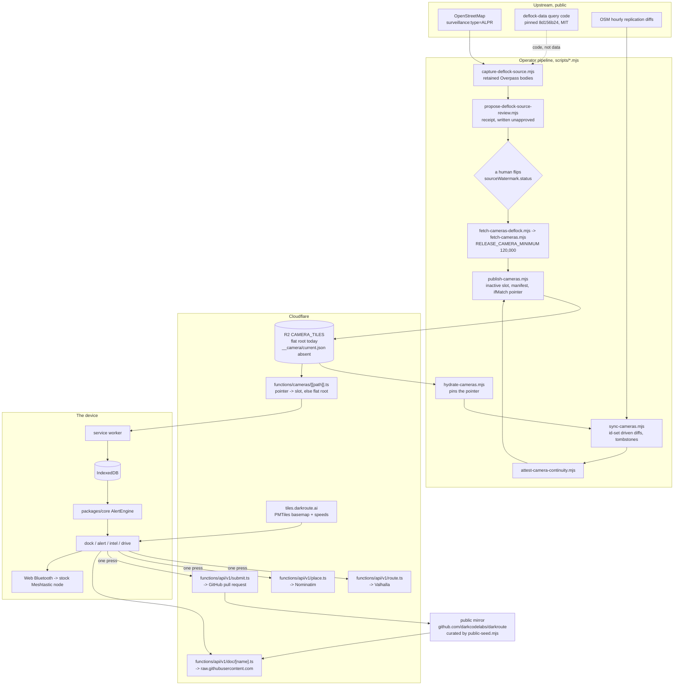
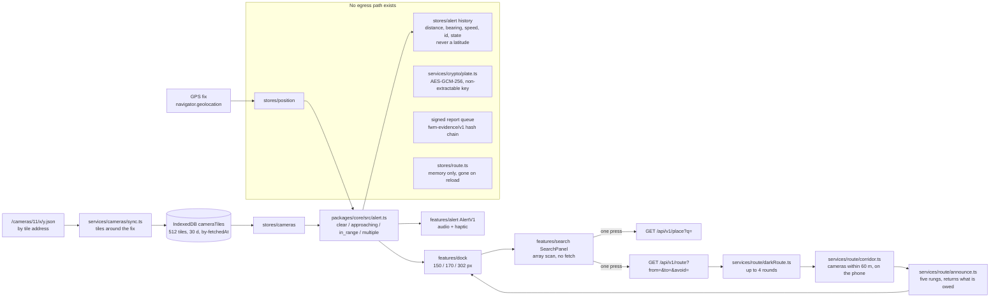
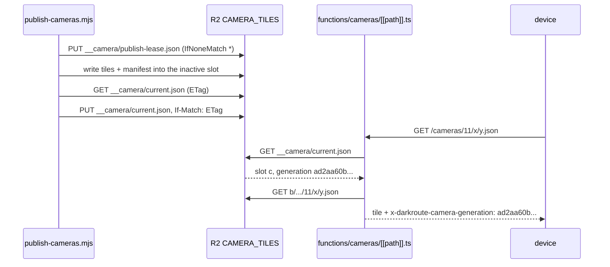
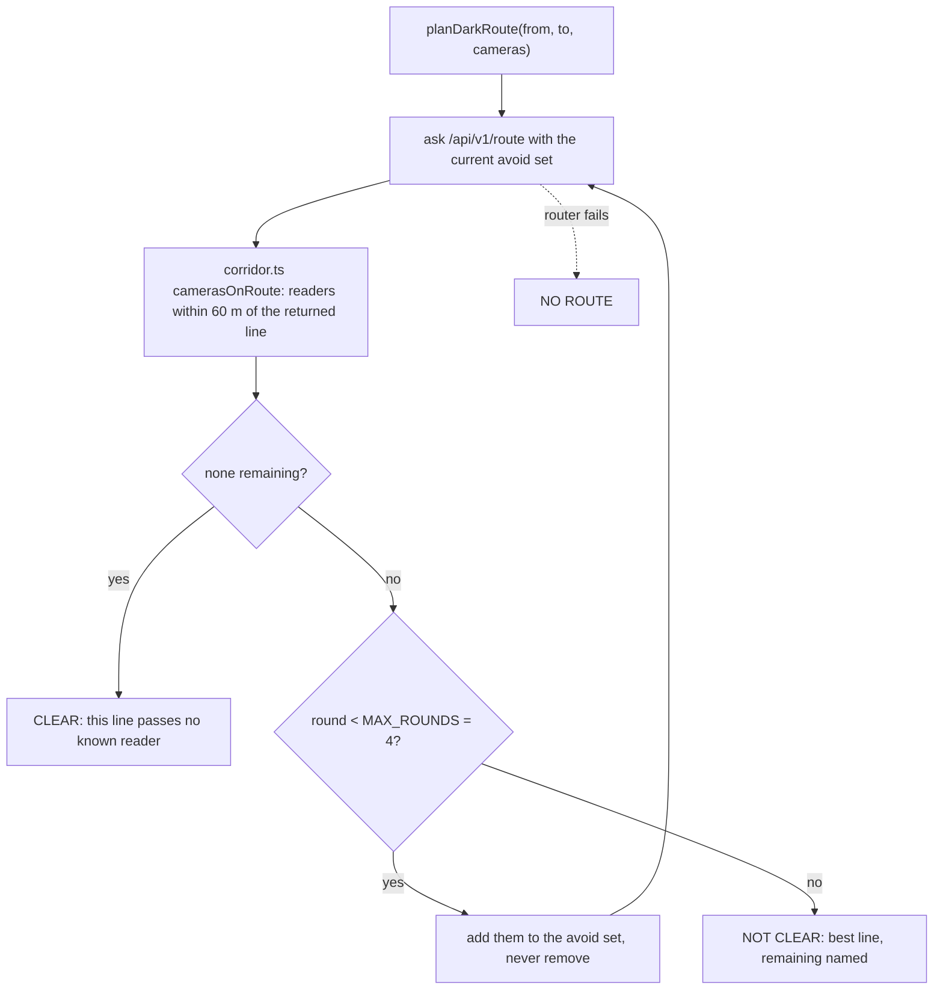
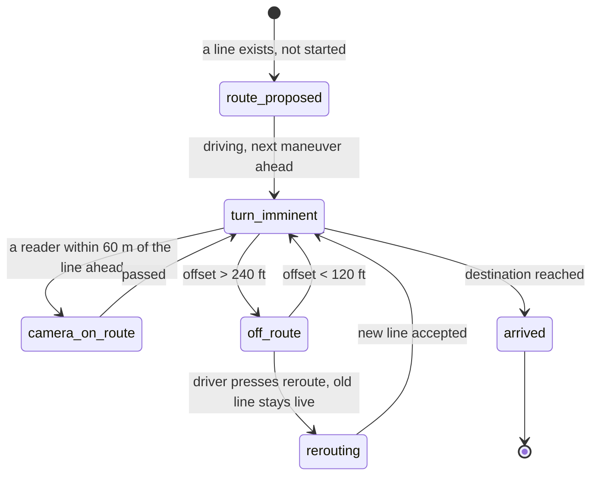

# What DarkRoute is

A map of where the plate readers are, a warning before you drive past one, and a
list of the things it refuses to promise. This is the full writeup: the
narrative first, then the technical body, and the body is the authority. Every
technical claim below names the file that makes it true. Where a number was
measured, the date is beside it; re-run the command instead of quoting the
number. Where the code and this document disagree, the code is right and this
document is the bug, see §10 for the test that catches the most common way that
happens.

*Measured against the working tree and the live host on 2026-09-09.*

## Contents

0. [The whole thing in one table](#0-the-whole-thing-in-one-table)
1. [What it is, what it is not, and why "no recognition" is the point](#1-what-it-is-what-it-is-not-and-why-no-recognition-is-the-point)
2. [Architecture](#2-architecture)
3. [The camera archive](#3-the-camera-archive)
4. [Navigation mode, the dark route, the detour key and the exposure model](#4-navigation-mode-the-dark-route-the-detour-key-and-the-exposure-model)
5. [LoRa mesh mode](#5-lora-mesh-mode)
6. [The UI](#6-the-ui)
7. [Privacy and threat model, with every outbound request](#7-privacy-and-threat-model-with-every-outbound-request)
8. [Quirks and features](#8-quirks-and-features)
9. [How to verify all of this yourself](#9-how-to-verify-all-of-this-yourself)
10. [Keeping this current](#10-keeping-this-current)
11. [Where it sits, and the limits](#11-where-it-sits-and-the-limits)

## The story first

I built a thing. [DarkRoute](https://darkroute.ai). It maps automated licence
plate readers and warns you before you drive past one. It is free, it has no
account, and the code is public.

### What it does not do

It does not hide your car. It does not make you anonymous. It does not survive a
compromised phone. If somebody has already decided to look at you specifically,
this app changes nothing about your position, and treating it as though it does
is the most dangerous thing you could do with it.

Absence of a camera on the map means nothing at all. Of the 139,613 cameras in
the archive, 116,417, 83.4%, carry no `operator` tag and are classed
`unverified` (`scripts/fetch-cameras.mjs:481-490`); the card says OPERATOR NOT
RECORDED for them (`apps/pwa/src/features/intel/intelState.ts:416`), because
"unverified" was the wrong claim. Most of them do carry a `manufacturer` tag:
113,420 of the whole archive say Flock Safety. A blank stretch of road is a
statement about the data and never a statement about the road. Drive as though
there is a reader there.

Every dot is a claim a volunteer made in OpenStreetMap. Not a sensor reading.
Not a government register. Somebody placed a point and tagged it. Most are
right. Some are stale by a month, or moved across the junction, or never
existed.

Right now the published archive holds 139,613 cameras across 8,740 tiles, built
2026-09-09 from a first-party Overpass capture whose every response body is
retained and hashed, approved by hand, then replayed forward
through OSM's hourly replication diffs to the head of the stream and attested
(§3). Every camera on it has a street name, four in five have a cross street,
and every one has a town or county, computed offline from the same basemap the
map draws (§3.7). The app prints the archive's age beside the camera count
(`apps/pwa/src/services/cameras/useCatalogueUpstream.ts:49-50`: LIVE under six
hours, BEHIND to forty-eight, STALE after), and checks the live generation
every minute so a phone never keeps an old one for long
(`apps/pwa/src/services/cameras/sync.ts:75`). I would rather show you a stale
number than a confident one.

### Where this sits next to noRecognition

Different layer, same adversary.

The noRecognition project attacks the model: a pattern goes on fabric and the
recognizer fails. DarkRoute attacks nothing. It is a map and a proximity alarm,
and calling it adversarial would be false.

The link is not thematic. The Falcon v2.2 teardown published by that community
reports that `person` is a first-class detection category in the shipped model
manifest, structurally equal to `licensePlate`, on a device marketed as a plate
reader. That claim is theirs, not this repository's, and nothing in this tree
can verify it. If it holds, it is why a clothing project and a driving app share
a threat surface: the plate reader is also a people detector. One of us works
on what the camera sees. The other works on whether you are in front of it.

Knowing where a camera is does not defeat it. That is a weaker privacy claim
than occlusion work, and this document is not going to dress it up as more.

### Where it sits in the ALPR ecosystem

The cameras come from OpenStreetMap. DeFlock established ALPR mapping as a
practice and settled the tagging vocabulary, and OSM is the system of record for
all of it. DarkRoute's capture code derives from the `flockhopper3/deflock-data`
repository at a pinned commit, under that project's MIT licence
(`scripts/capture-deflock-source.mjs:7-8`, `scripts/data/DEFLOCK-DATA-LICENSE.txt`);
the data itself is ODbL and is credited as such in every tile body. Anybody can
query the identical data without going through either project. That is the point
of the model.

One admission that belongs here. DeFlock's whole model is contributing back
upstream, and DarkRoute currently contributes nothing to OSM
(`apps/pwa/src/features/report/osmTags.ts:9`: "does NOT upload anything… no
OAuth, no changeset API call"). A correction you make leaves the phone only when
you press a key, and it opens a public pull request instead of writing anything
directly (`apps/pwa/src/services/share/shareCorrection.ts`,
`functions/api/v1/submit.ts:329`). The signed report queue on the device has
never been uploaded anywhere (`shareCorrection.ts:8-9`). That is a gap, not a
feature.

## 0. the whole thing in one table

| Question | Answer, with the file that makes it true |
|---|---|
| What is it | A static PWA (React 19, TypeScript strict, Vite, Zustand, IndexedDB, MapLibre + PMTiles) plus a handful of Cloudflare Pages Functions. `apps/pwa`, `packages/core`, `functions/` |
| Where the cameras come from | OpenStreetMap, ODbL. 139,613 cameras, 8,740 z11 tiles, replayed to the OSM replication head, upstream watermark `2026-09-09T19:00:00Z` at the time of writing (`apps/pwa/public/cameras/index.json`) |
| How they reach the phone | Whole z11 tiles fetched by address, never by coordinate (`packages/core/src/tiles.ts:68`, `apps/pwa/src/services/cameras/sync.ts:60-63`) |
| Where they live on the phone | IndexedDB, up to 512 tiles, hard expiry 30 days, stale after 24 h (`apps/pwa/src/services/db/policy.ts:34-52`); service worker cache `fwm-camera-tiles-v2` for 7 days (`apps/pwa/vite.config.ts:715`); the generation is re-checked every 60 s and a changed one replaces the tiles (`apps/pwa/src/services/cameras/sync.ts:75`) |
| What a record says | Street, cross street, distance to the street, town or county, owner class, maker, mount, facing, the OSM tags -- streets and towns computed offline from the basemap and Census polygons (§3.7, `scripts/build-camera-context.mjs`) |
| The alert decision | A radius, 100–1000 ft driver-set, default 500 (`packages/core/src/alert.ts:54-122`). Omnidirectional; the heading-aware cone is display only (`alert.ts:802`) |
| Routing | Valhalla `exclude_polygons` through DarkRoute's own Function; each camera is a 60 m box (`functions/api/v1/route.ts:102-161`). Default upstream is OSM's public Valhalla (`route.ts:57`) |
| The two things a driver sends on purpose | A place name (`GET /api/v1/place`) and an origin + destination pair (`GET /api/v1/route`), each behind one press (`apps/pwa/src/services/route/planRoute.ts:30-31`) |
| What never leaves | The GPS fix, the destination, the alert log, the plate vault, the signed report queue (`apps/pwa/src/stores/route.ts`, `apps/pwa/src/services/crypto/plate.ts`, `apps/pwa/src/services/share/shareCorrection.ts`) |
| LoRa | Stock Meshtastic over Web Bluetooth; a 16-byte sighting on port 256 (`apps/pwa/src/features/node/sighting.ts:73-76`); a test forbids every other transmit (`apps/pwa/src/features/node/mesh.privacy.test.ts`) |
| The network boundary | `connect-src 'self' https://tiles.darkroute.ai`, `script-src 'self'` (`apps/pwa/public/_headers`) |
| The provenance mechanism | sha256-pinned generations behind a compare-and-set pointer, a hand-approved review receipt binding the retained Overpass bodies, and an attested continuity chain from the receipt's replication floor to the head -- **in production since 2026-09-09T16:18Z** (§3) |
| The desk | `api.darkroute.ai` is a console over the same archive: filter rail, map, inspector, misuse table, API reference, coverage (`apps/desktop/src/console/`). A desk browser at `darkroute.ai/` is sent there; a phone, a deep link or `?app` gets the app (`functions/_middleware.ts:35`) |
| Licence | GPL-3.0-only. Public mirror: `https://github.com/darkcodelabs/darkroute` |

## 1. What it is, what it is not, and why "no recognition" is the point

**It is a warning, then an alternative.** There are good ALPR maps and DeFlock is
the best of them. But a map is a thing you look at *before* you leave, on a
laptop, with signal. The moment that matters is 1.4 miles out at 45 mph with the
phone in a cradle, and at that moment a map is the wrong shape of object. So the
constraint everything else falls out of is one line: **everything that matters
has to work with the radio off.** The archive is on the device, the alert engine
is pure geometry with no I/O (`packages/core/src/alert.ts`), search is an array
scan over local records (`apps/pwa/src/features/lookup/search.ts`), and the only
things that need a network are a place lookup and a route, both of which are a
key you press.

**It recognises nothing.** There is no camera input, no plate reading, no
computer vision. `Permissions-Policy` in `apps/pwa/public/_headers` sets
`camera=()`. The Android wrapper declares four permissions, fine and coarse
location, notifications and vibrate, and not `CAMERA`
(`apps/android/app/src/main/AndroidManifest.xml:25-27,49`). The reason is not
scope creep avoidance. A tool that exists because the reader is also a people
detector has no business being a detector.

**It does not make you anonymous.** Eight flat refusals are written into
[`THREAT-MODEL.md` §2](./THREAT-MODEL.md). The shortest version: it does not hide
you from cameras, it is not a VPN, and a silent map is not evidence of a clear
road.

**It publishes its own failures.** The transparency archive at
[`/transparency/`](../../transparency/README.md) has a dated count (0 as of
2026-08-29) so that silence is a claim on the record. [`AUDITING.md` §8](./AUDITING.md)
is what the audit found and nobody has fixed. And §3 of this document corrects a
provenance claim earlier drafts of this same text made and had to retract.

## 2. Architecture

### 2.1 the whole system



Every arrow has a call site. The dotted arrow is the one to read twice: the
capture code derives from DeFlock's query topology, but the archive that is
actually being served today came from DeFlock's *hourly build*, not from a
first-party capture, its own body says so (§3.2).

The Functions the app calls are `functions/cameras/[[path]].ts`,
`functions/api/v1/route.ts`, `functions/api/v1/place.ts`,
`functions/api/v1/submit.ts`, `functions/api/v1/photo/[[key]].ts` and
`functions/api/v1/doc/[name].ts`. Three more exist for third parties and have no
caller in the app: `functions/api/v1/cameras.ts` (cameras in a bounding box, read
through the app's own tile route), `functions/api/v1/abuse.ts` (the misuse
records) and `functions/api/v1/stats.ts` (what is published right now), with
`functions/api/v1/openapi.json.ts` describing them. Every `/api/v1/*` request
passes `functions/api/v1/_middleware.ts`: 60 requests a minute per IP per
isolate (`:66-67`), 429 with `Retry-After` above that. The administrative
The administrative Functions (identity-gated operator tooling, not distributed) sit behind Cloudflare Access on the
development host and are not part of the public product.

### 2.2 What happens on the phone



The two things that travel through the system travel in opposite directions and
never mix. **Camera positions come down**: public facts about public hardware,
the payload of every tile, marker and alert. **The driver's position stays put**:
read from the GPS into a store, consumed by the engine, and written only into
the alert history as a distance and a bearing (`apps/pwa/src/stores/alert.ts:470-481`
records `cameraId`, `label`, `state`, `previousState`, `distanceFt`, `speedMph`,
`headingDeg`, `muted`, and no coordinate). The destination is the most
sensitive value the app holds and it is deliberately never persisted
(`apps/pwa/src/stores/route.ts`, header).

### 2.3 the desk console

`api.darkroute.ai` is the same archive on a desk (`apps/desktop/`). It is a
second Cloudflare Pages project built from `apps/desktop/src/console/`, copied
frame by frame from a design that states its own rules: opaque panels with a
2 px / 3 px grain and no glass anywhere, 36 px rows under a pointer and 44
under a thumb, a 56 px bar, a 264 px filter rail, a 340 px inspector, a 32 px
status bar, one hue per meaning, and a light theme whose accent is `#096064`
because cyan fails on white. Four tabs: Archive (the map, the owner filters,
an inspector that shows a record down to its tile path and raw JSON, with the
OSM node and the correction form one press away), Misuse (the abuse archive
as a table with dated sources and a CSV), API (the published files, weighed
live), Coverage (every county with a camera and its share). Below 1024 px
the rails collapse; below 640 the map takes 260 px and a nearest-first list
owns the rest.

It reads what the phone reads. Its own Functions proxy `/v1/*`, `/api/v1/*`
and `/cameras/*` to the canonical origin (`apps/desktop/functions/`), so a
request to `api.darkroute.ai/cameras/index.json` is the archive and never the
console's HTML, and the map is the phone's basemap by range request
(`apps/desktop/src/console/basemap.ts:17`). It holds no state of its own
beyond the theme in `localStorage`.

A desk browser that opens `darkroute.ai/` is sent there with a 302
(`functions/_middleware.ts:35`). A phone, a `sec-ch-ua-mobile: ?1` hint, any
deep link (`?screen=`, `?camera=`), the installed app's own `start_url`
(`?src=pwa`) and an explicit `?app` all get the app, and `?app` is remembered
in a cookie so a desk that wants the phone surface is not bounced twice. The
redirect carries `vary: user-agent` and `cache-control: no-store`, so an edge
cache cannot hand a phone a desk's answer.

## 3. the camera archive

### 3.1 Tiled at zoom 11, fetched by address

The archive is cut into z11 tiles. A z11 tile is about 15 km across at
mid-latitudes: the largest square that still lets the client discard most of the
archive on a single fetch, and small enough that "somebody wanted this tile" is
a weak fact about a driver. The tile address is computed on the device from the
standard slippy-map transform (`packages/core/src/tiles.ts:68`, `latLonToTile`),
so no coordinate is ever sent to fetch camera data. The origin sees
`GET /cameras/11/{x}/{y}.json`, identical for every driver in that square and
cacheable at the edge. A 404 is the normal answer for a square with no ALPR in
it and the client reads it as "no cameras here"
(`apps/pwa/src/services/cameras/sync.ts:262-268`).

Not the whole archive as tiles, though. The device pulls tiles *around the fix*
as it moves (`sync.ts`), holds at most `MAX_CAMERA_TILES = 512` in IndexedDB
with a 30-day hard expiry and a 24-hour staleness mark
(`apps/pwa/src/services/db/policy.ts:34-52`), and the service worker caches
tiles `StaleWhileRevalidate` for seven days (`apps/pwa/vite.config.ts:698-715`).
The whole archive does reach the phone in one piece as `overview.json`, 139,613
flat coordinates, about 2.7 MB, for the national map and the POI export.

Three consequences, and they are separate claims:

- **No server can be subpoenaed for your queries, because there are no
  queries.** There is no row anywhere that says a given device asked about a
  given intersection. That is a structural property, not a retention policy
  ([`ARCHITECTURE.md` §2](./ARCHITECTURE.md)).
- **The tile address is not a coordinate, but it is not nothing.** A 15 km
  square is a weak fix. A *sequence* of those requests over an hour traces a
  corridor. [`THREAT-MODEL.md` §5.5](./THREAT-MODEL.md) says so in those words,
  and the in-app help answer (`apps/pwa/src/features/help/answers.ts:42`) names
  the 15 km tile, the 1.9 km speed square and the basemap viewport.
- **The edge caches the tiles because the Function puts them there.** A Pages
  Function's answer is `DYNAMIC` to Cloudflare's cache unless the Function
  uses the Cache API itself, and on 2026-09-09 every tile read was an R2 read.
  The Function now stores each answer under its own
  `cache-control: public, max-age=3600, must-revalidate` and answers repeats
  from the colo with `x-darkroute-edge: hit`
  (`functions/cameras/[[path]].ts:380`). The privacy argument never depended on
  it; the cost argument now holds.

### 3.2 the generation pointer, in use since 2026-09-09

**The archive is content-addressed, and in production it is.** An earlier
version of this section was a correction: the pointer had been designed
and tested and had never been written. It was written on 2026-09-09 at
16:18Z, and this section is what replaced the correction.

The design (`scripts/camera-generation.mjs:38-47`): generations pinned by
sha256, three slots `a / b / c`, a manifest with schema
`darkroute-camera-generation/v1`, a pointer at `__camera/current.json` with
schema `darkroute-camera-pointer/v1`, the active generation echoed in an
`x-darkroute-camera-generation` header on every tile, and a compare-and-set
write of the pointer (`scripts/publish-cameras.mjs`: `IfMatch` on the current
pointer's ETag, or `IfNoneMatch: '*'` for the first pointer ever written) so a
half-published generation cannot be pointed at. A generation must carry at
least 4,000 tiles and `RELEASE_CAMERA_MINIMUM` = 120,000 cameras
(`camera-generation.mjs:46-47`, `scripts/fetch-cameras.mjs:367`) or it is not a
generation. A publish takes a three-hour lease in the bucket first
(`scripts/publish-cameras.mjs:84`), so two publishes cannot interleave; a
publish that dies leaves the lease behind, and the next one waits or the
operator deletes it by hand, which is the right failure.

What is actually live, in one command:

```bash
curl -sD- https://darkroute.ai/cameras/index.json -o idx.json | grep -i camera-generation
 # x-darkroute-camera-generation: <64 hex>   -- the generation, not sha256(index.json)
curl -s https://darkroute.ai/api/v1/stats | jq '{cameras, generation, generatedAt, upstream}'
```

The header names the generation whose manifest lists every one of the 8,740
tiles and six sidecars by sha256 and byte length; the pointer names the slot
and the manifest's own hash. The first generation (`d91bec12…`, slot `a`)
was a bootstrap publish; the second (`1221119a…`, slot `b`) and third
(`ad2aa60b…`, slot `c`) were normal ones,
and a normal publish has to prove it extends the generation that is live --
`scripts/publish-cameras.mjs` re-derives the continuity document from the
retained receipt, the parent's proof and the replication diffs, and refuses
the candidate unless the bytes match (`candidate camera continuity is not the
independently reproduced transition` is the sentence; it fired twice on the
way here, both times correctly).



The retained-response ledger is real too. Every raw Overpass response body of
the capture is kept, hashed, and bound to the tiles it authorised
(`scripts/capture-deflock-source.mjs`, `scripts/deflock-capture.mjs`), and the
artifacts are in the tree now, bound by hash from the receipt:

```bash
ls -la scripts/data/deflock-us-overpass-response-ledger.json \
       scripts/data/deflock-us-overpass-responses.bundle.gz \
       scripts/data/deflock-us-source.geojson.gz \
       scripts/data/camera-predecessor.json \
       scripts/data/deflock-us-baseline-tombstones.json
jq '.sourceWatermark.status, .replicationFloor' scripts/data/deflock-us-source-review.json
 # "approved"
 # { "stream": "hour", "sequence": 122646, "timestamp": "2026-09-09T13:00:00.000Z", ... }
```

`apps/pwa/public/cameras/index.json` says so about itself:
`"source": "OpenStreetMap (ODbL), direct retained-response capture using
DeFlock-derived queries"`.

### 3.3 the review receipt, and why nothing can fake it

A capture becomes a trust root only through a review receipt, and
`scripts/propose-deflock-source-review.mjs` writes every receipt as
`unapproved` by construction. A human edits one field. The receipt in the tree
(`scripts/data/deflock-us-source-review.json`, schema
`darkroute-deflock-source-review/v3`) was promoted to `approved` by hand on
2026-09-09 -- "this is human validation" -- and it binds, by sha256 and byte
length: the two capture scripts as they were when they ran; the response
ledger, the retained bodies and the raw union; the predecessor archive it
replaced, with the live-id set it had to account for; the reconciled tombstone
ledger; the county geofence; the expected transformation (140,503 features in,
139,613 cameras out, 890 outside the geofence, 6 tombstones cleared by newer
OSM versions); and the conservative replication floor, the last hourly
sequence whose timestamp precedes every retained response's own
`osm3s.timestamp_osm_base`.

Every reader of the receipt checks all of it. `scripts/fetch-cameras.mjs`
refuses to build from a receipt whose capture-script hashes do not match the
tree; `scripts/attest-camera-continuity.mjs` re-runs the transformation from the
retained bodies and refuses if the numbers move; the public seed script
refuses to publish the mirror without every bound artifact present. The receipt
that was in the tree for a week before this one said `unapproved` and why --
the fetch run had not retained `osm3s.timestamp_osm_base` -- and the validators
threw away three finished national captures before the bugs turned out to be
in the validators (fixed 2026-09-09). Fail-closed is the right default and it
is not the same as provenance; the receipt is what made it provenance.

### 3.4 Hourly replication, and the continuity proof

`scripts/sync-cameras.mjs` does not poll Overpass -- Overpass's usage policy
names country-scale scheduled polling as prohibited -- it consumes OSM's hourly
replication diffs from the public planet mirror, driven by DarkRoute's own id
set instead of by tags, because a `<delete>` in OsmChange carries no tags and a
tag filter would see zero camera removals forever (`sync-cameras.mjs`, header).
It starts at the receipt's replication floor and applies every hourly sequence
to the head, refusing to advance if any sequence is missing. Removals become
tombstones with the sequence and OSM version that removed them
(`apps/pwa/public/cameras/tombstones.json`, 3,705 of them).

`scripts/attest-camera-continuity.mjs` then writes `continuity.json`: the
baseline's live and tombstone digests recomputed from the retained bodies, and
a transition -- `baseline-replay` for the first generation, `replication` with
the parent pointer for every one after -- listing the hourly sequences replayed
and the resulting digests. A phone can read it
(`apps/pwa/src/services/cameras/generation.ts`); `scripts/publish-cameras.mjs`
must reproduce it byte for byte before it will point at the generation. The
continuity core deliberately excludes the derived fields -- county, place,
street, town (`scripts/camera-integrity.mjs:13`) -- so it is a statement about
what OSM said and nothing else.

`.github/workflows/camera-sync.yml` still exits on a scheduled run by policy;
the sync to the head was run from the operator's own machine for these
generations, in the order the runbook gives, and the sync state it left is in
the tree (`scripts/camera-sync-state.json`: `versionsKnown: true`).

### 3.5 the two-armed counts

The archive carries five ownership classes, `unverified | police | hoa |
inter_agency | private` (`scripts/camera-generation.mjs:83`,
`apps/pwa/src/stores/settings.ts:66`), assigned from the OSM `operator` tag
alone (`scripts/fetch-cameras.mjs:481-490`). An empty `operator` is
`unverified`; nothing is guessed from a manufacturer, because a guessed "police"
would sit behind a filter a driver uses to decide what alerts them.

Measured over `apps/pwa/public/cameras/11/` on 2026-09-09, generation
`ad2aa60b…`:

| Class | Cameras | Share |
|---|---:|---:|
| `unverified` | 116,417 | 83.4% |
| `police` | 14,605 | 10.5% |
| `private` | 6,210 | 4.4% |
| `inter_agency` | 2,158 | 1.5% |
| `hoa` | 223 | 0.2% |

`operator` is present on 16.6% of records; `manufacturer` on 95.2% (Flock
Safety 113,428; Motorola Solutions 7,077; Genetec 3,417; Axis 1,936; Leonardo
1,171); `direction` on 98.7%; `camera:mount` on 30.1%; `surveillance:zone` on
87.9%. So the archive knows *what* most of these cameras are and does not know
*whose* they are, and the class label says so on its face: OPERATOR NOT
RECORDED. The retained-tag list is part of the pinned capture implementation
(`scripts/deflock-capture.mjs`), so `camera:type`, `surveillance=public` and
`manufacturer:wikidata` -- present on many nodes -- wait for the next capture.

### 3.6 Why a zero is never published

Every build gate refuses a small archive instead of publishing an empty one.
`RELEASE_CAMERA_MINIMUM = 120_000` and `MIN_TILES = 4_000` fail
`camera-generation.mjs` validation; a truncated Overpass response, a bad bbox or
an instance returning 200 with zero elements all look exactly like "every camera
here was removed", which is why `sync-cameras.mjs` never re-fetches a region and
deletes what is missing. On the device, `useCatalogueUpstream.ts` prints LIVE,
BEHIND or STALE beside the count instead of hiding the age, and the exposure
screen draws "Nothing recorded yet" as a sentence instead of a `0`
(`apps/pwa/src/features/exposure/ExposureScreen.tsx:118`), because a zero
the app never measured is a false statement.

Every tile carries `attribution`, `licence` and `licenceUrl`; the generation
validator requires all three (`camera-generation.mjs:525`).

### 3.7 Streets, cross streets and towns -- the context layer

Not one OSM ALPR node carries a street. Until 2026-09-09 every Lookup row read
"unnamed pole" over an id, and the Exposure log, which labels a pass from the
same record, read as a dash. That was the archive being honest and the product
being useless, and the fix is not a geocoder.

`scripts/build-camera-context.mjs` reads the same PMTiles basemap the map draws
-- `basemap-us-20260901-full-us.pmtiles`, 4.5 GB, read as a local file and
pinned by sha256 into the output -- decodes the z14 `roads` layer under each
camera, and takes the nearest named road as the street and the nearest
differently named road within 120 m as the cross street
(`build-camera-context.mjs:73-75`, `:216`). Names are abbreviated the way a
sign is ("West 95th Street" -> "W 95th St", `:117`). The town comes from the
Census cartographic-boundary PLACE polygons (`cb_2023_us_place_500k`, also
pinned by hash), or "<Name> County" outside every incorporated place. Nothing
leaves the machine that computes it; the phone never asks anybody where a
camera is.

Measured over the tree on 2026-09-09: 139,397 of 139,613 records have a street
(99.8%), 90.2% within 40 m of it and 95.3% within 100 m; 111,753 have a cross
street (80.0%); 139,553 have a town or county; 82,277 distinct street names.
The distance is on the record (`streetM`), so a row can say "off Metcalf Ave"
for a camera 300 m up a driveway instead of putting it at an intersection it
is not at (`apps/pwa/src/features/lookup/streetGroups.ts:280`).

The layer is an annotation, not a claim about OSM. It rides beside the review
receipt (`scripts/data/camera-context.json`, self-identifying: the basemap
and Census hashes are in its header), the release applies it to every record
it matches (`scripts/fetch-cameras.mjs:178`, `:243`), the continuity core
leaves every context field aside (`scripts/camera-integrity.mjs:13`), the
generation validator holds the fields to the same discipline as a tag -- short,
non-empty, nothing that reads as a contact (`scripts/camera-generation.mjs:460`)
-- and an hourly upsert carries them across in the same tile
(`scripts/sync-cameras.mjs`, `CARRIED_FORWARD`). A camera replication adds
after a context build has no street until the next build, and the row says so.

Two real streets the validator refused before it learned them, and the rule
it learned: "E Dot Stafford St" in Pecos, Texas (the tag de-obfuscator read
" dot " as a domain) and "2600 South / 1100 N" in Salt Lake's grid (eight
digits read as a phone number). A street may say "@" and count in fours.

### 3.8 Places and counties, on the phone and in the API

`counties.json` joins every camera to its county polygon at build time (2,382
counties, 139,613 located, 0 outside every polygon). `places.json` is written
from the context layer: one row per Census place with a camera in it, with
its geoid, name and count, in the shape the app's gazetteer keys on
(`apps/pwa/src/services/cameras/gazetteer.ts`). Generation `1221119a` shipped
it empty -- the release counted places by the raw OSM id and found none, and
the sync then replaced it with the "no enrichment" sidecar on every upsert;
both fixed the same day (`scripts/fetch-cameras.mjs:217`,
`scripts/sync-cameras.mjs:819`), and the third generation (`ad2aa60b…`)
carries the rows: 8,757 places, 111,691 cameras inside an incorporated place
and 27,922 outside every one. Verify with the command in §9, not this
sentence.

## 4. Navigation mode, the dark route, the detour key and the exposure model

### 4.1 the alert engine

The engine is `packages/core/src/alert.ts`: pure, dependency-free, no DOM, no
I/O, no clock of its own. Four states, `clear | approaching | in_range |
multiple` (`packages/core/src/types.ts:29`), decided by distance alone
(`alert.ts:287-296`):

| Constant | Value | Meaning |
|---|---:|---|
| `DEFAULT_ALERT_THRESHOLD_FT` | 500 | the radius, driver-set |
| `ALERT_THRESHOLD_DESIGN_MIN_FT` / `MAX` | 100 / 1000 | the slider's range, step 50 |
| `ALERT_THRESHOLD_MIN_FT` / `MAX` | 25 / 5280 | the hard bounds |
| `APPROACHING_OUTER_FT` | 1000 | `approaching` begins |
| `MULTIPLE_MIN_CAMERAS` | 2 | `multiple` instead of `in_range` |
| `DEFAULT_HYSTERESIS_FT` | 50 | leaving takes 50 ft more than entering |
| `DEFAULT_RE_ALERT_WHEN_CLOSER_THAN_FT` | 150 | a muted camera still speaks this close |
| `DEFAULT_MUTE_DURATION_MS` | 600,000 | ten minutes |
| `DEFAULT_GPS_ACCURACY_LIMIT_M` | 50 | worse than this and the fix is not trusted |
| `DRIVE_MODE_MIN_SPEED_MPH` | 5 | below this you are parked |

The decision is omnidirectional. The engine computes `facingVehicle`
(`alert.ts:802`, tolerance `DEFAULT_FACING_TOLERANCE_DEG = 30`, ahead cone
`AHEAD_HALF_ANGLE_DEG = 45` in `packages/core/src/geo.ts:43-52`) and never gates
the state on it: the forward corridor is heading-aware but **display-only**. A
rival with a comparable corridor gates on a predicted forward path and, by
this repository's own reading of its public materials, posts that path to its
server every 30 seconds or 300 metres (the competitive comparison, kept out of the public tree; the
Drivers Against Flock row and "Say:" note). That is an INFERENCE-tier claim in
§11.1's terms, not a packet capture; the trade it describes is the point.

Separately, "entering a watched area · N within 2 mi" fires at twelve or more
cameras within two miles and clears below eight, and it is never a haptic
(`apps/pwa/src/services/cameras/watchedArea.ts:39-57`).

**You can filter what the map draws. You cannot filter alerting from the map.**
`apps/pwa/src/features/map/ownerFilter.ts` is a drawing filter and its header
says what it must never become; the two nearest cameras stay on the map off
their own assessments whatever is hidden, and the control says on its face
`display only - every camera is still watched`
(`apps/pwa/src/features/map/MapControlPanel.tsx:153`). There *is* a separate
triage setting, `ownerTypesEnabled`, which governs which owner classes are
allowed to warn (`apps/pwa/src/stores/settings.ts:95,353`); the two are never
read by the same component, on purpose.

### 4.2 the router

The old design handed plane geometry to Google Maps as via-points. That shipped
and it was the wrong shape twice: a handoff tells a maps company where you are
going, and a via-point says "go through here" when a driver wants "do not go
through there". So the app now routes against **Valhalla with
`exclude_polygons`**, through its own Function. Each camera becomes a small
square the router may not enter, and the engine solves the problem that counts.

**The box is 60 m on a side, and getting that right is less trivial than it
looks.** A single delta on both axes produces a box that is 60 m north–south and
47 m east–west in Kansas, 20 m in Alaska. The east–west half-width is divided by
`cos(latitude)`, clamped at 0.2 to stop the division running away past about 78
degrees north (`functions/api/v1/route.ts:160-161`):

```js
const dLat = EXCLUSION_M / M_PER_DEG_LAT;              // 60 / 111320
const dLon = dLat / Math.max(0.2, Math.cos((point.lat * Math.PI) / 180));
```

The archive covers Alaska; a box that shrinks to 20 m is a box a road goes
straight through. The request is `GET /api/v1/route?from=&to=&avoid=`
(`route.ts:466-485`), at most `MAX_EXCLUSIONS = 60` boxes (`:70`), span capped
at `MAX_SPAN_DEG = 12` (`:106`), polyline decoded at precision 6 (`:182`), and
the response is `cache-control: no-store` (`:564`) because a route is personal
to one driver at one moment and an edge cache keyed on it would be a store of
exactly the records this app exists to prevent.

**One large caveat, stated plainly.** The Function's default upstream is the
third-party public FOSSGIS instance `https://valhalla1.openstreetmap.de/route`
unless `VALHALLA_URL` is set (`route.ts:57`), and place lookups default to
`https://nominatim.openstreetmap.org/search` unless `NOMINATIM_URL` is set
(`functions/api/v1/place.ts:65`). Nothing in the repository sets either. So the
honest sentence is: your origin and destination go to DarkRoute's Function,
which forwards them, without your IP, to OpenStreetMap's public router; the
code allows a self-hosted router and none is configured in the tree.

There is an invariant between the two halves that is easy to get wrong:
`EXCLUSION_M >= CORRIDOR_M` (`route.ts:92`, asserted in
`functions/api/v1/route.test.ts`). If the box were narrower than the corridor
the planner selects on, the router could thread a legal path through a camera
the planner had already promised to avoid.

### 4.3 the detour key

`planDetour` in `packages/core/src/avoidance.ts` still runs, and its role has
changed. It projects every camera onto the line ahead as signed cross-track and
along-track offsets, drops what is behind, calls anything within a metre of the
centreline unavoidable, and clusters the rest at `CLUSTER_SPAN_MULTIPLE = 2`
times `DEFAULT_CLEARANCE_FT = 1000` (`avoidance.ts:45-63`). What it produces now
is the detour's end point and the set of cameras *considered*
(`apps/pwa/src/features/drive/detour.ts:104`, `DETOUR_RUNOUT_FT = 1320`). The
exclusion set is then chosen by `apps/pwa/src/services/route/darkRoute.ts`:



The avoid set only grows (`darkRoute.ts:62,151`). The card tells you which
outcome you got and how many readers remain.

**One bug worth writing down.** The reroute key worked mid-alert and went
exactly one hop when fired from a parked card. Mid-alert the car is moving, the
course is measured, and the readers are ahead. Parked, the heading is stale and
fourteen readers are scattered in every direction, so a bearing that owed
nothing to the readers put one of fourteen inside the corridor. The fix aims the
corridor at the densest line through the set when there is no real heading
(`detour.ts:334`, `detourAimBearing`, weighing at most `AIM_MAX_CAMERAS = 128`).

**What that still cannot do**, said once: a straight corridor cannot hold a
ring. Fourteen readers over two miles do not fit on one line at any bearing,
and widening the berth until they did would redefine the berth, which is a read
range and not a routing preference. The app picks the line that carries the
most of them and says how many it dropped (`detour.ts:38-44`). That is why a
card can read `14 cameras within 2 mi` beside a key that says `Around 9`: one is
a fact, the other is a plan.

### 4.4 Navigation mode, and why it says so little

Routing produces a line. Navigation is the next twenty minutes, and the driver
is not reading, so every word has to be worth the glance it costs.

**Six navigation states, three expanded views, three heights, and the height
never changes mid-drive.** `DockNavStateId` is `route-proposed | turn-imminent |
camera-on-route | rerouting | off-route | arrived`
(`apps/pwa/src/features/dock/dockState.ts:218-233`), all at the navigating
height of 170 px; the nearby list, the turn list and the route chooser use the
expanded 302 px (`dockState.ts:255`, `DockExpandedViewId`). `turn-imminent` shouts under
`DOCK_TURN_IMMINENT_FT = 800` (`:244`). Escalation is colour, weight and the
number, never size, because a pane that grows while you approach a junction
moves the tap target at the worst possible moment.



**Announcements are a ladder, not a stream.** The maneuver module answers
"which turn is next and how far" on every GPS tick. Wired straight to a voice,
the voice never stops. So there are five rungs and each fires once per turn
(`apps/pwa/src/services/route/announce.ts:85-115`):

```text
RUNG_MILE          5280 ft
RUNG_HALF_MILE     2640 ft
RUNG_QUARTER_MILE  1320 ft
RUNG_APPROACH       500 ft
RUNG_NOW            100 ft   the mouth of the turn
```

The guard is a set of `(turn, rung)` pairs already spent, keyed on the
maneuver's shape index instead of its distance, because GPS noise walks you
back and forth across a rung boundary. Announcing a rung also spends every
coarser rung for that turn, so a fix that jumps you from a mile to 400 ft fires
once.

**The module that decides does not deliver.** `announce.ts` returns what is
*owed* and stops. It composes no notification, speaks nothing, touches no store,
requests no reroute. The caller delivers, because the caller knows whether the
screen is on, whether the trip is muted, and whether a camera alert already
holds the card.

**Off route is 240 ft, back on is 120 ft, and noticing is not acting.**
`OFF_ROUTE_FT = 240`, `BACK_ON_ROUTE_FT = 120` (`announce.ts:129,140`). Asking
for a new route is a network request carrying a position and a destination, and
the rule that the request is never made speculatively would be worthless if a
geometry function could fire one off. Rerouting is a state you can see, with
the old line still live underneath, and a Cancel.

**Which cameras are on the line is computed on the phone.** `corridor.ts` keeps
readers within `CORRIDOR_M = 60` of the route, in the order they will be
passed, using squared distances so there is no square root per camera per tick
(`apps/pwa/src/services/route/corridor.ts:48-60`). The server returned a line;
what is dangerous about it is worked out locally.

**Only three states animate, and never within five seconds of a maneuver.**
`approach | passing | cleared`, `SWEEP_TURN_QUIET_MS = 5000`
(`apps/pwa/src/features/chrome/PixelSweep.tsx:76,98`). Losing a turn because
pixels were moving is the one failure here that is actually dangerous.

### 4.5 the exposure model

Exposure is arithmetic over the alert history, and the history never holds a
coordinate. Two counts are named apart (`apps/pwa/src/features/log/exposure.ts`,
header): a **pass** is a camera that actually put the driver in range; an
**encounter** is any camera the log recorded the driver coming up on, including
one that only reached `approaching`. `FLOCKED TODAY` and the seven-day bars
count passes; the timeline and the hottest segment draw encounters. Muted
cameras count, muting removes the alert, never the record. The dock's density
ramp has four tiers, `clear 0 | low 1–5 | moderate 6–12 | high 13+`
(`apps/pwa/src/features/dock/dockState.ts:296`), and the word rides beside the
colour, always (`apps/pwa/src/features/dock/BrowseRow.tsx:179`).

## 5. LoRa mesh mode

A node is a stock Meshtastic radio sitting in the car. It matters because reach
without a carrier is the one thing the rest of the app cannot buy: a camera
somebody finds is useful to the driver behind them, and today that only travels
if both have signal and both trust a server in the middle.

**There is no DarkRoute firmware, and the reasoning is in the source.** Getting
two radios to exchange bytes is the easy tenth. Routing, encryption, key
exchange and an OTA story are the other nine, and Meshtastic has them across a
deployed fleet. So a sighting is a **16-byte payload on a private port**
(`apps/pwa/src/features/node/sighting.ts:73-76`: `SIGHTING_MAGIC 0xF1`,
`SIGHTING_BYTES 16`, `SIGHTING_PORTNUM 256`), big-endian:

| Byte | Field |
|---:|---|
| 0 | magic `0xF1`, so a stranger's packet on a shared port is rejected instead of parsed into a camera |
| 1 | kind: 1 reported, 2 confirmed, 3 disputed |
| 2–5 | latitude, int32, degrees × 1e5 |
| 6–9 | longitude, int32, degrees × 1e5 |
| 10–11 | bearing the camera faces, uint16, `0xFFFF` unknown |
| 12–15 | OSM id truncated to 32 bits, 0 for "not in OSM yet" |

Five decimal places is about a metre, which is what the archive itself stores;
a sighting cannot carry more precision than the data it came from. The client
library is `@meshtastic/js 2.6.0-0` (`apps/pwa/package.json:21`).

**Pairing reads. It does not transmit.** `apps/pwa/src/features/node/mesh.privacy.test.ts`
greps every file in both mesh directories (`GUARDED = ['node', 'mesh']`, `:65`)
for `sendPacket`, `traceRoute`, `requestPosition` and the rest (`:113-121`),
because a send is one line inside a button handler and a comment would not stop
it. Transmission is exactly the paths the test allows, each with one call site
behind a press (`apps/pwa/src/features/node/mesh.ts:821-876`): `sendText` as a
broadcast; `sendDirect` as a PKI DM sealed X25519 → AES-256-CCM with a cleartext
header; `joinChannel`, `setOwnerName`, `setLora` as local admin writes that put
nothing on the air by themselves.

**Mesh chat is a broadcast and the module says so before the UI does**
(`apps/pwa/src/features/node/chat.ts`, header). A message goes to every node in
range and into each of their message databases; on the default channel the key
is published in Meshtastic's own source. Two rules hold: nothing sends without a
press, no timer, no position update, no retry, and no plates ever, which is
enforced: `refuseToSend` returns `empty | too-long | plate`, with
`MAX_MESSAGE_CHARS = 180` (`chat.ts:41,56`).

**The cable flasher was deleted.** BLE cannot flash a bare board, the ESP32
bootloader speaks UART and BLE is a service *of* the firmware, and on Android
`navigator.serial` only surfaces Bluetooth RFCOMM ports
(`apps/pwa/src/features/node/transport.ts`). The app owns management after
compatible firmware is running, and says so
(`apps/pwa/src/features/mesh/installerRetired.test.ts`).

## 6. the UI

### 6.1 the dock's three locked heights

`COLLAPSED 150, NAVIGATING 170, EXPANDED 302`, border-box, hairline included,
from `data-fwm-pane` and nothing else (`apps/pwa/src/features/dock/dock.css:20-21`).
Fourteen collapsed states share the first height (`dockState.ts:115-129`), six
navigation states the second, three expanded views the third. The conformance
suite resolves all three from the stylesheet's own token sums
(`apps/pwa/src/features/dock/dockConformance.test.ts:356`), and, after a build
in which every height check passed while the pane was visibly wrong because two
components emitted class names the stylesheet declared nowhere, it now also
reads every class the components render and fails on any that has no rule
(`dockConformance.test.ts:1246`). The pane's arithmetic was correct and the pane
was wrong; a suite that tests only what you thought to write down tests your
imagination.

### 6.2 Four layers of glass

Every pane is "four layers of glass" (`dock.css:128`), and the layers are tokens
(`apps/pwa/src/styles/tokens.css:2373-2500`): the fill
`--fwm-surface-glass = rgb(var(--fwm-glass-rgb) / var(--fwm-glass-a))` with
alpha 0.3; the filter `blur(16px) saturate(180%) brightness(1.08)`; the rim
`--fwm-glass-rim`, two inset rim lines instead of a drop shadow; the border
`--fwm-glass-border: rgba(255,255,255,.14)`; and the sheen gradient that makes
glass read as glass. The liquid sheen and edge are paint, not refraction, and
the paper theme sets `--fwm-glass-a` to 1 and the e-ink theme sets
`--fwm-glass-blur` to 0 (`tokens.css:3063-3081`, `:3165`), so both read as flat
by token. One hue carries one
meaning: cyan was both "active selection" and "unverified report" for months,
and unverified is purple now (`tokens.css:1358-1371`, `--dr-owner-unverified`).

### 6.3 the search entry

`apps/pwa/src/features/search/SearchPanel.tsx` is a 46 px field with the voice
mic inside it, a list of places, and on the right of every row the number that
is the reason the app exists, how many cameras are on the way there. Typing
sends nothing: matching runs over the cameras already on the phone
(`apps/pwa/src/features/lookup/search.ts`, "IT NEVER ASKS ANYTHING"), and
`apps/pwa/src/features/search/SearchPanel.test.tsx:124,172,237` stubs the
global `fetch` and asserts it is never called through a fully typed query,
because an autocomplete is a keystroke logger you have agreed to. One
component serves both orientations off a `data-fwm-orient` attribute so that
rotating never remounts and never resets the query.

The panel follows `DarkRoute Search Entry.html`'s four states. It opens to
saved places and recents, and a recent is written only when a drive starts
(`apps/pwa/src/stores/destinations.ts`, `rememberRouteStart`): a destination
looked at and abandoned leaves no trace, and a long-press forgets one that
did. Picking a destination previews two lines from where the car is, fewest
cameras first with the readers still on each, then fastest with the readers
on it (`apps/pwa/src/features/search/preview.ts`); the row pressed is the
line planned. A geocoder result leads its sub-line with the drive distance
so a long address cannot clip it. The mic is a control wherever the platform
has a recogniser, and what it hears lands in the field as typed text. Drop a
pin routes to the map's centre; Set home and Set work save the next place
picked.

### 6.4 the intel card

Tapping a camera should not hide the map, you tapped it *because* of where it
is. So the camera modal is glass anchored above the dock holding three facts
and two verdicts, `STILL THERE` and `IT'S GONE`
(`apps/pwa/src/features/intel/components/IntelViewV1.tsx`, header). Everything
else, provenance rows, the mute, the share, the correction, is one level
deeper behind `Details`. A value nobody wrote down is an em dash, never the
mock's figure, because this is the one place a driver decides whether a
surveillance record is true.

### 6.5 the design-value gate that fails the build

Every colour, size, spacing, radius, duration and easing in application source
must be `var(--fwm-*)`, and `apps/pwa/src/styles/tokens.css` is the only file
where a raw value may exist (`scripts/check-design-values.mjs:9-10,63`). The
other half of the contract: a `var(--fwm-*)` must name something, because CSS
treats an undefined custom property as no declaration at all. The gate runs in
`pnpm lint` (`package.json`, `check:design`), and `pnpm lint` runs in CI
(`.github/workflows/ci.yml:59`).

## 7. Privacy and threat model, with every outbound request

### 7.1 the network policy, in one header

This is the header as served, byte for byte the same as
`apps/pwa/public/_headers`:

```text
Content-Security-Policy:
  default-src 'self'; base-uri 'none'; object-src 'none';
  frame-src 'none'; frame-ancestors 'none'; form-action 'self';
  connect-src 'self' https://tiles.darkroute.ai;
  font-src 'self'; img-src 'self' data: blob:;
  manifest-src 'self'; media-src 'self' blob:;
  script-src 'self'; style-src 'self' 'unsafe-inline';
  worker-src 'self' blob:; child-src 'self' blob:
Referrer-Policy: no-referrer
X-Frame-Options: DENY
Permissions-Policy: … camera=(), usb=(), payment=() …
```

Two origins on `connect-src`: its own, and the tile host. That is an enforcement
boundary, not a policy statement. `script-src 'self'` would refuse Cloudflare's
injected analytics beacon; as of 2026-09-09 the served HTML carries no beacon
reference at all, so nothing is being refused. `style-src` carries
`'unsafe-inline'` because the app writes CSS custom properties inline for
theming; it is the one weakened directive. No analytics SDK, no crash reporter,
no third-party script. The Functions log nothing, there is no `console.` call
in any non-test file under `functions/`.

### 7.2 Every outbound path

Adapted from [`ARCHITECTURE.md` §2](./ARCHITECTURE.md), which is the canonical
table; this one is ordered by what it discloses.

| # | Destination | Discloses | Gate | Site |
|---|---|---|---|---|
| 1 | `GET /api/v1/route?from=&to=&avoid=` | **your position and your destination in one request**: the sharpest disclosure in the product | one press on the destination card; no timer, no replan on movement; response `no-store` | `apps/pwa/src/services/route/planRoute.ts:31`, `functions/api/v1/route.ts` |
| 2 | `GET /api/v1/place?q=` | a place name you typed and a preference box around you | one press on a key that says what it sends; never on a keystroke; edge-cached 3600 s by query alone, `MAX_RESULTS 6`, `MAX_QUERY 120` | `planRoute.ts:30`, `functions/api/v1/place.ts:77-89` |
| 3 | PMTiles range requests to `tiles.darkroute.ai` | **the viewport**; the speed lookup identifies about a 1.9 km square around the fix | none: our host, cross-origin, unauthenticated | `apps/pwa/src/features/map/basemap.ts:82,96` |
| 4 | `GET /cameras/11/{x}/{y}.json` | one ~15 km square per square entered | same-origin Function, `guardedFetch`, `redirect: 'manual'` | `apps/pwa/src/services/cameras/sync.ts` |
| 5 | `GET /cameras/index.json`, `overview.json`, `counties.json`, `places.json` | that the app started; that the national map or a place name was needed | same-origin | `apps/pwa/src/services/cameras/catalogue.ts`, `apps/pwa/src/features/map/MapCanvas.tsx`, `apps/pwa/src/services/cameras/gazetteer.ts` |
| 6 | `GET tiles.darkroute.ai/basemap.json` | that the map loaded | pointer refused unless it names its own origin | `apps/pwa/src/features/map/manifest.ts` |
| 7 | `GET /records/counties.json` | that the misuse index was opened | static asset | `apps/pwa/src/services/records/countyRecords.ts` |
| 8 | `GET /api/v1/doc/{name}` | that a document was opened in-app | allowlisted proxy to the public repository's raw file | `apps/pwa/src/features/docs/DocViewScreen.tsx`, `functions/api/v1/doc/[name].ts` |
| 9 | `POST /api/v1/submit` | a correction you typed, and any contact you chose to give | one press; opens a public pull request titled `[unreviewed]`, one branch per content hash | `apps/pwa/src/services/share/shareCorrection.ts`, `functions/api/v1/submit.ts:329,378` |
| 10 | `PUT /api/v1/photo/{key}` | a photograph re-encoded through a canvas so no EXIF block exists | the app refuses to upload unless `metadataStripped === true` (`shareCorrection.ts:126`); the Function says outright it strips nothing itself | `apps/pwa/src/features/report/preparePhoto.ts`, `functions/api/v1/photo/[[key]].ts:20` |
| 11 | `geo:` local OS handoff, non-iOS only | the destination, to the OS-registered map handler; no DarkRoute HTTPS request | `canUseGeoHandoff`; iOS returns `unavailable` before the opener | `apps/pwa/src/services/adapters/navigateTo.ts` |
| 12 | `https://haveibeenflocked.com/` homepage | that you opened their site | the plate goes to the **clipboard**, never into a URL; `noopener,noreferrer` | `apps/pwa/src/features/lookup/handoff.ts` |
| 13 | `navigator.share` OS sheet | whatever you choose to send | user-initiated, text card only | `apps/pwa/src/services/adapters/share.ts` |
| 14 | Speech recognition | **audio, to a Google service, on Chromium** | surfaced by `sendsAudioOffDevice()`; the screen warns | `apps/pwa/src/services/adapters/speechRecognition.ts` |
| 15 | LoRa radio | a broadcast is not private; a DM is sealed but its header is not | one call site per transmit, each behind a button | `apps/pwa/src/features/node/mesh.ts:821-876` |
| 16 | `GET /api/admin/me` | your Cloudflare Access identity, on the development host only | the Access JWT is verified server-side, signature and audience; `https://darkroute.ai/` answered 200 with no Access challenge on 2026-09-09, and there is no end-user account ([`THREAT-MODEL.md` §3](./THREAT-MODEL.md), row 2) | `apps/pwa/src/features/admin/useAdmin.ts`, `functions/_shared/access.ts` |

Which readers are on the returned line is computed **on the device**
(`corridor.ts`), so the server is never told which cameras you cared about. The
detour card prints what will be sent, in plain language, before the first
request goes out, every time, with no remembered answer
(`apps/pwa/src/features/drive/DetourOffer.tsx`).

### 7.3 What is held on the device, and how

- **Camera tiles** in IndexedDB with an eviction policy and a `by-fetchedAt`
  index (`apps/pwa/src/services/cameras/tileStore.ts:8`,
  `apps/pwa/src/services/db/schema.ts:745`), so a cold start with no signal
  draws the archive it already had.
- **Plates**, if the vault ever holds any, are AES-GCM-256 under a per-install
  key generated with `extractable: false`, fresh 12-byte IV per encryption, AAD
  bound to the record id (`apps/pwa/src/services/crypto/plate.ts:10-16`). No
  cloud backup, no sync. The shipping lookup screen takes a plate only to copy it
  to the clipboard for the haveibeenflocked handoff
  (`apps/pwa/src/features/lookup/PlateHandoffV1.tsx`); it does not store it.
- **The alert history** records distance, bearing, speed, camera id and state,
  never a latitude or longitude (`apps/pwa/src/stores/alert.ts:470-481`).
- **The destination** is memory only and cleared when the drive ends
  (`apps/pwa/src/stores/route.ts`).
- **Filed reports** stay signed and hash-chained in local storage
  (`apps/pwa/src/services/crypto/chain.ts:76`, `fwm-evidence/v1`) and are never
  uploaded; the dead drop screen renders the chain and offers `EXPORT JSON`
  (`apps/pwa/src/features/dead-drop/deadDropModel.ts`).

### 7.4 What the model does not cover

[`THREAT-MODEL.md`](./THREAT-MODEL.md) ranks ten adversaries, with the
maintainer tenth, and lists the residual risks: the plate export escape hatch,
dead-drop rows that refuse to reverse-geocode, Chromium speech-to-text, the
cross-origin basemap and speed requests, deletion being only as good as the browser's, and a
route request telling our server where you are and where you are going. None of
that is made to go away by this document.

### 7.5 the desk redirect, and what it sees

The redirect in §2.3 reads three request headers -- `accept`, `user-agent`,
`sec-ch-ua-mobile` -- and one cookie it set itself. It logs nothing, keys no
cache on anything but those headers, and it only ever fires for a `GET` of
`/` that asks for HTML (`functions/_middleware.ts:35-51`). Everything else,
tiles and API included, passes through the middleware untouched.

## 8. Quirks and features

Some of this is structural and some of it is just what the app is.

- **Eleven skins in the picker, seventeen defined** (`FWM_MODES`,
  `apps/pwa/src/app/mode.ts:40`). `V1_MODES` offers
  `night-watch, slate, carbon, violet, e-ink, refinement, paper, ember, tide,
  moss, sodium` (`apps/pwa/src/features/settings/modes.ts:116`,
  `apps/pwa/src/features/settings/components/SettingsViewV1.tsx:390`); the
  default is `slate` (`apps/pwa/src/app/mode.ts:122`). The map's ground is
  pickable in Settings as a six-digit hex and applies in every theme
  (`apps/pwa/src/stores/settings.ts:295`, `apps/pwa/src/app/mapEarth.ts`).
- **The two default skins draw Google Maps' own palettes**, measured off
  screenshots with a pixel reader: slate is the dark one (ground `#15243F`,
  roads `#405870`, motorways `#388C38`) and refinement the light one (ground
  `#F3F3F3`, white roads with blue-grey casings, motorways `#15DE96`), each
  bound to its own ground (`apps/pwa/src/styles/tokens.css`,
  `--fwm-carto-*`). The other skins inherit slate's ground. A colour picked in
  Settings still wins in every theme.
- **Demo drive.** A scripted drive in Cook County, Illinois: FIPS 17031, so the
  alert states can be seen without driving to a reader
  (`apps/pwa/src/features/demo/demoDrive.ts:52`). It wraps the real geolocation
  adapter instead of replacing it, so it never touches the location permission
  (`apps/pwa/src/services/adapters/demoGeolocation.ts`).
- **A density ramp with four tiers**, and the colour never travels alone: the
  tier word rides beside the number (`apps/pwa/src/features/dock/BrowseRow.tsx:179`).
- **Ownership classes are a map filter, not an alert filter.** §4.1.
- **Search is an array scan.** §6.3.
- **An easter egg.** Tap the mark seven times. Silent for three, then a toast
  counts you down from four, "You are now 3 steps away from being a haKCer"  -
  to "You are now a haKCer!", and afterwards "No need, you are already a
  haKCer." (`apps/pwa/src/features/chrome/Toast.tsx:41-70`). It follows
  Android's build-number sequence with one substitution.
- **A dead drop, an exposure log, a misuse archive and a doc reader.**
  `apps/pwa/src/features/dead-drop/`, `apps/pwa/src/features/log/`,
  `apps/pwa/src/features/misuse/`, `apps/pwa/src/features/docs/`. The doc
  reader renders the repository's own markdown, fetched from the public
  repository through an allowlisted Function, so the terms you agreed to are
  the file in the repo instead of a page somebody could quietly edit.
- **93 cited misuse records** across 84 counties and 88 agencies, each with
  `agency, fips, incidents, sourceName, sourceUrl, summary, year`
  (`apps/pwa/public/records/counties.json`), and a build gate that refuses an
  uncited one (`scripts/check-record-citations.mjs`, in `pnpm lint`). 57
  unpromoted candidates sit in `apps/pwa/public/records/candidates.json`;
  1,004 work-zone hazards from KanDrive and MoDOT in
  `apps/pwa/public/records/hazards.json`.
- **It exports.** GPX 1.1 waypoints and Garmin Custom POI CSV, generated on
  the phone from `overview.json` (`apps/pwa/src/features/docs/poiExport.ts:82,96`).
  Load them into any satnav that takes custom POIs and you get audible
  proximity alerts with no phone, no account and no server at all.
- **No account, no session, no device registration, no analytics.** §7.1.

- **Lookup rows are grouped by street and read three lines.** The header is
  the street with its count; a row is titled by its cross street, or "on" or
  "off" the street for a mid-block camera, with maker, mount, facing and town
  on the second line and the operator (or the plain fact that none was
  recorded) and the OSM id on the third; the distance carries a compass point
  (`apps/pwa/src/features/lookup/streetGroups.ts:280`, `:327`).
- **A correction carries the record.** "Report a correction" sends the
  camera's position and the record as the card showed it -- street, town,
  owner, maker, facing -- beside the claim, and the review pull request prints
  them under "The archive record, as the app showed it"
  (`functions/api/v1/submit.ts:115`). The driver's own position is never in
  it.
- **The EFF Atlas of Surveillance layer** (`apps/pwa/public/records/atlas-counties.json`,
  4,142 ALPR rows across 1,345 counties and 3,574 agencies, fetched
  2026-09-09) is joined by county for the misuse screen and rebuilt monthly by
  `.github/workflows/atlas-refresh.yml`, which opens a pull request when the
  export moves instead of pushing a data change nobody read.
- **The intel card wraps its name.** DeFlock's 300 px card cut "Metcalf Ave &
  W 108th St" to "Metcalf Ave …"; the anchored card takes the width the phone
  has, to 360 px, and wraps (`apps/pwa/src/features/intel/intelV1.css`).

## 9. How to verify all of this yourself

Pin the tree first, then run the checks. Numbers in this document are dated; the
commands are not.

```bash
 # The tree this document was written against
git log -1 --format='%H %ci %s'

 # 1. The live generation is a pinned manifest, and its header is not the hash of the index
curl -sD- https://darkroute.ai/cameras/index.json -o idx.json | grep -i 'camera-generation'
sha256sum idx.json    # differs from the header: the header names the manifest, which names every tile

 # 2. The retained-response ledger and its evidence are committed, and bound by the receipt
git log --oneline -- scripts/data/deflock-us-overpass-response-ledger.json \
  scripts/data/deflock-us-overpass-responses.bundle.gz scripts/data/deflock-us-source.geojson.gz
jq '.sourceWatermark.responseLedger.sha256' scripts/data/deflock-us-source-review.json
sha256sum scripts/data/deflock-us-overpass-response-ledger.json

 # 3. The review receipt is approved, and names its replication floor
jq '{status: .sourceWatermark.status, floor: .replicationFloor, transformation: .expectedTransformation}' \
  scripts/data/deflock-us-source-review.json

 # 4. The replication state stands at the head, and the live proof says how it got there
jq . scripts/camera-sync-state.json
curl -s https://darkroute.ai/cameras/continuity.json \
  | jq '.transition | {kind, parent: .parent.generation, fromSequence, throughSequence, replayed: (.diffs | length)}'

 # 5. The ownership split, measured over every local tile
node -e "
const fs=require('fs'),p=require('path');const c={};let n=0;
const walk=d=>{for(const e of fs.readdirSync(d,{withFileTypes:true})){const f=p.join(d,e.name);
 if(e.isDirectory())walk(f);else for(const cam of JSON.parse(fs.readFileSync(f)).cameras){n++;c[cam.ownerType]=(c[cam.ownerType]??0)+1;}}};
walk('apps/pwa/public/cameras/11');console.log(n,c)"

 # 6. The CSP as served equals the CSP in source
curl -sI https://darkroute.ai/ | grep -i content-security-policy
grep -i content-security-policy apps/pwa/public/_headers

 # 7. The Functions log nothing; the app has no analytics
grep -rn 'console\.' functions --include='*.ts' --exclude-dir=node_modules | grep -v '\.test\.ts' || echo 'no console calls'
grep -rniE 'analytics|telemetry|sentry|gtag|posthog' apps/pwa/src | grep -v test

 # 8. The mesh directories contain no transmit the privacy test does not allow
pnpm --filter @fwm/pwa test:unit -- mesh.privacy

 # 9. The design-value gate, the citation gates, and this document's own currency test
node scripts/check-design-values.mjs
node scripts/check-help-citations.mjs
node scripts/check-record-citations.mjs
node --test scripts/writeup-currency.test.mjs
```

For the greps that establish absence, no coordinate egress, no analytics  -
[`AUDITING.md` §2](./AUDITING.md) is the fuller set, and it is written so that
you do not have to take the conclusion on faith.

Streets, towns and places, from the live archive and not from this document:

```bash
 # A camera with its street, cross street and town, straight from the API.
curl -s 'https://darkroute.ai/api/v1/cameras?bbox=-94.70,38.92,-94.64,38.96&limit=3' \
  | jq '.cameras[] | {id, street, cross, locality, manufacturer, mount, directionDeg}'
 # How many places the archive names, and the biggest.
curl -s https://darkroute.ai/cameras/places.json | jq '{places, inPlace, unincorporated, top: .rows[0:3]}'
 # The context layer's own identity: which basemap and which Census file it came from.
jq '{basemap: .basemap.sha256, places: .places, stats}' scripts/data/camera-context.json
 # Coverage, measured over the tree, not quoted.
node -e '
const fs=require("fs"),g=require("path");let n=0,s=0,c=0,l=0;
for(const x of fs.readdirSync("apps/pwa/public/cameras/11"))for(const y of fs.readdirSync(g.join("apps/pwa/public/cameras/11",x)))
 for(const r of JSON.parse(fs.readFileSync(g.join("apps/pwa/public/cameras/11",x,y))).cameras){n++;if(r.street)s++;if(r.cross)c++;if(r.locality)l++}
console.log({cameras:n,street:s,cross:c,locality:l})'
 # The console answers the archive, not its own page, on every prefix.
for p in /v1/stats /api/v1/stats /cameras/index.json; do curl -s -o /dev/null -w "$p %{http_code} %{content_type}\n" "https://api.darkroute.ai$p"; done
 # A desk gets the console; a phone gets the app.
curl -s -o /dev/null -w '%{http_code} %{redirect_url}\n' -H 'accept: text/html' -A 'Mozilla/5.0 (X11; Linux x86_64) Chrome/140.0' https://darkroute.ai/
curl -s -o /dev/null -w '%{http_code}\n' -H 'accept: text/html' -A 'Mozilla/5.0 (iPhone; CPU iPhone OS 18_0 like Mac OS X) Mobile/15E148' https://darkroute.ai/
 # The edge holds a tile after the first read.
curl -sI https://darkroute.ai/cameras/11/485/783.json | grep -i 'x-darkroute-edge\|cf-cache-status'
```

## 10. Keeping this current

This document is a claim about the code and it goes stale in the dangerous
direction: an earlier draft stated the archive was content-addressed and the
capture was a retained-response ledger, both true of the code and false of the
product. The rule is the one [`CONTRIBUTING.md` §10](./CONTRIBUTING.md) already
states, update the document in the **same PR**, with this table for what
touches which section:

| If you change… | Update |
|---|---|
| a tile route, the pointer, a slot, a generation threshold | §3.1, §3.2, §3.6 |
| the capture, the receipt schema, the review script | §3.3 |
| `camera-sync.yml`, `hydrate-cameras.mjs`, `sync-cameras.mjs` | §3.4; re-measure the run counts |
| the ownership classifier or the archive itself | §3.5; re-run verify step 5 |
| an alert constant, the state machine, the facing logic | §4.1 and the table in it |
| `route.ts`, `place.ts`, the box size, the upstream default | §4.2, §7.2 rows 1–2 |
| `darkRoute.ts`, `detour.ts`, `avoidance.ts` | §4.3 and its diagram |
| `dockState.ts`, `announce.ts`, `corridor.ts`, `PixelSweep.tsx` | §4.4 and the state diagram |
| `sighting.ts`, `chat.ts`, `mesh.ts`, the privacy test | §5 |
| `dock.css`, `tokens.css`, `check-design-values.mjs` | §6 |
| anything that crosses a network boundary | §7.2, and [`ARCHITECTURE.md` §2](./ARCHITECTURE.md) first |
| `_headers` | §7.1 |
| a skin, the easter egg, a records file | §8 |

**The test that enforces the cheap half of this.** `scripts/writeup-currency.test.mjs`
parses this file, extracts every backticked repository path (with any `:line`
suffix stripped) and every script named in a fenced command, and fails if a path
no longer exists in the tree. It runs with the rest of `scripts/*.test.mjs`
under `pnpm test:scripts`, which `pnpm test` runs and CI runs
(`.github/workflows/ci.yml:65`). A rename anywhere in the tree breaks the build
until this document is updated. It cannot tell you a *number* went stale, for
that, re-run §9 and change the date at the top.

**Reaching it from the app.** The in-app reader serves only the documents in
`DOC_ENTRIES` (`apps/pwa/src/features/docs/docs.ts`) that are also in the
`DOCS` allowlist of `functions/api/v1/doc/[name].ts`. Adding this file to both,
in one PR, is what makes it reachable from **MORE → How this works**.

## 11. Where it sits, and the limits

### 11.1 Method, before any comparison

A manifest permission tells you capability, not behaviour. `INTERNET` present is
not telemetry; `ACCESS_BACKGROUND_LOCATION` present is not location upload. Play
Data Safety is developer-declared metadata, not a packet capture. So a
comparison row is one of three things: **VERIFIED** (public package metadata,
public source, or a file and line), **ASSERTED** (a developer's own declaration)
or **INFERENCE** (a reading; discount it). The competitor rows in
`docs/comparison/darkroute_evidence_register.csv` are a point-in-time snapshot
from 2026-09-03 and none of them is a security assessment of anyone's app.

DarkRoute's own row was written by DarkRoute, which is exactly the shape a
matrix takes when it is marketing. So it was audited against source instead of
accepted. The permission claims held, the Android wrapper declares four
permissions, `ACCESS_FINE_LOCATION`, `ACCESS_COARSE_LOCATION`,
`POST_NOTIFICATIONS` and `VIBRATE`, and no background location
(`apps/android/app/src/main/AndroidManifest.xml:25-27,49`). The camera claims
did not, and §3 is the result.

### 11.2 the self-audit, briefly

- **Every camera tile answered 503, in production.** The Function read every
  tile through the generation pointer; no generation had ever been published; a
  read-only inventory of the live bucket returned 8,821 objects at the flat
  root and `pointer: none` (recorded in `functions/cameras/[[path]].ts:179-183`).
  Existing
  devices kept drawing cached tiles. Only a fresh install got an empty map, a
  new user, opening a surveillance-warning app, seeing no cameras and no error.
  The flat-root fallback in `functions/cameras/[[path]].ts` is the fix.
- **An AWS SDK default.** `requestChecksumCalculation` defaulted to
  `WHEN_SUPPORTED`, which pairs a CRC32 header with `ContentMD5`, which R2
  rejects. One line: `'WHEN_REQUIRED'` (`scripts/publish-cameras.mjs:1268`).
- **`versionsKnown: false` committed**, putting the replay guard in a degraded
  mode nothing surfaced. Still committed (`scripts/camera-sync-state.json`).
- **Eighteen live cameras that OSM records as ways** were resolved against the
  node namespace, returned unrelated elements, and were written up as "provably
  removed". Fixed by addressing them as `osm:w<id>`
  (`scripts/fetch-cameras.mjs:300`, `scripts/camera-predecessor.mjs:297`,
  `scripts/backfill-camera-tombstone-versions.mjs`). A confident absence, built
  into the project's own provenance chain.
- **The comparison file** (private) went on claiming the
  app had no routing for weeks after routing shipped. It carries two dated
  staleness warnings now, and a note on how to read an old document exists
  because the first did not prevent the second.

### 11.3 Limits

- The archive is only as good as OpenStreetMap. Dense in metros, thin rurally.
  **An empty map is not evidence of no cameras**, and the app never implies it
  is.
- Basemap range requests reveal your viewport, and the speed lookup a 1.9 km
  square.
- A route request carries your origin and destination to DarkRoute's Function,
  which forwards them to OpenStreetMap's public Valhalla by default. It is
  consented every time and no amount of `no-store` makes it not a disclosure.
- The alert decision is a radius. The heading-aware corridor is display-only.
- A straight corridor cannot solve a ring of readers.
- `style-src 'unsafe-inline'` is the one weakened CSP directive.
- Mobile and trailer-mounted units move. A static archive is structurally
  behind them.
- The head moves only when somebody publishes. The scheduled sync still exits
  by policy (§3.4); the replay to the replication head was run by hand for the
  generations that are live, and the archive's age is printed beside its count
  for exactly that reason.
- The street layer is an annotation over the reviewed records, not something
  OSM said. It is pinned to a basemap and a Census file by hash and held to the
  same discipline as a tag, but a camera replication adds after a context
  build has no street until the next build, and 156 cameras have no named road
  within two kilometres at all.
- `camera:type`, `surveillance` and `manufacturer:wikidata` are on many nodes
  and not in the retained-tag list, which is part of the pinned capture; they
  arrive with the next capture, not with a patch.
- The console's owner counts are counts of the view, not of the archive; no
  published file carries the whole-archive split yet.
- DarkRoute contributes nothing back to OSM yet.
- Documentation drift found while writing this, to fix alongside:
  [`TERMS.md` §4](./TERMS.md) still describes routing as a hand-off to a maps
  app; [`ARCHITECTURE.md` §2](./ARCHITECTURE.md) cites a search-bar test under
  features/drive that no longer exists, the fetch spy now lives in
  `apps/pwa/src/features/search/SearchPanel.test.tsx`, and does not list the
  in-app document fetch.
- Competitor rows are declarations and public metadata, not packet captures.

### 11.4 These are complementary tools

DeFlock is the better community map and editor, says outright that navigation is
not its focus, and is the reason DarkRoute has an archive at all. FlockHopper
does destination-based ALPR-reduced routing and documents its stack properly.
Use whichever solves your problem, including something other than this. What
this category needs more of is the boring thing: write down what your app does,
in enough detail that someone can check it.

**darkroute.ai** installs as a PWA, no account. Source GPL-3.0 at
`https://github.com/darkcodelabs/darkroute`. The full matrix and the evidence
register, one row per claim with its source and verification tier, are in
`docs/comparison/`.
